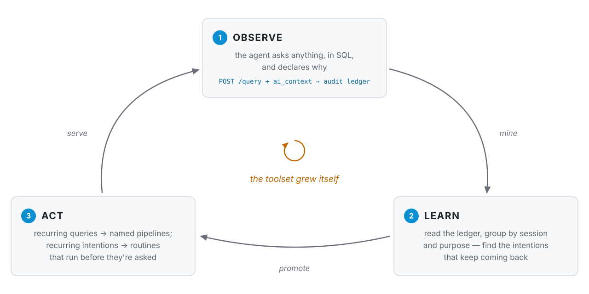
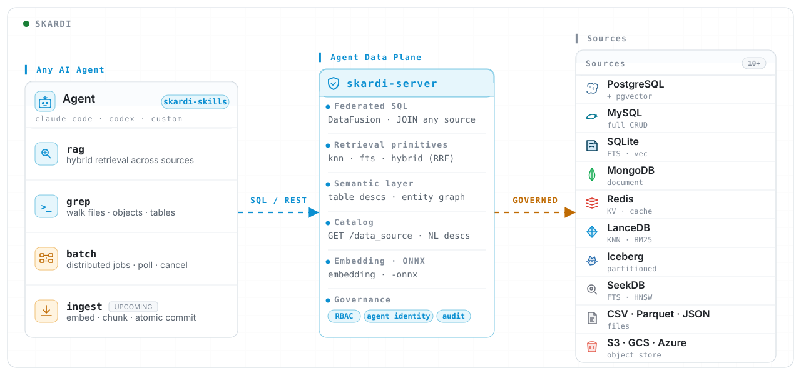
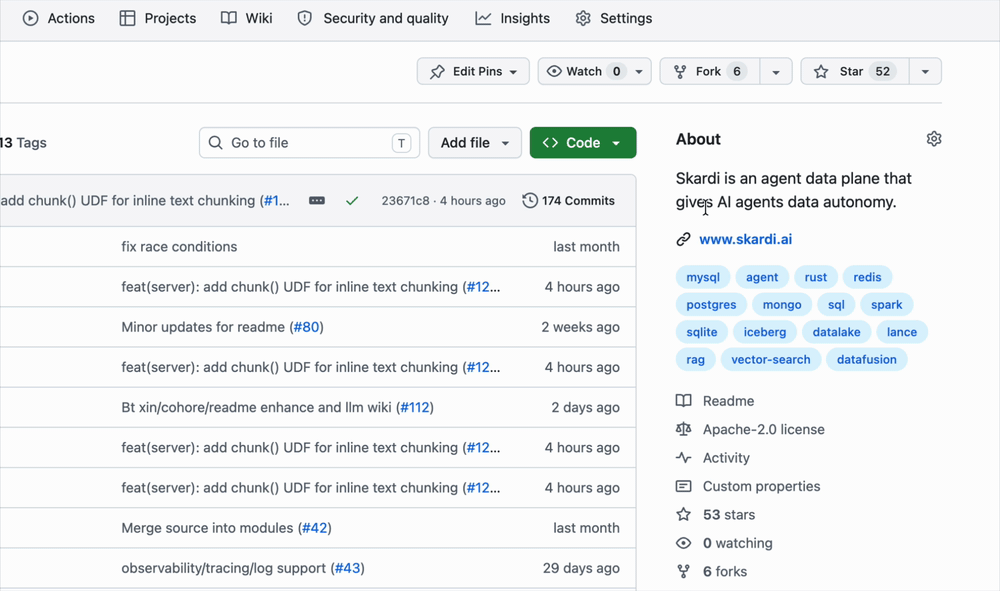

<div align="center">
<p align="center">


**Skardi is an open-source self-improving context framework.**

Your agent asks anything of your data, in SQL — declaring *why* it asks.
What keeps coming back becomes a named tool or a standing routine.
The thing that improves is the agent's **context**, not model weights — and you never write another integration.

**Observe** · every query, with intent &nbsp;·&nbsp; **Learn** · what recurs across sessions &nbsp;·&nbsp; **Act** · new tools and routines — *automation in flight*

<a href="#the-loop">How the loop works</a> •
<a href="#install">Install</a> •
<a href="https://skardilabs.github.io/skardi-docs/">Documentation</a> •
<a href="https://discord.gg/S5YQQPEV2m">Discord</a>

[License]: https://opensource.org/licenses/Apache-2.0
[License Badge]: https://img.shields.io/badge/License-Apache%202.0-orange.svg
[CI]: https://github.com/SkardiLabs/skardi/actions/workflows/ci.yml
[CI Badge]: https://github.com/SkardiLabs/skardi/actions/workflows/ci.yml/badge.svg
[Codecov]: https://codecov.io/gh/SkardiLabs/skardi
[Codecov Badge]: https://codecov.io/gh/SkardiLabs/skardi/branch/main/graph/badge.svg
[crates.io]: https://crates.io/crates/skardi
[crates.io Badge]: https://img.shields.io/crates/v/skardi?logo=rust
[Docs]: https://docs.rs/skardi
[Docs Badge]: https://docs.rs/skardi/badge.svg
[Discord]: https://discord.gg/S5YQQPEV2m
[Discord Badge]: https://img.shields.io/badge/Discord-Join-5865F2?logo=discord&logoColor=white

[![License Badge]][License]
[![CI Badge]][CI]
[![Codecov Badge]][Codecov]
[![crates.io Badge]][crates.io]
[![Docs Badge]][Docs]
[![Discord Badge]][Discord]

[](https://sealos.io/products/app-store/skardi/) [](https://github.com/SkardiLabs/skardi-skills)

</p>
</div>

<hr />

## The loop

Most agent stacks freeze their data tools at ship time: you guess which queries
the agent will need, wrap each one by hand, and find out in production what you
guessed wrong. Skardi inverts that. The agent gets one general way in, and the
tools it ends up with are the ones it demonstrably reached for.

<p align="center">
  <picture>
    <source media="(prefers-color-scheme: dark)" srcset="asset/loop-dark.svg">
    
  </picture>
</p>

**1 — Serve your data, with the ledger on.** One `ctx.yaml` names your sources
([full reference](docs/server.md)); `--query-audit-db` turns on the durable
record that makes the rest of the loop possible.

```yaml
kind: context
metadata: { name: acme }
spec:
  data_sources:
    - name: warehouse            # step 2 queries warehouse.public.subs
      type: postgres
      hierarchy_level: catalog   # register every table in the database
      connection_string: postgres://localhost:5432/acme
```

```bash
# from a source checkout — Docker once --query-audit-db ships in a tagged release
git clone https://github.com/SkardiLabs/skardi.git && cd skardi
cargo run --release --bin skardi-server -- \
  --ctx ctx.yaml --query-audit-db ./audit.db --port 8080
```

**2 — Your agent explores freely, declaring intent.** Any SQL over any
registered source, federated in one statement. `ai_context` is how the agent
says *why* — `purpose` and `session_id` are recorded, never executed.

```bash
curl -X POST localhost:8080/query -H 'Content-Type: application/json' -d @- <<'JSON'
{ "sql": "SELECT plan, COUNT(*) AS cancels FROM warehouse.public.subs WHERE cancelled_at > now() - interval '7 days' GROUP BY plan",
  "ai_context": { "purpose": "weekly churn check, by plan", "session_id": "sess-1a2b" } }
JSON
```

**3 — Promote what recurs.** &nbsp;`in flight` — the
[`skardi-query-log`](https://github.com/SkardiLabs/skardi-skills/pull/25) skill
reads the ledger, writes the pipeline, reloads the server, health-checks it, and
rolls back if the install fails. Held until `--query-audit-db` lands in a tagged
release; today you can read the ledger yourself with plain SQL — it is a SQLite
file indexed on `(session_id, created_at)`.

```yaml
# /skardi-query-log --db ./audit.db --dir pipelines/ --port 8080 --restart-cmd '...'
#   → 4 sessions asked the same churn question with different windows
#   → wrote pipelines/weekly-churn.yaml, reloaded, /health/weekly-churn ok
kind: pipeline
metadata: { name: weekly-churn }
spec:
  query: |                                   # the varying window, parameterized
    SELECT plan, COUNT(*) AS cancels FROM warehouse.public.subs
    WHERE cancelled_at > now() - CAST(concat({days}, ' days') AS INTERVAL)
    GROUP BY plan ORDER BY cancels DESC
```

**4 — The agent has a new tool.** One definition, both bindings — so the same
promoted pipeline works in Claude Code, Cursor, your own loop, or any HTTP host,
with no wrapper code to maintain.

```bash
# shell verb — any agent with a Bash tool, no MCP config
skardi run weekly-churn -p days=7
# same pipeline, served as REST
curl -X POST localhost:8080/weekly-churn/execute \
  -H 'Content-Type: application/json' -d '{"days": 7}'
```

Promotion is the first rung of ③, not the whole of it. The same ledger supports
acting on *intentions*: when every weekday morning ends with the same GitHub +
Slack queries, each declaring `purpose: "daily standup"`, the pattern isn't a
pipeline — it's a routine, and any harness that can run an agent on a schedule
(Claude Code routines, a cron-driven CLI run) can have the standup drafted
before anyone asks. And because the ledger is one SQLite file, you can hand a
window of it to an LLM and ask what keeps being needed that nobody turned into a
tool — recurring intentions the user hasn't noticed yet. Both land as skills on
top of the ledger, like
[`skardi-query-log`](https://github.com/SkardiLabs/skardi-skills/pull/25) —
no server changes required.

Then back to ①, with one fewer thing your agent has to figure out from scratch.

---

## Why it compounds

- **Intent is recorded, not inferred.** The ledger stores *why* each query ran,
  not just what ran. Two statements with different SQL and the same purpose are
  the same question — which is the difference between mining patterns and
  grepping strings.
- **One chokepoint means one memory.** Every source sits behind one engine, so a
  recurring need spanning Postgres, Parquet on S3 and a SaaS API is visible as
  *one* pattern. Across N SDKs it is N unrelated log files.
- **Promotion is reviewable.** What the loop produces is pipeline YAML you read,
  diff, edit and revert — not a learned weight you have to trust. Writes stay
  governed on the way in too: `access_mode` gates DML per source, DDL is always
  rejected, and literals never reach your logs or OTLP stream
  ([why](docs/server.md#query-confidentiality)).

> **Beta.** Skardi is under active development and APIs may move. Hit us on
> [Discord](https://discord.gg/S5YQQPEV2m) if you want to co-design a POC.

---

## Install

**Claude Code** — the fastest path. A skill that stands the whole thing up for
you:

```text
/plugin marketplace add SkardiLabs/skardi-skills
/plugin install auto-context@skardi-skills
```

[`auto_context`](https://github.com/SkardiLabs/skardi-skills/tree/main/auto_context)
turns a folder of documents — or a datastore you already run — into governed,
searchable context served over HTTP by `skardi-server`: hybrid search (vector +
FTS + RRF), defaulting to a local SQLite file the skill creates and owns, or
pointed at Postgres + pgvector, MongoDB, or Lance. For Cursor and other
[Agent Skills](https://agentskills.io/)-compatible hosts, see the
[skardi-skills README](https://github.com/SkardiLabs/skardi-skills#installation).

**CLI** — pre-built for `x86_64`/`aarch64` Linux and Apple Silicon (Intel Macs:
build from source — the one-liner below has no published artifact there):

```bash
curl -fSL "https://github.com/SkardiLabs/skardi/releases/latest/download/skardi-$(uname -m | sed 's/arm64/aarch64/')-$(uname -s | sed 's/Linux/unknown-linux-gnu/' | sed 's/Darwin/apple-darwin/').tar.gz" | tar xz
sudo mv skardi /usr/local/bin/
```

**Server** — a Docker image, or a source build (no pre-built binary yet):

```bash
git clone https://github.com/SkardiLabs/skardi.git && cd skardi
cargo build --release -p skardi-server     # add --features rag for embedding + chunk UDFs
cargo install --locked --path crates/cli   # the CLI, from the same checkout
```

---

## What's underneath

One Rust process ([DataFusion](https://datafusion.apache.org/) in-process) plus
a small SQLite file for the ledger and optional auth. One server serves many
agents; deploy it next to your data, behind your usual auth.

- **Federated SQL** — one statement across every registered source, no
  application-side joins. [docs/federated-queries.md](docs/federated-queries.md)
- **Pipelines** — a YAML file with parameterized SQL becomes a REST endpoint
  (schema inferred) *and* a `skardi run` verb. This is what the loop promotes
  into. [docs/pipelines.md](docs/pipelines.md)
- **Semantic overlay** — plain-English descriptions of tables and columns served
  on `GET /data_source`, so the agent reads what data *means* before querying
  instead of guessing from a schema dump. [docs/semantics.md](docs/semantics.md)
- **Offline jobs** — async batch writes with atomic commit, crash recovery and a
  run ledger you can list and inspect. [docs/jobs.md](docs/jobs.md)
- **Retrieval built in** — KNN, FTS and hybrid RRF in SQL; `candle()` embeddings,
  `chunk()`, `onnx_predict()` and `llm_extract()` as UDFs, so content and vector
  land on the same row atomically. [docs/embeddings/](docs/embeddings/)

### Supported data sources

| Type | CRUD | Catalog | Notes | Docs |
|------|------|---------|-------|------|
| PostgreSQL | Full | Yes | pgvector KNN, FTS | [docs](docs/postgres/) |
| MySQL | Full | Yes | Table or catalog registration | [docs](docs/mysql/) |
| SQLite | Full | Yes | sqlite-vec KNN, FTS | [docs](docs/sqlite/) |
| MongoDB | Full | No | Collections with point lookups | [docs](docs/mongo/) |
| Redis | Full | No | Hashes mapped to SQL rows | [docs](docs/redis/) |
| DynamoDB | Full | Yes | Scan + filter pushdown | [docs](docs/dynamodb/) |
| SeekDB | Full | Yes | MySQL-wire CRUD, FULLTEXT, HNSW | [docs](docs/seekdb/) |
| ClickHouse | Read | Yes | Columnar OLAP, filter/limit pushdown | [docs](docs/clickhouse/) |
| Lance | Read + job-write | No | KNN, BM25 FTS; job destination | [docs](docs/lance/) |
| Apache Iceberg | Read | No | Schema evolution, partition pruning | [docs](docs/iceberg/) |
| InfluxDB 3 | Read | No | Time series over Arrow Flight SQL | [docs](docs/influxdb/) |
| S3 / GCS / Azure | Read | No | CSV, Parquet, Lance in object stores | [docs](docs/S3_USAGE.md) |
| CSV / Parquet | Read | No | Local or remote files | [docs](docs/server.md) |
| SaaS via Open Connector | Read | Yes | GitHub, Slack, Notion, Feishu, Gmail, Discord, Outlook packs as stable SQL tables; pushdown + TTL cache | [docs](docs/open-connector.md) |
| Documents | Read | No | PDF/Office/ODF/image → per-page Markdown, tables, images | [docs](docs/documents.md) |
| RSS / Atom | Read | Yes | Feeds as `feeds` + `items`; per-feed TTL cache, fault isolation, un-sandboxed fetch egress | [docs](docs/rss.md) |
| Graph (Apache AGE) | Read | Yes | Read-only openCypher over Postgres; YAML views as catalog tables, `cypher_query` UDTF | [docs](docs/graph.md) |

---

## More

<details>
<summary><strong>Architecture diagram</strong></summary>

<p align="center">
  <a href="https://htmlpreview.github.io/?https://github.com/SkardiLabs/skardi/blob/main/asset/architecture-open-source.html">
    
  </a>
  <br>
  <sub><a href="https://htmlpreview.github.io/?https://github.com/SkardiLabs/skardi/blob/main/asset/architecture-open-source.html">View interactive diagram →</a></sub>
</p>

Most sources read a store that already holds rows. **RSS/Atom** is the one that
reaches out over the open web at query time — one DataFusion partition per feed
so a dead feed degrades alone, and, because feed URLs are agent-authored input,
a fetch deliberately left un-sandboxed in OSS for operators to gate at the
infrastructure layer. See [docs/rss.md](docs/rss.md).

</details>

<details>
<summary><strong>Docker & cloud</strong></summary>

```bash
docker run --rm -p 8080:8080 \
  -v /path/to/ctx.yaml:/config/ctx.yaml \
  -v /path/to/pipelines:/config/pipelines \
  ghcr.io/skardilabs/skardi/skardi-server:latest \
  --ctx /config/ctx.yaml --pipeline /config/pipelines --port 8080
```

Use the `skardi-server-rag` tag for the embedding + chunk UDFs, or build locally
with `docker build -t skardi .` (`--build-arg FEATURES=rag`). The fastest cloud
path is the [Sealos](https://sealos.io/products/app-store/skardi/) template.

</details>

<details>
<summary><strong>Worked examples & docs index</strong></summary>

Each demo ships a self-contained `ctx.yaml` plus pipelines, so reading the YAML
shows the shape in practice: [llm_wiki](demo/llm_wiki/) (agent-native wiki —
hybrid search, inline embeddings), [rag](demo/rag/),
[simple_backend](demo/simple_backend/) (REST on SQLite + auth),
[movie_recommendation](demo/movie_recommendation/) (ONNX NCF model).
Source-specific demos are linked from the table above.

Reference: [server](docs/server.md) (ad-hoc queries, `ai_context`, the audit
ledger) · [CLI](docs/cli.md) · [pipelines](docs/pipelines.md) ·
[jobs](docs/jobs.md) · [semantics](docs/semantics.md) ·
[federated queries](docs/federated-queries.md) ·
[embeddings](docs/embeddings/) · [chunking](docs/chunk.md) ·
[ONNX](docs/onnx_predict.md) · [LLM extraction](docs/llm_extract.md) ·
[JSON packing](docs/json_pack.md) · [auth](docs/auth/) ·
[observability](docs/observability.md).

</details>

---

## Community

Pick the channel that fits:

- [Discord](https://discord.gg/S5YQQPEV2m) — real-time chat, POC co-design,
  and shaping what lands next.
- [GitHub issues](https://github.com/SkardiLabs/skardi/issues) — bug reports
  and feature requests; we'll pair with you on design and review.
- [Security](#security) — vulnerabilities go to a private channel, never a
  public issue.

We read everything — and a ⭐️ helps other agent builders find the project.

<p align="center">
  <a href="https://github.com/SkardiLabs/skardi">
    
  </a>
</p>

### Contributors

<a href="https://github.com/SkardiLabs/skardi/graphs/contributors">
  
</a>

## Security

Skardi sits between your agents and your data, so we treat reports seriously.
Please don't post vulnerabilities as public issues — report them privately via
[GitHub security advisories](https://github.com/SkardiLabs/skardi/security/advisories/new)
and we'll follow up with you there.

## License

Apache 2.0 — see [LICENSE](LICENSE).
