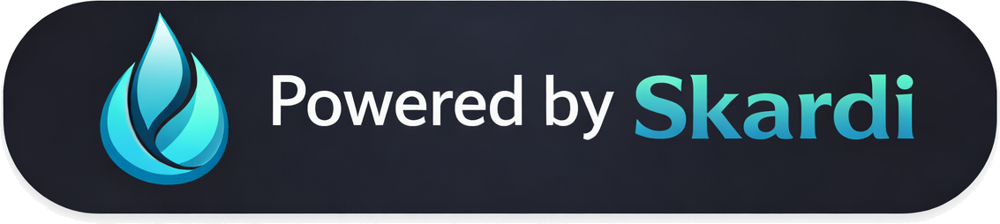

<div align="center">
<p align="center">


**SQL across anything: query, join, and aggregate over local files, databases, S3, and vector stores — or turn any SQL into a parameterized HTTP API, zero application code required, written in Rust, powered by Apache Datafusion.**

<a href="https://skardilabs.github.io/skardi-docs/">Documentation</a> •
<a href="https://discord.gg/S5YQQPEV2m">Discord</a> •

[License]: https://opensource.org/licenses/Apache-2.0
[License Badge]: https://img.shields.io/badge/License-Apache%202.0-orange.svg
[CI]: https://github.com/SkardiLabs/skardi/actions/workflows/ci.yml
[CI Badge]: https://github.com/SkardiLabs/skardi/actions/workflows/ci.yml/badge.svg
[crates.io]: https://crates.io/crates/skardi
[crates.io Badge]: https://img.shields.io/crates/v/skardi.svg
[Docs]: https://docs.rs/skardi
[Docs Badge]: https://docs.rs/skardi/badge.svg
[Discord]: https://discord.gg/S5YQQPEV2m
[Discord Badge]: https://img.shields.io/badge/Discord-Join-5865F2?logo=discord&logoColor=white

[![License Badge]][License]
[![CI Badge]][CI]
[![crates.io Badge]][crates.io]
[![Docs Badge]][Docs]
[![Discord Badge]][Discord]

[](https://sealos.io/products/app-store/skardi/)

</p>
</div>

<hr />

Skardi runs federated SQL across files, databases, object stores, and vector stores — and turns any query into a parameterized REST API with no application code.

- **`skardi-cli`** — Run SQL queries locally against files, object stores, databases, and datalake formats. Ideal for local agents like [OpenClaw](https://github.com/openclaw/openclaw) that need structured data access without a running server.
- **`skardi-server`** — Define SQL queries in YAML and serve them as parameterized HTTP APIs. Connect to multiple data sources, run federated queries, and expose results as REST endpoints.

> **Warning:** This software is in BETA. It may still contain bugs and unexpected behavior. Use caution with production data and ensure you have backups. Feel free to contact us if you want to have a POC for the product.

## Key Features

- **CLI for local agents & queries** — Run SQL against local files, remote object stores (S3, GCS, Azure), databases, and datalake formats — ideal for local AI agents like [OpenClaw](https://github.com/openclaw/openclaw)
- **Declarative pipelines** — Define SQL queries in YAML, get REST APIs automatically
- **Automatic parameter inference** — Request parameters, types, and response schemas are inferred from your SQL
- **Multi-source federation** — JOIN across CSV, Parquet, PostgreSQL, MySQL, SQLite, MongoDB, Redis, Iceberg, and Lance in a single query
- **Full CRUD** — SELECT, INSERT, UPDATE, and DELETE operations on supported databases
- **Vector search** — Native KNN similarity search via Lance, `pg_knn` for PostgreSQL pgvector, and SQLite-vec
- **Embedding inference** — Generate embeddings inline via GGUF, Candle, or remote embedding APIs (requires `--features embedding`)
- **Full-text search** — BM25-scored full-text search via Lance inverted indexes
- **Catalog mode** — Load an entire PostgreSQL, MySQL, or SQLite database as a DataFusion catalog with a single config entry
- **Simple auth** — Drop-in user authentication via [better-auth](https://www.better-auth.com/) backed by an internal SQLite database
- **S3 support** — Read CSV, Parquet, and Lance files directly from S3
- **Docker ready** — Ship as a container with your config files mounted at runtime
- **ONNX inference** — Run ONNX model predictions inline in SQL via the `onnx_predict` UDF

## Cloud (Sealos)

The fastest way to get started is with **[skardi-skills](https://github.com/SkardiLabs/skardi-skills)** — a collection of ready-to-deploy Skardi templates for [Sealos](https://sealos.io). Launch a fully configured Skardi server in the cloud with one click, no local setup required.

## Architecture

<details>
<summary>Click to expand Skardi's architecture diagram</summary>

<p align="center">
  
</p>

</details>

## Installation

### Docker (GHCR)

Pre-built Docker images are published to GitHub Container Registry on every release.

```bash
# Latest release
docker pull ghcr.io/skardilabs/skardi/skardi-server:latest

# Pull a specific version
docker pull ghcr.io/skardilabs/skardi/skardi-server:0.1.0
```

### CLI Binary

Download the latest CLI binary for your platform:

```bash
curl -fSL "https://github.com/SkardiLabs/skardi/releases/latest/download/skardi-$(uname -m | sed 's/arm64/aarch64/')-$(uname -s | sed 's/Linux/unknown-linux-gnu/' | sed 's/Darwin/apple-darwin/').tar.gz" | tar xz
sudo mv skardi /usr/local/bin/
```

Or download manually from the [Releases](https://github.com/SkardiLabs/skardi/releases) page. Available targets:

| Platform | Target |
|----------|--------|
| Linux x86_64 | `skardi-x86_64-unknown-linux-gnu.tar.gz` |
| Linux ARM64 | `skardi-aarch64-unknown-linux-gnu.tar.gz` |
| macOS ARM64 (Apple Silicon) | `skardi-aarch64-apple-darwin.tar.gz` |

> **Note:** macOS Intel (x86_64) binaries are not provided. Apple no longer produces Intel-based Macs. You can [build from source](#building-from-source) if needed.

## Quick Start

```bash
# Build
cargo build --release

# --- Skardi CLI ---
# Query local files directly
skardi query --sql "SELECT * FROM './data/products.csv' LIMIT 10"

# Query remote files
skardi query --sql "SELECT * FROM 's3://mybucket/events.parquet' LIMIT 10"

# --- Skardi Server ---
# Start the server with a context and pipeline
cargo run --bin skardi-server -- \
  --ctx docs/basic/ctx.yaml \
  --pipeline docs/basic/pipeline.yaml \
  --port 8080

# Execute the pipeline
curl -X POST http://localhost:8080/product-search-demo/execute \
  -H "Content-Type: application/json" \
  -d '{"brand": null, "max_price": 100.0, "color": null, "limit": 5}'
```

## Skardi CLI

The CLI lets you run SQL queries against local files, remote object stores, databases, and datalake formats — no server required. Great for local AI agents like [OpenClaw](https://github.com/openclaw/openclaw) that need to query structured data on the fly.

```bash
# Query files directly by path
skardi query --sql "SELECT * FROM './data/products.csv' LIMIT 10"
skardi query --sql "SELECT * FROM 's3://mybucket/events.parquet' LIMIT 10"

# Query with a context file (for databases, named tables, etc.)
skardi query --ctx ./ctx.yaml --sql "SELECT * FROM products LIMIT 10"

# Show table schemas
skardi query --ctx ./ctx.yaml --schema --all
```

For full CLI documentation, see [crates/cli/README.md](crates/cli/README.md).

## Skardi Server

Define SQL queries in YAML and serve them as parameterized HTTP APIs. The server includes a built-in dashboard, automatic parameter inference, and health checks for all data sources.

```bash
cargo run --bin skardi-server -- \
  --ctx ctx.yaml \
  --pipeline pipelines/ \
  --port 8080
```

For full server documentation — context files, pipeline files, access mode, caching, API endpoints, and response format — see [docs/server.md](docs/server.md).

## Supported Data Sources

| Type | CRUD | Description | Docs |
|------|------|-------------|------|
| CSV | Read | Local or remote CSV files | [docs/server.md](docs/server.md) |
| Parquet | Read | Local or remote Parquet files | [docs/server.md](docs/server.md) |
| PostgreSQL | Full | Tables, catalog mode, pgvector KNN | [docs/postgres/](docs/postgres/) |
| MySQL | Full | Tables and catalog mode | [docs/mysql/](docs/mysql/) |
| SQLite | Full | Tables, catalog mode, sqlite-vec KNN, FTS | [docs/sqlite/](docs/sqlite/) |
| MongoDB | Full | Collections with point lookups | [docs/mongo/](docs/mongo/) |
| Redis | Full | Hashes mapped to SQL rows | [docs/redis/](docs/redis/) |
| Apache Iceberg | Read | Schema evolution, partition pruning | [docs/iceberg/](docs/iceberg/) |
| Lance | Read | KNN vector search, BM25 full-text search | [docs/lance/](docs/lance/) |
| S3 | Read | CSV, Parquet, and Lance from S3/GCS/Azure | [docs/S3_USAGE.md](docs/S3_USAGE.md) |

## Additional Features

- **Catalog mode** — Load an entire database as a DataFusion catalog; no per-table registration needed. See [docs/catalog.md](docs/catalog.md).
- **Federated queries** — JOIN across different source types in a single SQL query. See [docs/federated-queries.md](docs/federated-queries.md).
- **Authentication** — Drop-in session-based auth via better-auth with SQLite. See [docs/auth/](docs/auth/).
- **ONNX inference** — Run ONNX model predictions inline in SQL. See [docs/onnx_predict.md](docs/onnx_predict.md).
- **Embedding inference** — Generate embeddings via GGUF, Candle, or remote APIs. See [docs/embeddings/](docs/embeddings/).
- **Observability** — OpenTelemetry traces, metrics, and logs with a pre-configured Grafana stack. See [docs/observability.md](docs/observability.md).

## Docker

### Build the image

```bash
docker build -t skardi .

# With embedding support (ONNX, GGUF, Candle, remote embed)
docker build -t skardi --build-arg FEATURES=embedding .
```

### Run with config files mounted

```bash
docker run --rm \
  -v /path/to/your/ctx.yaml:/config/ctx.yaml \
  -v /path/to/your/pipelines:/config/pipelines \
  -p 8080:8080 \
  skardi \
  --ctx /config/ctx.yaml \
  --pipeline /config/pipelines \
  --port 8080
```

## Building from Source

```bash
git clone https://github.com/SkardiLabs/skardi.git
cd skardi

# Build CLI
cargo build --release -p skardi-cli

# Build server
cargo build --release -p skardi-server

# With embedding support (ONNX, GGUF, Candle, remote embed)
cargo build --release -p skardi-server --features embedding
```

## Demo & Examples

### Data Source & Feature Reference ([docs/](docs/))

| Path | Description |
|------|-------------|
| [docs/postgres/](docs/postgres/) | PostgreSQL CRUD, federated queries, and catalog mode |
| [docs/mysql/](docs/mysql/) | MySQL CRUD, federated queries, and catalog mode |
| [docs/sqlite/](docs/sqlite/) | SQLite CRUD, federated queries, and catalog mode |
| [docs/mongo/](docs/mongo/) | MongoDB CRUD and federated query examples |
| [docs/redis/](docs/redis/) | Redis CRUD and federated query examples |
| [docs/iceberg/](docs/iceberg/) | Apache Iceberg integration examples |
| [docs/lance/](docs/lance/) | Lance vector search and full-text search examples |
| [docs/onnx_predict.md](docs/onnx_predict.md) | `onnx_predict` UDF reference |
| [docs/S3_USAGE.md](docs/S3_USAGE.md) | S3 data source configuration guide |

### Application Examples ([demo/](demo/))

| Directory | Description |
|-----------|-------------|
| [demo/simple_backend/](demo/simple_backend/) | Zero-code REST backend with SQLite and optional auth |
| [demo/llm_wiki/](demo/llm_wiki/) | Wikipedia Q&A with LLM and vector search |
| [demo/rag/](demo/rag/) | Retrieval-augmented generation pipeline |
| [demo/movie_recommendation/](demo/movie_recommendation/) | Movie recommendations with ONNX NCF model |


## Powered By Skardi

Built something powered by Skardi? Show it off in your README with one of our badges:

<picture>
  
</picture>

```markdown
[](https://github.com/SkardiLabs/skardi)
```

Dark mode variant:

<picture>
  
</picture>

```markdown
[](https://github.com/SkardiLabs/skardi)
```

Auto-switching (light/dark):

```markdown
<picture>
  <source media="(prefers-color-scheme: dark)" srcset="https://raw.githubusercontent.com/SkardiLabs/skardi/main/asset/powered-by-skardi-dark.svg">
  
</picture>
```

## Community

Have questions, ideas, or want to share what you're building with Skardi? Join us on [Discord](https://discord.gg/S5YQQPEV2m) !

## License

See [LICENSE](LICENSE) for details.
