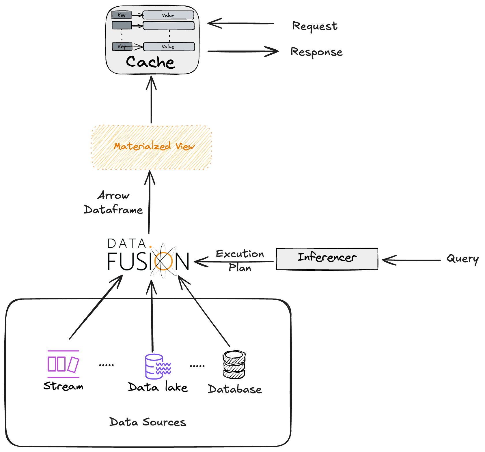

<div align="center">
<p align="center">


**Skardi is an agent data plane that gives AI agents data autonomy.**

<a href="https://skardilabs.github.io/skardi-docs/">Documentation</a> •
<a href="#roadmap">Roadmap</a> •
<a href="https://discord.gg/S5YQQPEV2m">Discord</a>

[License]: https://opensource.org/licenses/Apache-2.0
[License Badge]: https://img.shields.io/badge/License-Apache%202.0-orange.svg
[CI]: https://github.com/SkardiLabs/skardi/actions/workflows/ci.yml
[CI Badge]: https://github.com/SkardiLabs/skardi/actions/workflows/ci.yml/badge.svg
[Codecov]: https://codecov.io/gh/SkardiLabs/skardi
[Codecov Badge]: https://codecov.io/gh/SkardiLabs/skardi/branch/main/graph/badge.svg
[crates.io]: https://crates.io/crates/skardi
[crates.io Badge]: https://img.shields.io/crates/v/skardi.svg
[Docs]: https://docs.rs/skardi
[Docs Badge]: https://docs.rs/skardi/badge.svg
[Discord]: https://discord.gg/S5YQQPEV2m
[Discord Badge]: https://img.shields.io/badge/Discord-Join-5865F2?logo=discord&logoColor=white

[![License Badge]][License]
[![CI Badge]][CI]
[![Codecov Badge]][Codecov]
[![crates.io Badge]][crates.io]
[![Docs Badge]][Docs]
[![Discord Badge]][Discord]

[](https://sealos.io/products/app-store/skardi/)

</p>
</div>

<hr />

## What is Skardi?

Skardi is an open-source **data plane for AI agents** — every tool call your agent makes hits a Skardi pipeline: declarative SQL, served over REST or shell, with retrieval primitives built in. Build RAG, hybrid search, memory, and data APIs across databases, files, data lakes, and vector stores.

Borrowing Spark's shape — one engine over every data source — but tilted for online serving, not analytics. Your agent and your pipeline YAMLs are the *control plane*; Skardi is the *data plane* every tool call traverses, designed for how agents actually use data: schemas they can *read*, outputs they can *parse*, tools they can *discover*, writes they can *trust*.

- **`skardi` CLI** — federated SQL + parameterized pipelines as shell commands. Drop it into any agent that has a Bash tool (Claude Code, Cursor, custom loops) and it's wired.
- **`skardi-server`** — two peer surfaces on one engine: **online serving** (declarative SQL pipelines as parameterized REST endpoints) and **offline jobs** (async batch writes into Lance or any read-write DB, with atomic commit + run ledger).
- **Soon** — skills generation for auto-discovery, MCP binding for non-Claude hosts, a first-class **memory primitive** (structured + vector + FTS + provenance + TTL), lineage, and agent-scoped governance.

> **Beta.** Skardi is under active development. APIs may move. Hit us on [Discord](https://discord.gg/S5YQQPEV2m) if you want to co-design a POC.

<p align="center">
  <a href="https://htmlpreview.github.io/?https://github.com/SkardiLabs/skardi/blob/main/asset/architecture-open-source.html">
    
  </a>
  <br>
  <sub><em>fig. 01 — skardi open source topology.</em> <a href="https://htmlpreview.github.io/?https://github.com/SkardiLabs/skardi/blob/main/asset/architecture-open-source.html">View interactive diagram →</a></sub>
</p>

---

## Why an agent data plane?

Agents don't lack intelligence — they lack **data autonomy**. Hand an LLM a raw schema dump and it hallucinates; hand it a bag of bespoke REST endpoints and it gets lost; hand it a vector store and it still can't JOIN. The gap isn't the model. The gap is that today's data stack was designed for humans writing queries, not agents calling tools.

Skardi closes that gap with three deliberate choices:

1. **One engine over every source.** DataFusion-based single-node federation. An agent can `JOIN` a CSV against Postgres against a Lance dataset in one query.
2. **Online serving.** Parameterized SQL served synchronously as REST endpoints; the low-latency path every agent tool call hits.
3. **Offline jobs.** The same SQL shape run asynchronously into a durable destination, with a run ledger, atomic commit, and submit / poll / cancel.

Read the full narrative in [docs/agent_data_plane.md](docs/agent_data_plane.md).

---

## ⭐️ Star the Repository

If you find Skardi useful or interesting, a GitHub Star ⭐️ would be greatly appreciated — it helps others discover the project and signals which directions are worth pushing on.

<p align="center">
  <a href="https://github.com/SkardiLabs/skardi">
    
  </a>
</p>

---
## Quick Start

### Install the CLI

```bash
# From source (recommended during beta)
git clone https://github.com/SkardiLabs/skardi.git
cd skardi
cargo install --locked --path crates/cli
```

Or grab a pre-built binary:

```bash
curl -fSL "https://github.com/SkardiLabs/skardi/releases/latest/download/skardi-$(uname -m | sed 's/arm64/aarch64/')-$(uname -s | sed 's/Linux/unknown-linux-gnu/' | sed 's/Darwin/apple-darwin/').tar.gz" | tar xz
sudo mv skardi /usr/local/bin/
```

| Platform | Target |
|----------|--------|
| Linux x86_64 | `skardi-x86_64-unknown-linux-gnu.tar.gz` |
| Linux ARM64 | `skardi-aarch64-unknown-linux-gnu.tar.gz` |
| macOS ARM64 (Apple Silicon) | `skardi-aarch64-apple-darwin.tar.gz` |

> macOS Intel binaries are not published. [Build from source](#building-from-source) if you need one.

### First-time agent loop (two minutes)

```bash
# 1. Ad-hoc SQL across local + remote data — no server, no pre-registration
skardi query --sql "SELECT * FROM './data/products.csv' LIMIT 10"
skardi query --sql "SELECT * FROM 's3://mybucket/events.parquet' LIMIT 10"

# 2. Register named sources in a ctx, query them by name
skardi query --ctx ./ctx.yaml --sql "SELECT * FROM products LIMIT 10"

# 3. Turn a parameterized SQL into an agent-callable verb (alias + pipeline)
#    — now any agent with a shell can call it:
skardi grep "turing machine computation" --limit=10
```

Drop `skardi` into a Claude Code or Cursor session and the agent can already use any pipeline you've declared as a tool via its Bash integration. No MCP config, no separate server — that's the MVP design intent.

### Skardi Server — online serving + offline jobs

```bash
cargo run --bin skardi-server -- \
  --ctx ctx.yaml \
  --pipeline pipelines/ \
  --jobs jobs/ \
  --port 8080
```

```bash
# Pipelines: synchronous answer
curl -X POST http://localhost:8080/product-search-demo/execute \
  -H "Content-Type: application/json" \
  -d '{"brand": null, "max_price": 100.0, "limit": 5}'

# Jobs: submit an async write-to-destination
skardi job run backfill-to-lake --param from_date='2026-01-01'
skardi job status <run_id>
```

Full reference:
- **CLI** — [docs/cli.md](docs/cli.md)
- **Server** — [docs/server.md](docs/server.md)
- **Pipelines (online serving)** — [docs/pipelines.md](docs/pipelines.md)
- **Jobs (offline batch)** — [docs/jobs.md](docs/jobs.md)
- **Catalog semantics** — [docs/semantics.md](docs/semantics.md)
- **Why an agent data plane** — [docs/agent_data_plane.md](docs/agent_data_plane.md)

---

## Worked examples

For end-to-end walkthroughs — RAG, recommendations, an agent-native wiki, a simple REST backend — see the [`demo/`](demo/) directory. Each demo ships as a self-contained `ctx.yaml` plus pipelines (and sometimes jobs), so reading the YAML shows the Skardi shape in practice. Full list in [Demo & Examples](#demo--examples) below.

---

## RAG skills for agents

Two ready-to-use skills from **[skardi-skills](https://github.com/SkardiLabs/skardi-skills)** you can drop into Claude Code or Cursor:

- **[`auto_knowledge_base`](https://github.com/SkardiLabs/skardi-skills/tree/main/auto_knowledge_base)** — turn a directory of documents into a queryable local RAG with one command. Chunking, embedding, indexing, and hybrid search exposed as a `skardi grep` verb. Zero infra by default (SQLite + local embeddings), so any agent session gets a grounded, citable local knowledge base.
- **[`auto_rag`](https://github.com/SkardiLabs/skardi-skills/tree/main/auto_rag)** — stand up server-backed hybrid-search RAG via `skardi-server` on top of a datastore you already control (Postgres + pgvector, MongoDB, or Lance). The skill renders the `ctx.yaml` + pipelines, starts the server, and drives ingestion and queries through REST — for when retrieval needs to be shared across multiple agents or processes.

---

## Supported Data Sources

| Type | CRUD | Description | Docs |
|------|------|-------------|------|
| CSV | Read | Local or remote CSV files | [docs/server.md](docs/server.md) |
| Parquet | Read | Local or remote Parquet files | [docs/server.md](docs/server.md) |
| JSON / NDJSON | Read | Local or remote JSON files | [docs/cli.md](docs/cli.md) |
| PostgreSQL | Full | Table or catalog registration, pgvector KNN | [docs/postgres/](docs/postgres/) |
| MySQL | Full | Table or catalog registration | [docs/mysql/](docs/mysql/) |
| SQLite | Full | Table or catalog registration, sqlite-vec KNN, FTS | [docs/sqlite/](docs/sqlite/) |
| MongoDB | Full | Collections with point lookups | [docs/mongo/](docs/mongo/) |
| Redis | Full | Hashes mapped to SQL rows | [docs/redis/](docs/redis/) |
| SeekDB | Full | MySQL-wire CRUD, native FULLTEXT FTS, HNSW VECTOR KNN | [docs/seekdb/](docs/seekdb/) |
| Apache Iceberg | Read | Schema evolution, partition pruning | [docs/iceberg/](docs/iceberg/) |
| Lance | Read (job-write) | KNN vector search, BM25 FTS; job destination | [docs/lance/](docs/lance/) |
| S3 / GCS / Azure | Read | CSV, Parquet, Lance from object stores | [docs/S3_USAGE.md](docs/S3_USAGE.md) |

---

## Additional Features

- **Federated queries** — JOIN across different source types. See [docs/federated-queries.md](docs/federated-queries.md).
- **Catalog semantics** — NL descriptions on tables and columns, surfaced on the catalog endpoint so agents can pick the right tool from `GET /data_source`. See [docs/semantics.md](docs/semantics.md).
- **Authentication** — session-based via better-auth + SQLite. See [docs/auth/](docs/auth/).
- **ONNX inference** — inline model predictions in SQL. See [docs/onnx_predict.md](docs/onnx_predict.md).
- **Embedding inference** — GGUF, Candle, or remote APIs. See [docs/embeddings/](docs/embeddings/).
- **Observability** — OTel traces / metrics / logs with Grafana. See [docs/observability.md](docs/observability.md).

---

## Architecture

<details>
<summary>Click to expand Skardi's architecture diagram</summary>

<p align="center">
  
</p>

</details>

---

## Docker

```bash
# Build
docker build -t skardi .
docker build -t skardi --build-arg FEATURES=rag .   # adds embedding + chunk UDFs

# Or pull pre-built
docker pull ghcr.io/skardilabs/skardi/skardi-server:latest
docker pull ghcr.io/skardilabs/skardi/skardi-server-rag:latest   # embedding + chunk UDFs

# Run
docker run --rm \
  -v /path/to/your/ctx.yaml:/config/ctx.yaml \
  -v /path/to/your/pipelines:/config/pipelines \
  -p 8080:8080 \
  skardi \
  --ctx /config/ctx.yaml \
  --pipeline /config/pipelines \
  --port 8080
```

## Cloud (Sealos)

The fastest cloud path is the [Sealos](https://sealos.io) template in **[skardi-skills](https://github.com/SkardiLabs/skardi-skills)** — our growing library of ready-to-use Skardi setups. One-click launch, no local setup.

## Building from Source

```bash
git clone https://github.com/SkardiLabs/skardi.git
cd skardi

cargo build --release -p skardi-cli
cargo build --release -p skardi-server

# With the full RAG kit (embedding UDFs + chunk UDF)
cargo build --release -p skardi-server --features rag

# Or just the embedding UDFs (ONNX, GGUF, Candle, remote embed) without chunking
cargo build --release -p skardi-server --features embedding
```

---

## Demo & Examples

| Directory | Description |
|-----------|-------------|
| [demo/llm_wiki/](demo/llm_wiki/) | Agent-native wiki (server + CLI flavors) — hybrid search, inline embeddings, agent verbs |
| [demo/simple_backend/](demo/simple_backend/) | REST backend with SQLite and optional auth |
| [demo/rag/](demo/rag/) | Retrieval-augmented generation pipeline |
| [demo/movie_recommendation/](demo/movie_recommendation/) | Movie recommendations with ONNX NCF model |

For data-source-specific demos, see the entries in [Supported Data Sources](#supported-data-sources).

---

## Roadmap

We're **building in public**. `[x]` means shipped today, `[ ]` means open for contribution. Open an issue or hop into [Discord](https://discord.gg/S5YQQPEV2m) on anything unchecked.

`1` Federated SQL engine
   - [x] DataFusion single-node federation across CSV, Parquet, JSON, S3 / GCS / Azure, Postgres, MySQL, SQLite, MongoDB, Redis, Iceberg, Lance, SeekDB — all joinable in one query
   - [x] Register by table, or load an entire DB (Postgres / MySQL / SQLite) as a DataFusion catalog — one config line either way
   - [ ] Graph database sources (Neo4j / Kuzu) — native federation to unlock graphRAG patterns alongside vector / FTS retrieval

`2` Retrieval primitives
   - [x] Vector search — `pg_knn` (pgvector), `sqlite_knn` (sqlite-vec), Lance KNN, SeekDB HNSW
   - [x] Full-text search — `pg_fts`, `sqlite_fts`, Lance BM25 inverted indexes, SeekDB FULLTEXT
   - [x] Hybrid search — RRF merge of FTS + KNN in plain SQL
   - [x] Inline embeddings — `candle()` UDF (GGUF / Candle / remote embed APIs) runs directly inside SQL; content + vector stay on the same row atomically
   - [x] ONNX inference — `onnx_predict` UDF for inline model predictions in SQL
   - [x] Chunking UDF — `chunk()` with character / markdown splitters (via [`text-splitter`](https://crates.io/crates/text-splitter)) so ingestion can chunk inline in SQL ([docs](docs/chunk.md)); token / code splitters next
   - [ ] Memory primitive — hybrid access + TTL + provenance + consolidation collapsed into one declarative macro

`3` Online serving (pipelines)
   - [x] Declarative YAML → parameterized REST endpoint with inferred request / response schema
   - [x] Built-in pipeline dashboard
   - [x] CLI pipeline binding + aliases — `skardi run <pipeline> --param=…` and user-defined verb aliases ([#90](https://github.com/SkardiLabs/skardi/pull/90))
   - [x] CLI federated SQL — `skardi query` against files, object stores, datalake formats, and databases with no server required

`4` Offline jobs
   - [x] Async batch execution with submit / poll / cancel ([#98](https://github.com/SkardiLabs/skardi/pull/98))
   - [x] Lance dataset destinations with atomic commit + crash recovery
   - [x] SQL-DML destinations (Postgres / MySQL / SQLite)
   - [x] SQLite-backed run ledger with submit-time schema diff

`5` Agent-facing bindings
   - [x] REST — every pipeline served as a parameterized HTTP endpoint
   - [x] Shell — every pipeline runnable as a `skardi` command; works in Claude Code, Cursor, and any agent with a Bash tool
   - [ ] Skills generator — `skardi skills generate --ctx <ctx.yaml> --out .claude/skills/` emits a skill Markdown per pipeline for Claude Code / Desktop auto-discovery
   - [ ] MCP binding — same pipeline YAML projected to MCP tools for non-Claude hosts

`6` Governance & lineage
   - [x] Catalog with semantics — `kind: semantics` YAML overlay attaching NL descriptions to tables / columns; supports both bare source names and fully-qualified `catalog.schema.table` paths for per-table targeting on catalog-mode sources; surfaced on `GET /data_source` for agent-side discovery
   - [ ] Agent-callable `describe` verb — CLI / pipeline form on top of the catalog endpoint
   - [ ] Lineage capture — `agent_id`, `session_id`, `tool_call_id`, `timestamp` on writes; queryable from metadata tables
   - [ ] Agent identity passthrough — any binding injects client identity into a SQL context var pipelines can read
   - [ ] Snapshot-as-branch / agent checkpoints — Iceberg / Lance-backed; `git checkout`-like semantics for destructive agent experiments

`7` Ops
   - [x] Session auth — drop-in user auth via [better-auth](https://www.better-auth.com/) backed by SQLite
   - [x] Observability — OpenTelemetry traces / metrics / logs with a pre-configured Grafana stack
   - [x] Docker + pre-built binaries — Linux x86_64 / ARM64, macOS ARM64

---

## What's already in the box

### Engine
- **Federated SQL across every major source** — CSV, Parquet, JSON, S3 / GCS / Azure, Postgres, MySQL, SQLite, MongoDB, Redis, Iceberg, Lance, SeekDB — all joinable in one query.
- **Register by table or by catalog** — pick per source: expose a single named table, or load an entire Postgres / MySQL / SQLite database as a DataFusion catalog. One config line either way.
- **Vector search** — native KNN via Lance, `pg_knn` (pgvector), `sqlite_knn` (sqlite-vec), SeekDB HNSW.
- **Full-text search** — Lance BM25 inverted indexes, `pg_fts`, `sqlite_fts`, SeekDB native FULLTEXT.
- **Inline embeddings** — `candle()` UDF (GGUF / Candle / remote embed APIs) directly inside SQL, so content + vector stay on the same row atomically.
- **Inline chunking** — `chunk()` UDF (character / markdown splitters via [`text-splitter`](https://crates.io/crates/text-splitter)) so RAG ingest stays a single SQL statement: chunk → embed → write ([docs](docs/chunk.md)).
- **ONNX inference** — `onnx_predict` UDF for inline model predictions in SQL.
- **Hybrid search** — RRF merge of FTS + KNN in plain SQL (see [llm_wiki demo](demo/llm_wiki/)).

### Agent-facing surfaces
- **CLI `skardi run <pipeline>`** — parameterized pipeline invocation from any shell; works in Claude Code / Cursor / any agent with a Bash tool.
- **User-defined aliases** — `skardi grep "…"` → `run wiki-search-hybrid`. Collapses multi-line SQL into agent-ergonomic verbs.
- **Online serving** — YAML → parameterized HTTP endpoint, with an inferred request / response schema and a built-in dashboard.
- **Offline jobs** — async pipeline that commits to Lance or a DB destination, with a SQLite run ledger and submit / poll / cancel. ([#98](https://github.com/SkardiLabs/skardi/pull/98))

### Ops
- **Session auth** — drop-in user auth via [better-auth](https://www.better-auth.com/) backed by SQLite.
- **Observability** — OpenTelemetry traces / metrics / logs with a pre-configured Grafana stack.
- **Docker + pre-built binaries** — Linux x86_64 / ARM64, macOS ARM64.

---

## Community

Building an agent on top of Skardi, or want to influence the roadmap above? Join us on [Discord](https://discord.gg/S5YQQPEV2m), file an issue, or open a PR. We read everything.

## License

Apache 2.0 — see [LICENSE](LICENSE).
