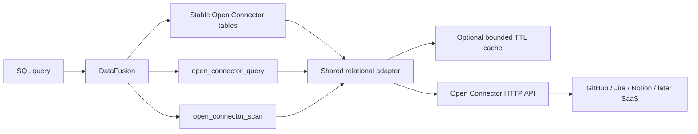
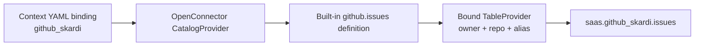
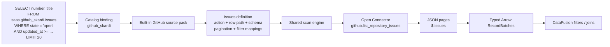
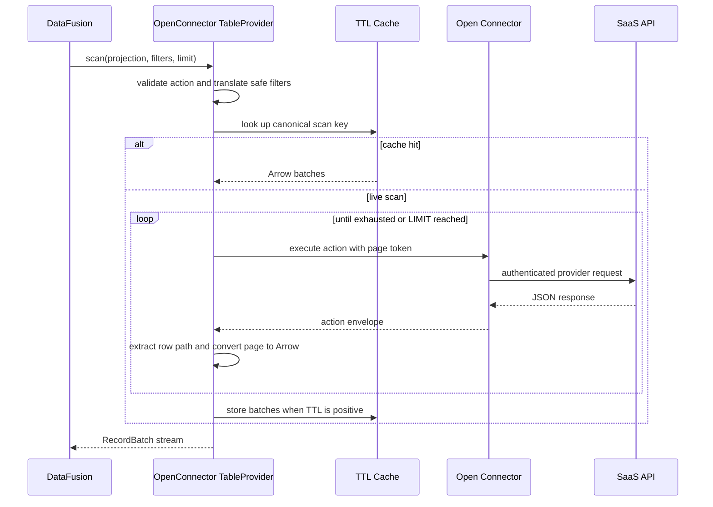
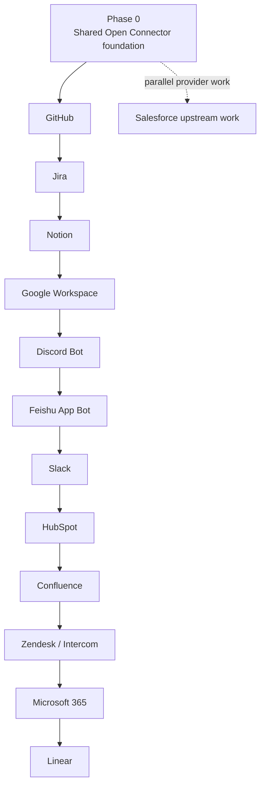
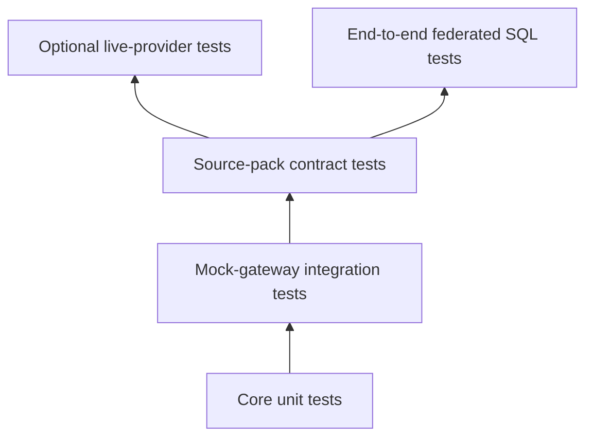

# Open Connector Integration Design

**Status:** Approved design
**Date:** 2026-07-11
**Branch:** `codex/open-connector-proposal`

## Summary

Skardi will integrate with [Open Connector](https://github.com/oomol-lab/open-connector) as a separate authenticated SaaS gateway. Open Connector will continue to own provider credentials, OAuth flows, token refresh, action policies, and provider-specific HTTP execution. Skardi will add the relational layer: stable table definitions, JSON-to-Arrow conversion, pagination, safe filter and limit pushdown, optional caching, and DataFusion registration.

The integration will expose three SQL interfaces:

1. Persistent stable catalog tables registered from context YAML bindings.
2. `open_connector_query`, a built-in source-pack UDTF with a stable schema and known pagination behavior.
3. `open_connector_scan`, a lower-level UDTF for explicitly allowlisted raw Open Connector read actions.

Milestone one delivers the reusable foundation and validates it with GitHub, Jira, and Notion. All milestone-one behavior is read-only.

## Motivation

Skardi currently implements each database or storage source as a DataFusion `TableProvider`. Open Connector exposes more than one thousand SaaS providers through a uniform HTTP action API, including input and output JSON Schemas, authentication metadata, connection aliases, and execution envelopes.

The two systems are complementary:

- Open Connector is an authentication and action-execution gateway.
- Skardi is a federated relational query engine.

Open Connector actions are not automatically SQL tables. Their results may be scalar, nested, binary, mutating, asynchronous, incompletely pageable, or dependent on required resource identifiers. Skardi therefore needs a relational contract between an Open Connector action and a DataFusion table.

## Research Findings

The Open Connector catalog audited at commit `6d23b1341475df7c60984186882ff826beedd9b2` contained 1,045 providers and 10,104 actions. A mechanical scan found hundreds of read-like actions with array outputs, but action metadata does not standardize:

- the JSON path containing relational rows;
- pagination input and output fields;
- primary keys;
- SQL filter translations;
- stable relational schemas;
- whether an action represents a complete collection scan.

Coverage for Skardi's prioritized SaaS sources is uneven:

| Priority source | Open Connector coverage | Relational readiness |
|---|---|---|
| Google Workspace | Gmail, Calendar, Drive, Docs, Forms, Sheets, Slides, Tasks | Broad; Sheets and document content need special mapping |
| Discord | OAuth and bot providers | Bot messages/channels are viable with explicit bindings |
| Slack | Conversations, users, files, messages, threads | Metadata viable; message history lacks complete cursor handling |
| Feishu | App Bot and Custom Bot | App Bot IM is viable but bot-visible only; Custom Bot is send-only |
| HubSpot | CRM objects, contacts, companies, deals, properties, campaigns | Strong |
| Notion | Data sources, databases, pages, blocks, users | Strong, with dynamic property schemas |
| Jira | Projects, JQL issue search, issues, comments | Strong |
| GitHub | Repositories, issues, pull requests, commits, workflows, releases | Very strong |
| Salesforce | No current provider | Blocked pending upstream provider work |
| Confluence | Search, spaces, pages | Viable but narrow |
| Zendesk | Tickets, users, organizations | Strong |
| Intercom | Contacts, conversations, admins | Strong |
| Microsoft 365 | Outlook Mail and Excel | Useful but not full Microsoft 365 coverage |
| Linear | Issues, teams, users, projects, states, labels, cycles | Strong |

## Goals

- Make selected SaaS resources queryable as ordinary Arrow-backed DataFusion tables.
- Keep provider credentials and OAuth responsibilities outside Skardi.
- Provide stable table schemas independent of additive upstream JSON changes.
- Support complete bounded scans through explicit pagination contracts.
- Push safe filters, projections, and limits to SaaS APIs where possible.
- Support live reads by default and an optional bounded TTL cache.
- Make new SaaS support primarily a source-pack addition rather than a new execution engine.
- Preserve an escape hatch for ad-hoc allowlisted Open Connector actions.
- Support federated joins between SaaS sources and existing Skardi sources.

## Non-goals

- Automatically registering all Open Connector actions as tables.
- Exposing mutating Open Connector actions in milestone one.
- Mapping SQL `INSERT`, `UPDATE`, or `DELETE` to SaaS APIs.
- Embedding or forking the Open Connector runtime into Skardi.
- Claiming full product-suite coverage when only particular APIs are supported.
- Providing transaction or snapshot-isolation guarantees across SaaS APIs.
- Returning partial results after a failed page.

## Decisions

The approved design choices are:

- Use a separate Open Connector service over HTTP.
- Build a shared relational adapter with declarative built-in source packs.
- Deliver both stable catalog tables and UDTFs.
- Maintain built-in mappings in Skardi with safe YAML overrides.
- Use explicit resource bindings rather than automatic repository/database discovery.
- Perform live reads by default with optional TTL caching.
- Keep milestone one strictly read-only.
- Validate the abstraction with GitHub, Jira, and Notion.
- Bind stable tables exclusively through context YAML, registered as a DataFusion catalog provider.
- Keep the UDTFs as the ad-hoc interactive interface; expose no SQL DDL in milestone one.

## Alternatives Considered

### Fully schema-driven automatic catalog

This approach would generate tables directly from Open Connector action JSON Schemas. It minimizes source-specific definitions but cannot reliably infer row paths, complete pagination, stable columns, required resource bindings, or safe filters. It would create a broad but unreliable catalog and was rejected.

### Dedicated Rust provider per SaaS

This approach would implement GitHub, Jira, Notion, and every later SaaS as separate provider code. It could provide deep optimization but would duplicate HTTP execution, pagination, JSON conversion, caching, retries, and error handling. It was rejected in favor of shared infrastructure plus small source packs.

### Embed Open Connector in Skardi

Embedding or porting the Node runtime would couple Skardi to Open Connector's credential store, OAuth lifecycle, executor loading, and release cadence. It would duplicate responsibilities and was rejected.

## High-level Architecture

Open Connector remains outside the Skardi process.



Skardi receives only an Open Connector gateway URL and runtime token. Provider credentials never enter Skardi configuration, memory, SQL, logs, or query results.

## Components

### Typed configuration

Skardi's existing `options: HashMap<String, String>` cannot safely represent nested gateway bindings, resources, and overrides. `DataSource` will receive an optional typed `open_connector` configuration field that is valid only for `type: open_connector`.

The configuration represents:

- runtime-token environment variable;
- request and scan timeouts;
- cache limits and default TTL;
- maximum pages and rows;
- raw-action allowlist;
- named bindings;
- optional safe source-pack overrides.

### Open Connector client

The client owns:

- gateway health and action discovery calls;
- runtime-token authentication;
- connection-alias headers;
- action execution envelopes;
- retries and `Retry-After` handling;
- bounded response decoding;
- cancellation and timeouts;
- redacted tracing context.

It does not understand Arrow or DataFusion.

### Action-schema registry

At gateway registration, Skardi loads the metadata for configured and allowlisted actions. The registry stores action input/output schemas and compatibility fingerprints. Query planning uses this in-memory registry and never performs network I/O.

### Source-pack registry

A built-in source pack contains stable table definitions for one provider. Each table definition includes:

- stable source-pack identifier such as `github.issues`;
- Open Connector action ID;
- fixed row path;
- stable Arrow schema and field mappings;
- pagination strategy;
- resource input requirements;
- filter and optional projection translations;
- primary-key metadata;
- default safety bounds;
- expected action-contract fingerprint.

Source-pack definitions are maintained and versioned by Skardi. Users bind them to concrete resources but do not define their internal relational contracts.

All built-in packs are compiled into the Skardi binary and registered in an in-memory registry at process start; constructing the registry involves no file discovery or network I/O. A context binding's `source_pack` name resolves against this registry during configuration validation, so an unknown pack name fails at startup with a targeted error. Only packs referenced by a binding (and explicitly allowlisted raw actions) trigger gateway action-metadata discovery and compatibility verification; unbound packs stay inert.

The registry is designed to accept a second tier later: user-authored packs loaded from a configured directory, the way pipelines and jobs are loaded today. User packs would use the same declarative format and execution engine and be subject to the same engine-level read-only classification and safety bounds, but as user content — versioned by their authors, never advertised as Skardi-supported sources, and without built-in schema-stability guarantees. This tier is deliberately excluded from milestone one so the pack format can stabilize while it is still Skardi-internal.

Stable-table overrides are intentionally narrow: users may select or rename exposed columns, adjust cache and safety bounds, and supply required resource inputs. They may not replace the action, pagination strategy, row path, field source paths, or stable Arrow types. A materially different relational mapping is a raw-action scan or a new source-pack contribution, not an override of a stable definition.

### Relational scan engine

The shared engine combines a source-pack table definition or raw action definition with a resource binding and DataFusion scan request. It produces a physical execution plan that streams Arrow `RecordBatch` values page by page.

### JSON-to-Arrow converter

The converter extracts rows from a declared JSON path and applies a fixed Arrow schema. It reports action, page, row path, row index, and field for conversion failures.

### Cache

Milestone one uses a bounded in-memory TTL cache behind a `ScanCache` interface. The implementation is size-limited and evicts least-recently-used entries. The interface permits a future shared or persistent cache without changing table providers.

### DataFusion integrations

The integration registers:

- a gateway `CatalogProvider` exposing the schemas and tables declared by persistent YAML bindings;
- a stable-source-pack `open_connector_query` table function;
- a raw-action `open_connector_scan` table function.

## Catalog Namespace

One configured gateway is a catalog. Each explicit resource binding is a schema, and built-in source-pack tables are tables beneath that schema:

```text
<gateway catalog>.<binding schema>.<stable table>
```

Examples:

```text
saas.github_skardi.issues
saas.github_skardi.pull_requests
saas.jira_company.issues
saas.notion_roadmap.rows
```

This naming permits multiple Open Connector gateways, connection aliases, repositories, Jira sites, and Notion data sources without hiding resource identity.

## Stable Table Registration from Context YAML

Stable tables are registered exclusively from context YAML. At startup, each configured gateway registers a DataFusion `CatalogProvider`. Each named binding becomes a schema beneath the gateway catalog, and each selected source-pack table becomes a table entry that resolves to a streaming `TableProvider`.



The binding combines the built-in source-pack definition with resource parameters into one internal `OpenConnectorTableSpec`. The user does not declare columns, row paths, pagination, or filter mappings for built-in definitions.

Registration is a configuration action, not a SQL action. Binding changes are reviewed configuration changes applied at startup or configuration reload; no SQL statement can add, alter, or remove a stable table. This keeps the SQL validator's no-DDL invariant intact and gives the shared server `SessionContext` a single, operator-controlled catalog whose contents are identical for every user and reproducible across restarts. Ad-hoc exploration uses the two UDTFs, which are plain `SELECT` statements and pass SQL validation unchanged.

## Persistent Context Binding

The compact YAML form declares the gateway configuration and table bindings:

```yaml
kind: context

metadata:
  name: saas-example
  version: 1.0.0

spec:
  data_sources:
    - name: saas
      type: open_connector
      connection_string: http://open-connector:3000
      hierarchy_level: catalog

      open_connector:
        runtime_token_env: OPEN_CONNECTOR_TOKEN
        request_timeout_seconds: 30
        scan_timeout_seconds: 300
        max_pages: 100
        max_rows: 100000
        cache_max_bytes: 268435456
        raw_action_allowlist:
          - github.list_repository_issues
          - github.search_code

        bindings:
          - name: github_skardi
            source_pack: github
            connection_alias: work
            resource:
              owner: SkardiLabs
              repo: skardi
            tables:
              - issues
              - pull_requests
              - commits
```

YAML-bound tables and UDTF invocations compile into the same internal scan specification and use identical validation, schema, security, caching, and execution paths.

## Three SQL Interfaces

### Stable catalog table

This is the preferred interface for repeatedly queried resources and federated joins.

```sql
SELECT
    number,
    title,
    author_login,
    comments,
    created_at,
    updated_at
FROM saas.github_skardi.issues
WHERE state = 'open'
  AND updated_at >= timestamp '2026-01-01 00:00:00'
LIMIT 50;
```

The source pack translates `state` and `updated_at` into GitHub action inputs (`state` and `since`) and stops pagination when the SQL limit is satisfied. Unsupported predicates remain in DataFusion.

### Built-in source-pack UDTF

`open_connector_query` uses the same stable table definition without persistent registration.

```sql
SELECT number, title, author_login
FROM open_connector_query(
  'saas',
  'github.issues',
  '{"owner":"SkardiLabs","repo":"skardi"}',
  'work'
)
WHERE state = 'open'
LIMIT 50;
```

Arguments are gateway name, stable source-pack table ID, resource input JSON, and optional connection alias. It returns exactly the same Arrow schema and uses the same pagination and filter mappings as the stable table.

The function accepts either three arguments, using the gateway's default connection, or four arguments with an explicit connection alias.

### Raw-action UDTF

`open_connector_scan` directly invokes an explicitly allowlisted read action.

```sql
SELECT number, title, user
FROM open_connector_scan(
  'saas',
  'github.list_repository_issues',
  '{"owner":"SkardiLabs","repo":"skardi","state":"open"}',
  '$.issues',
  'work'
)
LIMIT 50;
```

Arguments are gateway name, Open Connector action ID, input JSON, row path, and optional connection alias.

The function accepts either four arguments, using the gateway's default connection, or five arguments with an explicit connection alias.

For a raw scan, the row-path target must have a deterministic object item schema in the discovered action output schema. Stable primitives are exposed as typed fields; arbitrary unions or maps are encoded as JSON strings. If the target cannot produce a deterministic row type, planning fails with a message recommending a built-in definition or a new source-pack contribution.

## Built-in Stable Schema Example

The built-in `github.issues` definition uses `github.list_repository_issues`, extracts `$.issues`, and exposes a versioned schema:

| Column | Arrow type | Nullability |
|---|---|---|
| `id` | `UInt64` | not null |
| `number` | `UInt64` | not null |
| `title` | `Utf8` | not null |
| `state` | `Utf8` | not null |
| `body` | `Utf8` | nullable |
| `author_login` | `Utf8` | nullable |
| `assignees` | `List<Utf8>` | nullable |
| `labels` | `List<Utf8>` | nullable |
| `comments` | `UInt64` | nullable |
| `created_at` | `Timestamp(Millisecond, UTC)` | nullable |
| `updated_at` | `Timestamp(Millisecond, UTC)` | nullable |
| `closed_at` | `Timestamp(Millisecond, UTC)` | nullable |
| `html_url` | `Utf8` | nullable |

Built-in definitions may flatten selected nested values, such as `user.login` to `author_login`, while retaining complex unsupported fields as JSON only when they are intentionally part of the stable schema.

## Source-Pack Definition Example

A source pack is a declarative definition shipped inside the Skardi binary. In milestone one it is not user-editable configuration, and context YAML never references an external schema file: per-provider response-shape differences are absorbed here, where Skardi can version, fingerprint, and release-gate them. An illustrative `github.issues` definition:

```yaml
# Shipped with Skardi. Versioned and release-gated; not user configuration.
kind: pack
pack: github
version: 1

tables:
  issues:
    action: github.list_repository_issues
    action_fingerprint: "sha256:…"
    row_path: $.issues
    primary_key: [id]
    resource_inputs:
      required: [owner, repo]
    pagination:
      strategy: page_number
      page_input: page
      page_size_input: per_page
      max_page_size: 100
    columns:
      - { name: id,           type: uint64,           nullable: false, source: $.id }
      - { name: number,       type: uint64,           nullable: false, source: $.number }
      - { name: title,        type: utf8,             nullable: false, source: $.title }
      - { name: state,        type: utf8,             nullable: false, source: $.state }
      - { name: author_login, type: utf8,             nullable: true,  source: $.user.login }
      - { name: labels,       type: list<utf8>,       nullable: true,  source: "$.labels[*].name" }
      - { name: created_at,   type: timestamp_ms_utc, nullable: true,  source: $.created_at }
      - { name: updated_at,   type: timestamp_ms_utc, nullable: true,  source: $.updated_at }
    # Predicates translatable into provider API parameters. Any predicate
    # not listed here is still valid SQL; DataFusion evaluates it locally.
    filter_pushdown:
      state:      { input: state, operators: [eq],  fidelity: exact }
      updated_at: { input: since, operators: [gte], fidelity: inexact }
    defaults:
      cache_ttl_seconds: 0
      max_pages: 100
```

The pack owns the relational contract: action, row path, schema, pagination, filter translations, and safety defaults. Context YAML supplies only what the pack cannot know — gateway, credentials reference, resource values, and bounded overrides. Whether packs are embedded as YAML assets or Rust declarations is an implementation choice for the Phase 0 plan; the contract boundary is what this design fixes.

## Stable Table Read Flow



## Scan Execution

Catalog tables and both UDTFs share one scan pipeline.



Execution rules:

- Pages are requested sequentially.
- `LIMIT` stops pagination as soon as enough rows have been emitted.
- A page is converted to Arrow before the next page is requested.
- Failed pages fail the scan; no partial result is returned as a successful query.
- Cancellation aborts the current request and prevents further pages.
- Every scan is bounded by page, row, request-timeout, total-timeout, and response-size limits.

## Pagination

Source packs describe pagination using typed strategies rather than arbitrary callbacks:

- page number and page size;
- cursor input and next-cursor output;
- offset input and next-offset output;
- next-link output;
- empty-page termination;
- explicit `has_more` plus token.

The engine validates that a pagination strategy advances. Repeated cursors or offsets fail the scan instead of looping indefinitely.

The three milestone sources exercise:

- GitHub page-number pagination;
- Jira cursor pagination;
- Notion `start_cursor`/`next_cursor` plus `has_more` pagination.

## Filter, Projection, and Limit Pushdown

Filter pushdown is source-pack-defined and allowlisted per column and operator.

- Faithful translations are reported as `Exact`.
- Conservative translations are reported as `Inexact`, so DataFusion reapplies them.
- Unsupported expressions remain entirely in DataFusion.

Milestone one does not attempt generic translation from arbitrary SQL expressions to provider query languages.

Projection always reduces Arrow conversion. It is pushed upstream only when the source pack declares a provider-side selected-fields capability.

Limit pushdown controls provider page size where safe and always stops subsequent pagination. A provider page may still contain more rows than the SQL limit; excess rows are not emitted.

## JSON-to-Arrow Rules

Conversion uses the table's fixed schema, never per-page inference.

- JSON booleans map to Arrow booleans.
- Declared integers and numbers map to the declared integer or floating type.
- Strings map to UTF-8.
- Explicit date, time, and timestamp fields map to temporal Arrow types.
- Stable objects map to `Struct`.
- Stable homogeneous arrays map to `List`.
- Arbitrary maps, unsupported unions, and intentionally opaque values map to JSON UTF-8.
- Missing properties become null for nullable fields.
- Missing required properties or incompatible values fail conversion.
- Extra upstream properties are ignored unless a source-pack version adds them.

Notion dynamic data-source properties expose stable core columns and `properties_json` by default. An optional property-expansion mode reads the Notion data-source schema when the table is bound, creates typed columns, and freezes that Arrow schema for the table's lifetime.

## Caching and Freshness

Live reads are the default. `cache_ttl_seconds: 0` disables shared caching.

Cache entries are keyed by:

- gateway identity;
- connection alias;
- action ID and source-pack version;
- resource and fixed action inputs;
- translated filters;
- upstream projection;
- stable Arrow schema fingerprint.

Only completed scans are stored. Because the SQL `LIMIT` is part of the cache key, a scan that stops because its `LIMIT` was satisfied is complete *for its key* and is cached: an identical `LIMIT` query replays it, while any fuller query computes a different key and fetches live. Scans that stop early for any other reason — cancellation or a safety bound — are never cached. Either way a cache entry always represents the complete result for its key, and truncated data can never be served as a complete result. `LIMIT`'s membership in the cache key is the load-bearing invariant here; removing it would silently reintroduce truncated-served-as-complete. *(Refined during milestone 3 from the original "never cache a LIMIT-stopped scan" rule — the key-scoped form preserves the rule's intent while letting repeated `LIMIT` queries hit the cache.)*

Milestone one cache invalidation is TTL-based. The cache is bounded by bytes and entries and uses least-recently-used eviction. Cache state is observable in traces and metrics.

Caching does not claim transactional consistency. A live multi-page scan can observe upstream changes between pages, subject to the provider's own pagination guarantees.

## Retries, Timeouts, and Errors

- `429` responses and transient `5xx` responses use bounded exponential backoff with jitter.
- `Retry-After` is honored within the total scan deadline.
- Authentication, authorization, invalid input, missing action, and incompatible-schema errors are terminal.
- Retry exhaustion reports the action, binding, page, attempts, and provider status without secrets.
- Conversion failures report action, row path, page, row index, column, expected type, and safe value-type information.
- Empty collections return an empty batch with the stable schema.
- No production path uses raw `unwrap()`.

## Security Model

Security is default-deny.

- Provider credentials remain in Open Connector.
- Skardi loads only the Open Connector runtime token from an environment variable.
- Logs never include tokens, provider credentials, authorization headers, or full sensitive inputs.
- Stable tables can execute only the read actions hard-coded in their source packs.
- YAML overrides cannot replace a stable table action with another action.
- `open_connector_query` can use only built-in stable definitions.
- `open_connector_scan` can use only action IDs explicitly allowlisted for the gateway.
- The allowlist alone does not grant execution. Read-only classification is enforced from discovered Open Connector action metadata: an allowlisted raw action executes only when its metadata identifies it as a non-mutating read. Actions whose metadata is absent or ambiguous are rejected by default, with an error naming the classification gap.
- Milestone one registers no SQL DML provider methods and exposes no mutating actions.
- Open Connector action policies provide a second independent allowlist boundary.

## Compatibility and Schema Drift

At startup or configuration reload, Skardi verifies:

- the configured gateway is reachable;
- the source-pack action exists;
- the action is locally executable for the configured runtime;
- the connection alias is available when required;
- required resource inputs are present;
- the discovered action contract is compatible with the source-pack expectation.

Each stable definition records a source-pack version and action-contract fingerprint. Additive upstream fields are ignored. Removed required fields, incompatible type changes, missing actions, or pagination-contract changes fail table registration with a targeted compatibility error.

Stable Arrow schema changes require an explicit source-pack version change and release note. An Open Connector upgrade must not silently change a Skardi table schema.

The active source-pack version for every bound table is surfaced at registration time in logs and table metadata, so a Skardi upgrade that changes a pack version is visible rather than silent. Explicit per-binding version pinning and migration tooling remain future extensions.

## Observability

Each scan records structured tracing fields and metrics for:

- gateway and binding names;
- source-pack table and action ID;
- cache hit or miss;
- translated filter count;
- pages and rows fetched;
- bytes received;
- retries and rate-limit waits;
- scan duration;
- terminal error category.

Identifiers are included only when safe and useful. Tokens, headers, provider credentials, and message/document bodies are excluded.

## Rollout Plan

The rollout separates foundation validation from product-priority expansion.



This document is an architecture and roadmap proposal, not one monolithic implementation plan. Implementation is split into independently reviewable plans:

1. shared foundation with a synthetic mock source pack;
2. GitHub source pack;
3. Jira source pack;
4. Notion source pack;
5. each later rollout wave or provider pack.

The first implementation plan after this proposal covers only the shared foundation and synthetic mock pack. The milestone-one acceptance criteria remain the integration gate across the first four plans.

### Phase 0: shared foundation

Deliver the typed configuration, HTTP client, action registry, source-pack registry, Arrow converter, pagination engine, filter/limit pushdown, bounded cache, physical execution plan, catalog provider, both UDTFs, security policy, observability, and test harness.

### Milestone 1: GitHub, Jira, and Notion

#### GitHub first

GitHub validates API-key authentication, repository resource binding, page-number pagination, stable schemas, filters, and broad table coverage.

Initial stable tables:

- repositories for the connected account;
- issues;
- issue comments;
- pull requests;
- pull request reviews;
- commits;
- workflow runs;
- releases.

#### Jira second

Jira validates OAuth, cursor pagination, JQL-backed filtering, selected fields, and semi-structured issue properties.

Initial stable tables:

- projects;
- issues;
- issue comments.

#### Notion third

Notion validates explicit data-source binding, cursor pagination, nested properties, stable core columns, and optional binding-time dynamic schema expansion.

Initial stable tables:

- data-source rows;
- pages;
- blocks;
- users.

Milestone one is complete only when all three work through persistent YAML bindings, the built-in UDTF, the raw-action UDTF, and federated joins.

### Phase 2: highest-priority expansion

1. **Google Workspace**
   - Gmail, Calendar, Drive metadata, Forms, and Tasks first.
   - Google Sheets after Notion proves binding-time dynamic schemas.
   - Docs and Slides as metadata and text-content tables.
2. **Discord Bot**
   - Guilds, channels, roles, and messages with explicit bindings.
3. **Feishu App Bot**
   - Chats, members, messages, reactions, and pins.
   - Advertised as bot-visible IM rather than complete Feishu Workspace access.
4. **Slack**
   - Conversations, users, and files first.
   - Complete message tables only after Open Connector provides complete message cursor handling.
5. **HubSpot**
   - Contacts, companies, deals, owners, properties, and campaign metrics.

### Phase 3: broader business coverage

1. Confluence spaces, pages, and search results.
2. Zendesk tickets, users, and organizations, followed by Intercom contacts and conversations.
3. Microsoft 365 Outlook Mail, followed by Excel tables and ranges.
4. Linear issues, teams, users, projects, cycles, states, and labels.

### Parallel upstream provider lane

Salesforce provider work begins after the action and source-pack contracts stabilize, without blocking other packs. Required Open Connector capabilities are object discovery, object schema, SOQL query, query-more pagination, and later Bulk API query jobs.

Additional upstream gaps include complete Slack message pagination, Feishu Docs/Base/Drive, Microsoft Teams/SharePoint/OneDrive/Calendar, and missing Google Workspace services.

## Source-pack Admission Gate

A source is advertised as supported only when it has:

- complete and terminating pagination;
- deterministic or explicitly bound schema;
- read-only action allowlist;
- documented authorization and visibility boundaries;
- documented rate-limit behavior;
- bounded safety defaults;
- empty, null-bearing, nested, and schema-mismatch fixtures;
- stable-table, built-in UDTF, and raw-action examples;
- filter and limit behavior documented per table;
- README and source-specific documentation.

## Testing Strategy



### Core unit tests

Cover JSON and declared-schema conversion, nulls, missing fields, empty pages, nested values, row paths, every pagination strategy, cursor-loop detection, filter translation, limits, projection, cache keys, TTL expiry, and default-deny validation.

### Mock-gateway integration tests

A local mock Open Connector server covers action discovery, execution envelopes, multiple pages, empty terminal pages, rate limits, retries, timeouts, cancellation, malformed JSON, incompatible schemas, cache behavior, and the no-partial-success guarantee.

### Source-pack contract tests

Each source pack stores small redacted response fixtures matching the expected Open Connector action schema. Tests assert Arrow types and row values, including empty and null-bearing results. Vector-like or ordered results assert ordering and identity where applicable.

### Live-provider tests

Credentialed tests are ignored and opt-in. They are not required for ordinary CI and never use repository secrets by default.

### End-to-end tests

End-to-end tests execute YAML registration, stable-table queries with filters, both UDTFs, cache behavior, restart-equivalent registration, and federated joins against mock SaaS responses.

## Milestone-one Acceptance Criteria

1. GitHub, Jira, and Notion stable tables register from context YAML bindings.
2. Bindings reproduce identical tables after server restart.
3. Stable tables support filters and limits with verified pushdown behavior.
4. `open_connector_query` returns the same schema and values as its corresponding stable table.
5. `open_connector_scan` executes an explicitly allowlisted raw read action.
6. GitHub, Jira, and Notion participate in a federated join with an existing Skardi source.
7. Live-by-default and bounded TTL-cached reads are verified.
8. Empty collections preserve the expected schema.
9. Null-bearing and nested rows convert correctly.
10. Rate limits, retries, timeouts, cancellation, and pagination-loop detection are verified.
11. Mutating actions are rejected before an HTTP request is made.
12. Incompatible Open Connector action changes fail registration with a targeted error.
13. Logs and traces contain useful scan metadata without credentials or sensitive bodies.
14. README, supported-sources table, configuration reference, context YAML examples, and source-specific guides are updated.

## Expected Repository Shape

The implementation plan should preserve focused module boundaries. A likely shape is:

```text
crates/skardi/src/sources/providers/open_connector/
├── mod.rs
├── client.rs
├── config.rs
├── error.rs
├── action_registry.rs
├── schema.rs
├── row_path.rs
├── pagination.rs
├── filters.rs
├── cache.rs
├── table.rs
├── exec.rs
├── catalog.rs
├── table_functions.rs
└── packs/
    ├── mod.rs
    ├── github.rs
    ├── jira.rs
    └── notion.rs
```

This is directional rather than a mandate for exact filenames. The boundaries are requirements: HTTP, conversion, pagination, caching, DataFusion integration, and individual source packs must remain independently testable.

## Documentation Commitments

The implementation must update:

- the README supported-sources table;
- the architecture diagram and description;
- a general `docs/open-connector.md` guide;
- source guides for GitHub, Jira, and Notion;
- context YAML binding examples;
- UDTF examples;
- authorization, visibility, rate-limit, and freshness caveats;
- the source-pack contribution guide.

Marketing language must describe concrete supported resources. For example, use “Feishu bot-visible messages” rather than “full Feishu support,” and “Outlook Mail and Excel” rather than “complete Microsoft 365 support.”

## Future Extensions

The design deliberately leaves room for:

- persistent or distributed scan caches;
- scheduled snapshot materialization into Parquet, Lance, or Iceberg;
- user-authored source packs loaded from a configured directory, enforced by the same engine-level read-only classification and safety bounds but versioned by their authors and not advertised as supported sources;
- automatic generation of candidate source-pack definitions for review;
- additional typed pagination strategies;
- write actions behind an explicit non-SQL action API;
- provider-specific SQL DML only after separate safety and transaction designs;
- source-pack version pinning and migration tools;
- SQL DDL table registration (`CREATE EXTERNAL TABLE ... STORED AS OPEN_CONNECTOR`) once DDL authorization and shared-session semantics are designed;
- upstream Open Connector relational metadata such as row paths and pagination contracts.

These are not part of milestone one.
