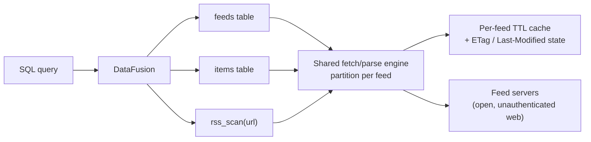
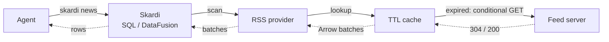
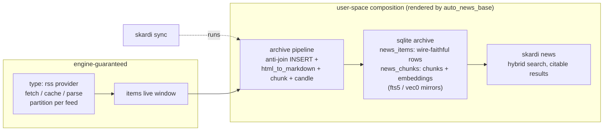
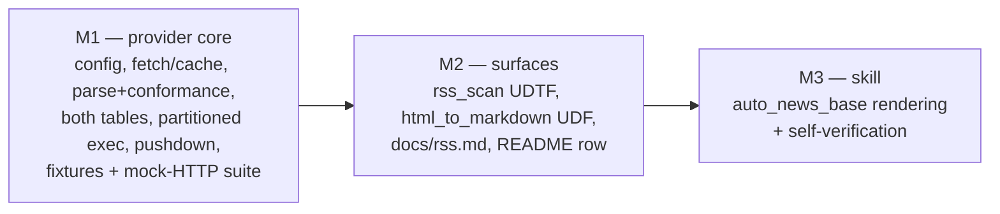

# RSS Feed Support Design

**Status:** Draft for review
**Date:** 2026-07-22
**Branch:** `add_RSS_Feed`

## Summary

Skardi will support RSS/Atom subscriptions as a first-class, read-only data source, `type: rss`. One configured source binds a subscription list and exposes two fixed tables: `feeds`, one row per subscription carrying fetch health, and `items`, the live union of all current entries across subscriptions. Scans fetch at query time through a per-feed TTL cache with HTTP conditional requests; each feed is an independent execution partition, so a dead feed degrades visibly instead of failing the scan.

The design exposes three SQL surfaces:

1. Persistent stable tables `<name>.main.feeds` and `<name>.main.items`, registered from context YAML.
2. `rss_scan(url)`, a registration-free UDTF for previewing any feed ad hoc.
3. `html_to_markdown()`, a scalar UDF that closes the type gap between feed HTML and `chunk('markdown', …)` pipelines.

The provider is deliberately a pure protocol adapter. History retention, chunking, embedding, and hybrid retrieval compose from existing primitives — anti-join `INSERT` pipelines, `chunk()`, `candle()`, `sqlite_knn`/`sqlite_fts`. An `auto_news_base` skill renders and self-verifies that composition end to end.

## Motivation

Agents need continuously updating external information — industry news, competitor blogs, arXiv categories, CVE announcements, GitHub releases — as *retrievable, citable context* rather than one-shot web searches. RSS/Atom is the only open, machine-readable standard for this class of content, and it remains ubiquitous.

The engine already contains almost every needed primitive: pipelines can `INSERT`, `chunk()` and `candle()` run inline in SQL, `sqlite_knn`/`sqlite_fts` power hybrid search, aliases expose short verbs, and semantics overlays make tables agent-discoverable. What is missing is the protocol translation — feed XML to relational rows — and the packaging that lets a user get from "the blogs I read" to "my agent can search them" in one conversation.

## Research Findings

Multiple feed dialects coexist on the wild web and will indefinitely: RSS 0.9x, RSS 1.0 (RDF), RSS 2.0, Atom 0.3, Atom 1.0, and JSON Feed 1.x. They differ in envelope, field names, and date formats (RFC 822 vs ISO 8601 vs RFC 3339) but describe the same relational shape: a channel of entries with identity, title, link, timestamps, content, and categories.

Feeds routinely misdescribe themselves: Atom documents served with an `application/rss+xml` Content-Type, `<rss version="2.0">` documents missing spec-required channel fields, encoding declarations that lie, unescaped entities, and truncated documents. Python's `feedparser` tolerates two decades of this; Rust's `feed-rs` parses all the dialects above (JSON Feed arrives free) but is stricter. The tolerance gap, not dialect coverage, is the known parsing risk, and it is handled by a sanitation pre-pass, a conformance record, and a fixture corpus rather than by parser choice.

## Goals

- Make a subscription list queryable as ordinary Arrow-backed DataFusion tables: subscription list in, `feeds` + `items` out, zero external processes.
- Normalize every wild-web dialect into one protocol-pinned relational representation.
- Serve live-by-default reads with a per-feed TTL cache and HTTP conditional requests (ETag / Last-Modified).
- Isolate faults per feed; make feed health queryable in SQL, never silent.
- Record declared-versus-parsed dialect conformance queryably.
- Publish the dialect → unified-schema mapping as documentation and semantics annotations.
- Preserve an escape hatch for ad-hoc exploration: `rss_scan(url)` without registration.
- Support federated joins between feed items and existing Skardi sources.
- Let `auto_news_base` assemble a searchable, citable news base from a natural-language subscription list, keep it maintainable afterwards through configuration edits alone, and keep results citable after entries leave the live window.

## Non-goals

- Full-article scraping. Feeds that carry only summaries are served as summaries; crawling is a different product.
- A scheduler. Refresh cadence belongs to the caller; the TTL cache makes polling cheap; nothing runs unbidden.
- Push (WebSub). Recorded as a future extension; it is a cache-invalidation signal, not a different provider shape.
- A write path. The source registers strictly read-only; `WRITABLE_SOURCE_TYPES` is untouched.
- Authenticated feeds. Cookie-, token-, or basic-auth-protected feeds belong behind Open Connector or a scoped follow-up.
- History retention in the provider. The live window is the contract; archiving is a pipeline composition.
- A gateway. RSS is unauthenticated public HTTP with an open wire format; a gateway adds a moving part and buys nothing.

## Decisions

The design choices, grouped by concern:

**Relational model**

- Model one source as one subscription list; a single feed is a list of length one.
- Register two fixed, protocol-pinned tables as a catalog: `feeds` and `items`, with a `feed` discriminator column instead of per-feed tables.
- Key item identity by `(feed, guid)`, with `guid` falling back to `link`.
- Serve a live window only; compose history through pipelines.

**Freshness, execution, and failure**

- Fetch at scan time through a per-feed TTL cache with HTTP conditional requests; cache only complete, successfully parsed windows.
- Execute one DataFusion partition per feed.
- Degrade per feed in multi-feed scans, visibly; fail fast in the single-feed `rss_scan`.
- Compile `rss_scan` and the catalog tables to one shared scan path.
- Push down only `feed`/`feed_url` equality and `IN`; stop launching fetches once `LIMIT` is satisfied.

**Configuration and registration**

- Configure through a typed `rss:` block, not the flat options map.
- Treat the subscription list as configuration, never as SQL-mutable data.
- Perform zero network I/O at registration.

**Parsing and normalization**

- Parse with `feed-rs` behind an `rss` Cargo feature, hardened by a sanitation pre-pass and a fixture corpus.
- Detect dialect and record declared-versus-parsed conformance queryably.
- Store content wire-faithful (HTML); provide `html_to_markdown()` as a separate scalar UDF.
- Pin stable columns for the RSS/Atom core plus enclosures; collapse other namespaces into `extensions_json`.
- Publish the dialect → unified-schema mapping in docs and as semantics-overlay column descriptions.

**Downstream contract**

- Archive in two tables: `news_items` keeps one wire-faithful row per entry and is the anti-join target; `news_chunks` holds chunks and embeddings — so citations and re-processing survive the live window.
- Keep every rendered artifact except the `rss:` block subscription-agnostic; subscription edits are configuration-only and re-render nothing.
- Render idempotently: `IF NOT EXISTS` DDL, diff-before-write, never blind-overwrite a user-edited file.

## Alternatives Considered

### Per-feed tables

Discovery-style catalogs (sqlite) exist because table structure is unknown ahead of time; RSS structure is pinned by the protocol, so there is nothing to discover — only identical schemas repeated N times. Per-feed tables would fragment the primary query ("search all my subscriptions") into `UNION ALL`, force table-name aliasing for unstable feed titles, and turn every subscription edit into registration churn. Rejected.

### A generic `type: xml` source

XML is syntax, not a data contract: a generic XML source cannot declare a fixed schema without a user-authored XPath mapping layer, which is a different and much larger product. RSS/Atom is a protocol with known fields — exactly what a `TableProvider`'s fixed `SchemaRef` wants. Rejected.

### History or archive inside the provider

A provider that owns an archive database is stateful, needs retention policy, compaction, and its own dedup — all of which pipelines plus a writable source already provide, governed and inspectable. Rejected.

### Scan-level all-or-nothing failure for multi-feed scans

One unreachable blog would render a 50-subscription news base unqueryable. The spirit of the Open Connector rule — no *silent* incompleteness — is kept while the granularity moves to the feed. Rejected for `items`; adopted for `rss_scan`.

## High-level Architecture

The provider owns everything from feed URL to Arrow batches; everything downstream is user-space composition.



One agent request, end to end — solid arrows carry the request outward, dashed arrows the response back. The Feed server leg fires only when the cache window has expired; within TTL the response turns around at the cache. Per-partition rules and failure modes are normative in "Scan Execution".



Downstream, the live window feeds ordinary pipelines; the `auto_news_base` skill renders the user-space half of this picture:



## Components

Eight components in four layers: configuration (boot-time, zero network), the engine (together, the shared fetch/parse engine of the architecture diagram), the SQL surface (the three query entry points), and packaging (user space, outside the provider).

### Configuration layer

#### Source registration

`DataSourceType::Rss` variant, dispatch arms in `crates/server/src/config.rs` and `crates/cli/src/main.rs`, membership in `CATALOG_SUPPORTED_SOURCES` and deliberate absence from `WRITABLE_SOURCE_TYPES`, and a Cargo feature `rss = ["dep:feed-rs", …]` following the `documents` precedent. Registration validates configuration only — URL syntax, bounds, OPML readability — and performs zero network I/O; probing dozens of feeds at boot would make startup slow and brittle.

#### Typed configuration

`DataSource` receives an optional typed `rss` field, valid only for `type: rss`, because the flat `options: HashMap<String, String>` cannot safely express a nested subscription list. It carries the subscription list (inline or an OPML path, mutually exclusive), TTL, politeness bounds, and user agent.

### Engine layer

#### Fetcher

The fetcher owns bounded HTTP: per-request timeout, total scan deadline, response-size cap, bounded jittered retries honoring `Retry-After`, cancellation, and conditional GET with stored ETag / Last-Modified validators. Concurrency is capped by `max_concurrent`, which doubles as the per-host politeness bound. A self-identifying `User-Agent` is sent by default — feed servers routinely ban anonymous clients.

#### Cache

A per-feed, in-memory, bounded (bytes + entries, LRU) TTL cache behind a small trait so a persistent implementation can be swapped in later without touching the table providers. An entry stores parsed Arrow batches, ETag / Last-Modified validators, and fetch metadata. Only complete, successfully parsed feed windows are ever stored.

#### Parser and conformance checker

A strict `feed-rs` parse is attempted first; on failure a bounded, deterministic sanitation pass runs and the parse is retried once. After every successful parse, a conformance check records the declared dialect, the parsed dialect, and any deviations. Details in "Parsing, Sanitation, and Conformance".

### SQL layer

#### Table providers and execution plan

`feeds` and `items` are fixed-`SchemaRef` `TableProvider`s over a shared execution plan that exposes one partition per subscription. A `feeds` scan reads cache/state for feeds within TTL and revalidates the rest — the cheap health check.

#### `rss_scan` UDTF and `html_to_markdown()` UDF

`rss_scan(url)` returns the `items` schema for a single unregistered feed through the same fetch/sanitize/parse path, default TTL 0. `html_to_markdown()` is a scalar UDF registered alongside the existing model UDFs, backed by a pure-Rust HTML→Markdown crate (`htmd`/`html2md` class, selected at implementation); it is useful for any HTML-bearing column, not just RSS.

### Packaging layer

#### `auto_news_base` skill

Lives in skardi-skills; this spec defines the contract it renders against. It holds no privileged API — everything it produces is plain user-space configuration.

Rendered artifacts: `ctx.yaml` (rss source + sqlite archive), a one-shot DDL script for the archive, `pipelines/archive_ingest.yaml`, `pipelines/search_hybrid.yaml`, `aliases.yaml` (`sync`, `news`), and a semantics overlay. Render rules: the DDL is idempotent (`CREATE TABLE IF NOT EXISTS`); re-rendering shows a diff before writing and never blind-overwrites a user-edited file.

The archive contract is two tables. `news_items` retains one wire-faithful row per entry — primary key `(feed, guid)`, plus `title`, `link`, `author`, `published`, and `content` (HTML) — and is the anti-join target for ingest. `news_chunks` holds `(feed, guid, chunk_idx, chunk_text, embedding, ingested_at)` with the fts5/vec0 mirrors attached. Ingest is two `INSERT` steps: new entries land wire-faithful in `news_items`, then are chunked and embedded from `news_items` into `news_chunks`. Search joins the two inside the archive, so results remain citable (title + link + published) after entries fall out of the live window, and history can always be re-chunked or re-embedded from retained content.

### Skill lifecycle

First assembly is the five-step flow under Rollout. Afterwards, every rendered artifact except the `rss:` block is subscription-agnostic — pipelines, DDL, aliases, and semantics reference `news.main.items`, never individual feeds — so the lifecycle splits cleanly:

- **Subscription add/remove (frequent):** a pure configuration action — preview with `rss_scan`, edit the `rss:` block or OPML, reload. No artifact is re-rendered. Removing a subscription retains its archived history by default (its rows simply stop growing); the skill offers an optional cleanup statement.
- **Parameter change (rare):** a new chunk size, overlap, or embedding model requires re-rendering the two pipelines and rebuilding `news_chunks` from the content retained in `news_items`; the skill owns this rebuild flow.
- **Skill re-run over an existing setup:** safe by construction — idempotent DDL, diff-before-write, no blind overwrites.

## Catalog Namespace

One configured source is a catalog; the two stable tables live beneath the conventional `main` schema, mirroring the sqlite catalog convention:

```text
<source name>.main.feeds
<source name>.main.items
```

## Persistent Context Binding

```yaml
kind: context
metadata: { name: news-context, version: 1.0.0 }
spec:
  data_sources:
    - name: news
      type: rss
      hierarchy_level: catalog
      rss:
        feeds:
          - url: https://blog.rust-lang.org/feed.xml
            name: rust-blog            # optional; defaults to the URL
          - url: https://this-week-in-rust.org/rss.xml
        # or: opml: subscriptions.opml # mutually exclusive with feeds:
        ttl_seconds: 900               # 0 = always live
        max_concurrent: 6              # fetch parallelism and per-host politeness bound
        request_timeout_seconds: 10
        max_response_bytes: 5242880
        user_agent: "skardi-rss/<version> (+https://github.com/SkardiLabs/skardi)"
```

Subscription management is a configuration action, not a SQL action: no SQL statement can add, alter, or remove a subscription, preserving the SQL validator's no-DDL invariant. Agents manage subscriptions by editing `ctx.yaml`/OPML and reloading — a flow the `auto_news_base` skill owns.

## SQL Interfaces

### Stable tables

The preferred interface for repeated queries and federated joins:

```sql
SELECT title, link, published
FROM news.main.items
WHERE feed = 'rust-blog'
  AND published >= timestamp '2026-07-01 00:00:00'
ORDER BY published DESC
LIMIT 20;
```

The `feed = 'rust-blog'` predicate prunes execution to exactly one partition — one HTTP fetch at most. The health check is plain SQL:

```sql
SELECT name, last_status, dialect, item_count, last_error
FROM news.main.feeds;
```

### `rss_scan` UDTF

Ad-hoc preview of any feed, no registration:

```sql
SELECT title, link, published
FROM rss_scan('https://blog.example.com/feed.xml')
LIMIT 10;
```

Same schema, same scan path, single-origin and therefore fail-fast. This is the skill's subscribe-time preview and any user's "what is in this feed?" one-liner.

### `html_to_markdown()` in pipelines

```sql
SELECT chunk('markdown', html_to_markdown(COALESCE(content, summary)), 1200, 120)
FROM news.main.items;
```

## Table Schemas

`<name>.main.feeds` — one row per subscription:

| Column | Arrow type | Nullability | Notes |
|---|---|---|---|
| `name` | `Utf8` | not null | configured name; defaults to URL; unique |
| `url` | `Utf8` | not null | subscription URL |
| `title` | `Utf8` | nullable | wire title, once fetched |
| `site_url` | `Utf8` | nullable | feed's HTML alternate |
| `description` | `Utf8` | nullable | |
| `last_fetch` | `Timestamp(ms, UTC)` | nullable | |
| `last_status` | `Utf8` | not null | `never` \| `fresh` \| `revalidated` \| `stale-error` \| `error` |
| `http_status` | `UInt16` | nullable | last HTTP response code |
| `last_error` | `Utf8` | nullable | fetch/parse error, redacted |
| `etag` / `last_modified` | `Utf8` | nullable | conditional-request state |
| `dialect` | `Utf8` | nullable | parsed dialect: `rss-0.9x` \| `rss-1.0` \| `rss-2.0` \| `atom-0.3` \| `atom-1.0` \| `json-feed-1.x` |
| `dialect_declared` | `Utf8` | nullable | what the document claimed (root element + version attr; Content-Type corroborates) |
| `conformance_notes` | `Utf8` | nullable | JSON array: declared/parsed mismatch, missing spec-required fields, sanitation repairs; `[]` = clean |
| `item_count` | `UInt64` | nullable | entries in current window |

`<name>.main.items` — the live union across subscriptions; primary key `(feed, guid)`:

| Column | Arrow type | Nullability | Notes |
|---|---|---|---|
| `feed` | `Utf8` | not null | subscription `name`; pushdown-prunable |
| `feed_url` | `Utf8` | not null | pushdown-prunable |
| `guid` | `Utf8` | not null | `entry.id`, falling back to `link` |
| `title` | `Utf8` | nullable | |
| `link` | `Utf8` | nullable | |
| `author` | `Utf8` | nullable | |
| `published` | `Timestamp(ms, UTC)` | nullable | |
| `updated` | `Timestamp(ms, UTC)` | nullable | |
| `content` | `Utf8` | nullable | wire-faithful HTML (full content when present) |
| `summary` | `Utf8` | nullable | wire-faithful HTML |
| `categories` | `List<Utf8>` | nullable | |
| `enclosure_url` | `Utf8` | nullable | podcast/media support |
| `enclosure_type` | `Utf8` | nullable | MIME type |
| `enclosure_length` | `UInt64` | nullable | bytes |
| `position` | `UInt32` | not null | document order within the feed window |
| `extensions_json` | `Utf8` | nullable | non-core namespaces as JSON |

In-place updates to an entry (same `guid`, new `updated`) simply reflect in the live window; versioning is an archive concern.

## Field Mapping

The normative dialect → unified-schema mapping. It ships in `docs/rss.md` and — as column descriptions — in a bundled semantics overlay, so an agent inspecting the schema sees the provenance of every column without reading provider source.

| `items` column | RSS 2.0 | RSS 1.0 (RDF) | Atom 1.0 | JSON Feed 1.x |
|---|---|---|---|---|
| `guid` | `<guid>` → fallback `<link>` | `rdf:about` → fallback `<link>` | `<id>` | `id` |
| `title` | `<title>` | `<title>` | `<title>` (text/html/xhtml normalized) | `title` |
| `link` | `<link>` | `<link>` | `<link rel="alternate">` (first, else first link) | `url` |
| `author` | `<author>` / `dc:creator` | `dc:creator` | `<author><name>` | `authors[0].name` |
| `published` | `<pubDate>` (RFC 822) | `dc:date` (ISO 8601) | `<published>` (RFC 3339) | `date_published` |
| `updated` | — (extensions) | — | `<updated>` (RFC 3339) | `date_modified` |
| `content` | `content:encoded` | `content:encoded` | `<content>` | `content_html` / `content_text` |
| `summary` | `<description>` | `<description>` | `<summary>` | `summary` |
| `categories` | `<category>*` | `dc:subject*` | `<category term>*` | `tags[]` |
| `enclosure_*` | `<enclosure url/type/length>` | — | `<link rel="enclosure">` | `attachments[0]` |

All date formats normalize to `Timestamp(ms, UTC)` at parse time. Fields a dialect lacks are simply null — nullability in the schema *is* the dialect-coverage annotation. Anything outside this table lands in `extensions_json`.

## Scan Execution

Catalog tables and `rss_scan` share one scan pipeline.

```mermaid
sequenceDiagram
    participant DF as DataFusion
    participant TP as RSS TableProvider
    participant C as Per-feed TTL cache
    participant W as Feed server

    DF->>TP: scan(projection, filters, limit)
    TP->>TP: prune partitions (feed / feed_url predicates)
    loop each surviving feed partition (parallel)
        TP->>C: look up feed entry
        alt within TTL
            C-->>TP: cached Arrow batches (zero network)
        else expired
            TP->>W: conditional GET (ETag / Last-Modified)
            alt 304 Not Modified
                TP->>C: re-arm TTL, no reparse
                C-->>TP: cached Arrow batches
            else 200 OK
                W-->>TP: feed document
                TP->>TP: strict parse → sanitize+retry → conformance check → Arrow
                TP->>C: store complete window + validators
            else fetch/parse failure
                TP->>TP: serve stale window (marked) or zero rows;<br/>record feeds.last_status / last_error; trace warning
            end
        end
    end
    TP-->>DF: RecordBatch stream
```

Execution rules:

- Each feed is one DataFusion partition: parallel fetching without a bespoke pool, streaming batches (fast feeds emit before slow ones), and a natural fault boundary.
- `feed`/`feed_url` equality and `IN` predicates prune partitions before any fetch and are reported `Exact`; all other predicates remain in DataFusion — RSS has no query parameters, so nothing else can reach the wire.
- `LIMIT` stops launching further partitions once satisfied; items have no global order (documented).
- Cancellation aborts in-flight requests and prevents further partitions.
- Every scan is bounded by request timeout, total scan deadline, response-size cap, and `max_concurrent`.
- Incomplete scans are never cached.

## Freshness and Caching

Live reads are the default; `ttl_seconds: 0` means always-live. Three freshness tiers per feed:

1. Within TTL → serve cache, zero network.
2. TTL expired, HTTP 304 → header-only revalidation; cache re-armed without reparsing (`last_status = 'revalidated'`).
3. HTTP 200 → full sanitize/parse/convert; cache replaced.

Cache entries are per feed, not per scan, so partial hits refetch only expired feeds. The completeness invariant is adopted at feed granularity: **only a complete, successfully parsed feed window is ever cached** — a half-parsed feed is never served. Conditional requests still minimize transfer under `ttl_seconds: 0`.

Caching claims no cross-feed consistency: a multi-feed scan can observe different feeds at different freshness, visible per row via `feeds.last_fetch`.

## Parsing, Sanitation, and Conformance

`feed-rs` parses RSS 0.9x/1.0/2.0, Atom 0.3/1.0, and JSON Feed 1.0/1.1. The tolerance strategy:

1. **Sanitation pre-pass, on failure only.** A strict parse is attempted first. On failure, a bounded, deterministic sanitation pass runs — encoding sniff (BOM / XML declaration / `encoding_rs`), re-encode to UTF-8, strip control characters, repair naked ampersands — and the parse is retried once. Both attempts and applied repairs are traced and recorded in `conformance_notes`.
2. **Conformance check, after every successful parse.** Detect the declared dialect from the document itself (root element + version attribute; Content-Type as corroboration), compare with what `feed-rs` parsed, and verify the dialect's spec-required fields (e.g. RSS 2.0 channel `title`/`link`/`description`). Deviations populate `feeds.dialect_declared` / `dialect` / `conformance_notes`; they never reject a feed that parsed — the check converts silent tolerance into queryable evidence.
3. **Fixture corpus as a regression ratchet.** `providers/rss/fixtures/` holds real-world feed documents across dialects plus every failure case encountered during development and in the field. Contract tests assert that every fixture either parses or degrades per-feed with a recorded reason — never a panic, never a silent skip. The corpus only grows.
4. **Documented tolerance floor.** Feeds that still fail are visible via `feeds.last_status = 'error'` with `last_error` naming the parse stage; `docs/rss.md` states plainly what Skardi does not salvage.
5. **Evidence loop.** Live-feed failures extend the sanitation pass and the corpus; the parser choice is revisited only if the gap versus `feedparser` proves structural rather than case-by-case.

Content is stored wire-faithful (HTML); transformation is a query-time choice via `html_to_markdown()`.

## Failure Modes

| Scenario | Behavior |
|---|---|
| Feed down / DNS failure | Partition serves stale cached window (`stale-error`) or zero rows if never fetched; other partitions unaffected; `feeds` row records error; tracing warns |
| Malformed XML | Strict parse → sanitation → retry; success traced with repairs recorded; failure sets `last_status = 'error'`, `last_error` names the parse stage |
| Dialect misdeclaration | Parses normally; mismatch recorded in `dialect_declared` vs `dialect` and `conformance_notes` |
| Feed omits `guid` | `link` used as guid; dedup collapses to link identity |
| Response exceeds `max_response_bytes` | Fetch aborts with a targeted error status; never partial-parsed |
| Slow feed | Per-request timeout isolates it; scan deadline bounds the whole query |
| HTTP 304 | Cache re-armed without reparse; `last_status = 'revalidated'` |
| HTTP 429 / transient 5xx | Bounded jittered retries honoring `Retry-After` within the scan deadline |
| `rss_scan` on a bad URL/feed | Fails fast with a targeted HTTP or parse error (single-origin all-or-nothing) |
| `LIMIT` satisfied early | Remaining partitions never launch; incomplete scans are never cached |

## Observability

Each scan records structured tracing fields and metrics for: source and feed names, cache hit/revalidation/miss per feed, HTTP status, bytes received, retries and rate-limit waits, sanitation repairs applied, conformance deviations, rows emitted, scan duration, and terminal error category. Feed URLs are safe to log; response bodies are not logged.

## Rollout Plan

Three milestones, independently reviewable; each gets its own implementation plan.



The `auto_news_base` flow (M3): collect a natural-language subscription list or OPML → autodiscover feed URLs from site HTML → preview each with `rss_scan` and confirm → render `ctx.yaml`, the two-table archive DDL (`news_items` + `news_chunks`), ingest/search pipelines, aliases (`sync`, `news`), semantics overlay → self-verify by running `skardi sync` then `skardi news "<probe>"`, asserting non-empty citable results served from the archive itself (no live-window join) and reporting per-feed health.

## Testing Strategy

- **Unit:** typed config parsing/validation (inline vs OPML, bounds), cache keying/TTL/eviction/completeness invariant, sanitation determinism, feed-rs → Arrow conversion (nulls, timestamps, categories, enclosures, extensions_json), guid fallback, dialect detection.
- **Fixture corpus contract tests:** every fixture parses or degrades visibly; row-value assertions per dialect following the Field Mapping table; dialect and `conformance_notes` asserted per fixture, including deliberate liars (Atom served as `rss+xml`, RSS 2.0 missing required channel fields).
- **Mock-HTTP integration:** a local server exercises TTL tiers (fresh / 304 / 200), request counting for partition pruning, dead-feed isolation, response-size cap, timeout, retry/`Retry-After`, cancellation, zero-network registration.
- **End-to-end:** ctx.yaml registration; `items` × sqlite federated join; the full archive pipeline (`html_to_markdown` → `chunk` → `candle` → INSERT into `news_items` + `news_chunks`) with rerun idempotency; citability after window expiry (mock feed window shrinks between syncs, archived entries stay citable); subscription add/remove touching only the `rss:` block; parameter-change rebuild of `news_chunks` from `news_items`; `rss_scan` schema parity with the registered tables.
- **Live tests:** opt-in, ignored by default, never in ordinary CI.

## Acceptance Criteria

1. A `ctx.yaml` with N subscriptions registers with zero network I/O (mock server observes no requests at startup).
2. `SELECT * FROM news.main.items` fetches all feeds concurrently; `WHERE feed = 'x'` fetches exactly one (verified by mock request counts).
3. Two scans within TTL cause one fetch per feed; after TTL expiry an unchanged feed takes the 304 path with no reparse.
4. With one dead feed among N, `items` returns the other feeds' rows, `feeds.last_status`/`last_error` reflect the failure, and a tracing warning is emitted — nothing silent.
5. `rss_scan(url)` returns the `items` schema without registration and fails fast on a broken feed.
6. Every corpus fixture parses or degrades per-feed with a recorded reason; no fixture panics.
7. The archive pipeline INSERTs wire-faithful rows into `news_items` and chunk/embedding rows into `news_chunks` via `html_to_markdown()` + `chunk()` + `candle()`; rerunning it inserts zero new rows.
8. `items` participates in a federated join with an existing Skardi source.
9. On a clean machine, `auto_news_base` takes a natural-language subscription list to a working news base and its self-verification passes; an unmodified agent session drives `sync`/`news` using only README + `--help`.
10. Timestamps surface as typed Arrow timestamps; enclosures, categories, and `extensions_json` populate per fixtures.
11. For every fixture, `feeds.dialect` matches the known dialect; a mismatching or spec-violating fixture yields non-empty `conformance_notes` while still serving rows.
12. After an entry falls out of the live window (mock server shrinks the feed between syncs), `skardi news` still returns its title, link, and published timestamp from the archive.
13. Adding or removing a subscription changes only the `rss:` block/OPML; every other rendered artifact is byte-identical.

## Expected Repository Shape

```text
crates/skardi/src/sources/providers/rss/
├── mod.rs        # register_rss_tables(), feature-gated
├── config.rs     # typed RssConfig: feeds/opml, ttl, bounds, user_agent
├── fetch.rs      # HTTP client, conditional GET, retries, bounds
├── cache.rs      # per-feed TTL cache behind a swap-friendly trait
├── parse.rs      # sanitation pre-pass + conformance check + feed-rs → Arrow
├── table.rs      # feeds/items TableProviders (fixed SchemaRef)
├── exec.rs       # partition-per-feed ExecutionPlan
├── udtf.rs       # rss_scan table function
└── fixtures/     # compatibility corpus (tests only)
crates/skardi/src/model/html_markdown.rs   # html_to_markdown() scalar UDF
docs/rss.md
```

Directional rather than a filename mandate; the boundaries — HTTP, caching, parsing/conformance, DataFusion integration — must remain independently testable. Plus the four standard touch-points: `data_source_type.rs` variant, dispatch arms in `crates/server/src/config.rs` and `crates/cli/src/main.rs`, the `rss` feature in `crates/skardi/Cargo.toml`, and the typed `rss` field on `DataSource`. The skill lands in the external skardi-skills repository as `auto_news_base/`.

## Documentation Commitments

- README supported-sources table row and architecture mention.
- `docs/rss.md`: configuration reference, freshness/caching semantics, politeness defaults, the Field Mapping table, conformance-check semantics, tolerance floor, `rss_scan` and pipeline examples, troubleshooting.
- A bundled semantics overlay snippet whose column descriptions carry per-dialect provenance.
- Example `ctx.yaml` under `docs/sample_data` or equivalent.
- skardi-skills: `auto_news_base` README with the five-step flow and self-verification contract.

## Future Extensions

- WebSub (push) as a cache-invalidation signal; requires a resident server; the live-window contract is unchanged.
- Persistent / shared cache behind the existing cache trait; enables serve-stale across restarts.
- Scheduled snapshot materialization when a scheduler primitive exists.
- RFC 5005 paged/archived feeds; extends the fetch layer, not the schema.
- Authenticated feeds behind Open Connector or a scoped credential design.
- Full-article extraction as a separate design; explicitly not this provider.

These are not part of the three milestones.
