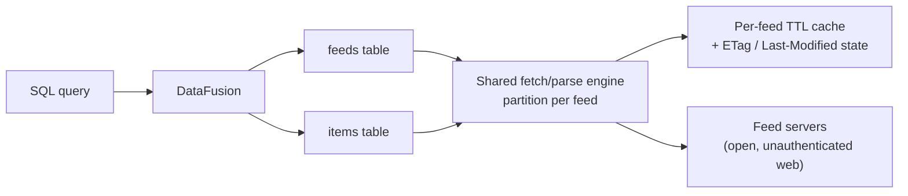
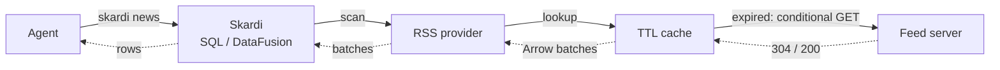
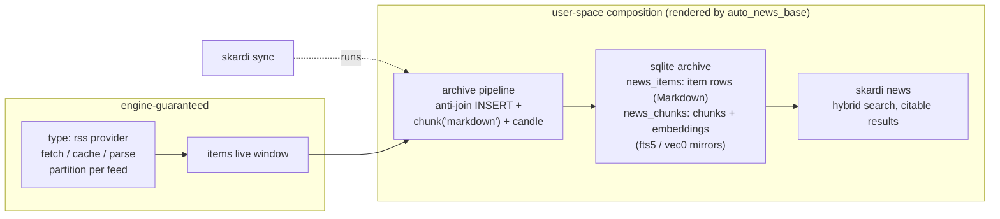
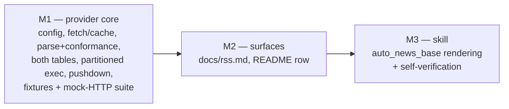

# RSS Feed Support Design

**Status:** Draft for review
**Date:** 2026-07-22 (egress boundary revised 2026-08-03 — see Security)
**Branch:** `add_RSS_Feed`

## Summary

Skardi will support RSS/Atom subscriptions as a first-class, read-only data source, `type: rss`. One configured source binds a subscription list and exposes two fixed tables: `feeds`, one row per subscription carrying fetch health, and `items`, the live union of all current entries across subscriptions. Scans fetch at query time through a per-feed TTL cache with HTTP conditional requests; each feed is an independent execution partition, so a dead feed degrades visibly instead of failing the scan; served rows carry their window's freshness in-band via `window_status`.

The design exposes one SQL surface: persistent stable tables `<name>.main.feeds` and `<name>.main.items`, registered from context YAML. Item content is stored as Markdown: the provider converts each entry's extracted HTML once, at extraction time, through a deterministic internal HTML→Markdown pass — so query results drop into prompts as-is, chunking uses the existing `'markdown'` mode, and no engine surface changes outside the provider.

The provider is deliberately a pure protocol adapter. History retention, chunking, embedding, and hybrid retrieval compose from existing primitives — anti-join `INSERT` pipelines, `chunk()`, `candle()`, `sqlite_knn`/`sqlite_fts`. An `auto_news_base` skill renders and self-verifies that composition end to end.

## Motivation

Agents need continuously updating external information — industry news, competitor blogs, arXiv categories, CVE announcements, GitHub releases — as *retrievable, citable context* rather than one-shot web searches. RSS/Atom is the only open, machine-readable standard for this class of content, and it remains ubiquitous. The continuity is caller-supplied: the provider fetches only when read, so unattended freshness — and archive capture — depends on a scheduled `skardi sync` (cron or a recurring agent session); nothing self-refreshes (see Non-goals).

The engine already contains almost every needed primitive: pipelines can `INSERT`, `chunk()` and `candle()` run inline in SQL, `sqlite_knn`/`sqlite_fts` power hybrid search, aliases expose short verbs, and semantics overlays make tables agent-discoverable. What is missing is the protocol translation — feed XML to relational rows — and the packaging that lets a user get from "the blogs I read" to "my agent can search them" in one conversation.

## Research Findings

Multiple feed dialects coexist on the wild web and will indefinitely: RSS 0.9x, RSS 1.0 (RDF), RSS 2.0, Atom 0.3, Atom 1.0, and JSON Feed 1.x. They differ in envelope, field names, and date formats (RFC 822 vs ISO 8601 vs RFC 3339) but describe the same relational shape: a channel of entries with identity, title, link, timestamps, content, and categories.

Feeds routinely misdescribe themselves: Atom documents served with an `application/rss+xml` Content-Type, `<rss version="2.0">` documents missing spec-required channel fields, encoding declarations that lie, unescaped entities, and truncated documents. Python's `feedparser` tolerates two decades of this; Rust's `feed-rs` parses all the dialects above (JSON Feed arrives free) but is stricter. The tolerance gap, not dialect coverage, is the known parsing risk, and it is handled by a sanitation pre-pass, a conformance record, and a fixture corpus rather than by parser choice.

## Goals

- Make a subscription list queryable as ordinary Arrow-backed DataFusion tables: subscription list in, `feeds` + `items` out, zero external processes.
- Normalize every wild-web dialect into one protocol-pinned relational representation.
- Serve item content LLM-ready: Markdown, converted once at extraction — prompt-ready query results, tag-free text for fts5 and embeddings, no per-consumer conversion.
- Serve live-by-default reads with a per-feed TTL cache and HTTP conditional requests (ETag / Last-Modified).
- Isolate faults per feed; make feed health queryable in SQL and stale degradation visible in-band on served rows, never silent.
- Record declared-versus-parsed dialect conformance queryably.
- Publish the dialect → unified-schema mapping as documentation and semantics annotations.
- Support federated joins between feed items and existing Skardi sources.
- Let `auto_news_base` assemble a searchable, citable news base from a natural-language subscription list, keep it maintainable afterwards through configuration edits alone, and keep results citable after entries leave the live window.

## Non-goals

- Full-article scraping. Feeds that carry only summaries are served as summaries; crawling is a different product.
- A scheduler. Refresh cadence belongs to the caller; the TTL cache makes polling cheap; nothing runs unbidden.
- Push (WebSub). Recorded as a future extension; it is a cache-invalidation signal, not a different provider shape.
- A write path. The source registers strictly read-only; `WRITABLE_SOURCE_TYPES` is untouched.
- Authenticated feeds. Cookie-, token-, or basic-auth-protected feeds belong behind Open Connector or a scoped follow-up.
- Ad-hoc scanning of unregistered feeds. An `rss_scan(url)` preview UDTF was cut at review: every feed Skardi reads is declared in configuration first. Registration is zero-I/O and a first `items` scan plus the `feeds` health table covers the preview need; recorded as a future extension.
- History retention in the provider. The live window is the contract; archiving is a pipeline composition.
- A gateway. RSS is unauthenticated public HTTP with an open wire format; a gateway adds a moving part and buys nothing.

## Decisions

The design choices, grouped by concern:

**Relational model**

- Model one source as one subscription list; a single feed is a list of length one.
- Register two fixed, protocol-pinned tables as a catalog: `feeds` and `items`, with a `feed` discriminator column instead of per-feed tables.
- Key item identity by `(feed, guid)`, with `guid` falling back to `link`.
- Serve a live window only; compose history through pipelines.

**Freshness, execution, and failure**

- Fetch at scan time through a per-feed TTL cache with HTTP conditional requests; cache only complete, successfully parsed windows.
- Initiate fetches only from `items` scans; `feeds` is a pure, side-effect-free observation surface. Every attempt re-arms the TTL — success, 304, or failure alike (negative caching) — so a failure is a remembered result, not a gap.
- Execute one DataFusion partition per feed.
- Degrade per feed, visibly; a dead feed never fails the whole scan. Stamp every `items` row with its window's freshness (`window_status`), so stale-window degradation reaches the consumer in the result stream itself, without a `feeds` lookup; a feed yielding zero rows remains visible only via `feeds` — absent rows have no in-band carrier, so a prescribed anti-join absence check covers them (see SQL Interfaces).
- Push down only `feed`/`feed_url` equality and `IN`; stop launching fetches once `LIMIT` is satisfied.

**Configuration and registration**

- Configure through a typed `rss:` block, not the flat options map.
- Treat the subscription list as configuration, never as SQL-mutable data.
- Expose registered subscriptions only; ad-hoc scanning of unregistered URLs is deferred (see Non-goals).
- Perform zero network I/O at registration.

**Parsing and normalization**

- Parse with `feed-rs` behind an `rss` Cargo feature, hardened by a sanitation pre-pass and a fixture corpus.
- Detect dialect and record declared-versus-parsed conformance queryably.
- Store item content as Markdown: a deterministic HTML→Markdown conversion runs inside the provider at extraction time, so chunking uses the existing `'markdown'` mode — no new chunk mode, no new UDF, no engine change outside the provider.
- Pin stable columns for the RSS/Atom core plus enclosures; collapse other namespaces into `extensions_json`.
- Publish the dialect → unified-schema mapping in docs and as semantics-overlay column descriptions.

**Downstream contract**

- Archive in two tables: `news_items` keeps one row per entry, content exactly as `items` served it (Markdown), and is the anti-join target; `news_chunks` holds chunks and embeddings — so citations and re-processing survive the live window.
- Keep every rendered artifact except the `rss:` block subscription-agnostic; subscription edits are configuration-only and re-render nothing.
- Render idempotently: `IF NOT EXISTS` DDL, diff-before-write, never blind-overwrite a user-edited file.
- Version the engine↔skill surface: `feeds`/`items` evolve additively under an integer `rss` surface version — surfaced at registration, stamped into rendered artifacts, checked at pipeline load (see Skill lifecycle).

**Security and trust boundary**

- Do not sandbox fetch egress in OSS: feed URLs reach any address the host can route to. The fetcher exposes an `EgressPolicy` seam (default `AllowAll`) so an operator or Skardi Cloud can inject destination filtering, but OSS ships no default-deny — network-level egress control is the operator's responsibility (see Security and the [Cloud egress design](2026-08-03-rss-cloud-egress-design.md)).
- Store item content as Markdown produced by the provider's own conversion. The contract: no HTML **tag** survives as markup (`<script>`/`<style>` dropped, markup without a Markdown equivalent reduced to its text content); tag-shaped **text** can survive in two pinned shapes — attribute-derived text keeps its literal `<`, and plain-text-typed bodies pass through byte-exact. Rendering it is therefore not optional hygiene but part of the contract: a consumer that renders the Markdown MUST keep raw/inline HTML disabled and filter link schemes (see Security).

## Alternatives Considered

### Per-feed tables

Discovery-style catalogs (sqlite) exist because table structure is unknown ahead of time; RSS structure is pinned by the protocol, so there is nothing to discover — only identical schemas repeated N times. Per-feed tables would fragment the primary query ("search all my subscriptions") into `UNION ALL`, force table-name aliasing for unstable feed titles, and turn every subscription edit into registration churn. Rejected.

### A generic `type: xml` source

XML is syntax, not a data contract: a generic XML source cannot declare a fixed schema without a user-authored XPath mapping layer, which is a different and much larger product. RSS/Atom is a protocol with known fields — exactly what a `TableProvider`'s fixed `SchemaRef` wants. Rejected.

### Wire-faithful HTML storage with query-time conversion

An earlier revision stored `content`/`summary` as wire-faithful HTML and bridged into chunking with a new `'html'` mode on `chunk()`. That kept the original markup — a future, better converter could re-render history — at the price of making every consumer pay for HTML on every read: prompts ingest tag noise (wasted tokens), fts5 and embeddings index markup instead of text, every chunking pipeline needs the bridge mode (an engine change), and each re-read or re-embed re-runs the same conversion. In practice the consumer of item content is retrieval and LLM context — nobody renders feed HTML — so markup fidelity served no live consumer while its costs recurred on every read. Reversed in favor of converting once at extraction and storing Markdown: prompt-ready results, clean text for fts5/embeddings, the already-shipped `'markdown'` chunk mode, one deterministic conversion instead of N query-time ones, and a narrower rendering surface (no HTML tag stored as markup). The accepted loss: source HTML is not retained, so history cannot be re-converted with a future converter; re-chunking and re-embedding from stored Markdown remain possible.

### History or archive inside the provider

A provider that owns an archive database is stateful, needs retention policy, compaction, and its own dedup — all of which pipelines plus a writable source already provide, governed and inspectable. Rejected.

### Scan-level all-or-nothing failure for multi-feed scans

One unreachable blog would render a 50-subscription news base unqueryable. The spirit of the Open Connector rule — no *silent* incompleteness — is kept while the granularity moves to the feed. Rejected.

### Result-level warnings instead of row stamps

The other candidate for an in-band degradation channel was a warning attached to the query result itself. DataFusion exposes no warning/notice channel and SQL defines no standard carrier for partial-result signals, so it would have to be a cross-cutting Skardi surface mechanism (CLI/server response envelope), not a provider feature. The row-level `window_status` stamp delivers the in-band signal with engine-native machinery instead; result-level warnings stay open as a future surface refinement. Neither mechanism can represent a feed that yields zero rows — absence has no in-band carrier in a relational result — which is why the `feeds` health table remains authoritative for `never`/`error` feeds.

## High-level Architecture

The provider owns everything from feed URL to Arrow batches; everything downstream is user-space composition.



One agent request, end to end — solid arrows carry the request outward, dashed arrows the response back. The Feed server leg fires only when the cache window has expired; within TTL the response turns around at the cache. Per-partition rules and failure modes are normative in "Scan Execution".



Downstream, the live window feeds ordinary pipelines; the `auto_news_base` skill renders the user-space half of this picture:



## Components

Eight components in four layers: configuration (boot-time, zero network), the engine (together, the shared fetch/parse engine of the architecture diagram), the SQL surface (the stable tables), and packaging (user space, outside the provider).

### Configuration layer

#### Source registration

`DataSourceType::Rss` variant, dispatch arms in `crates/server/src/config.rs` and `crates/cli/src/main.rs`, membership in `CATALOG_SUPPORTED_SOURCES` and deliberate absence from `WRITABLE_SOURCE_TYPES`, and a Cargo feature `rss = ["dep:feed-rs", …]` following the `documents` precedent. Registration validates configuration only — URL syntax, bounds, OPML readability — and performs zero network I/O; probing dozens of feeds at boot would make startup slow and brittle.

#### Typed configuration

`DataSource` receives an optional typed `rss` field, valid only for `type: rss`, because the flat `options: HashMap<String, String>` cannot safely express a nested subscription list. It carries the subscription list (inline or an OPML path, mutually exclusive), TTL, politeness bounds, and user agent.

### Engine layer

#### Fetcher

The fetcher owns bounded HTTP: per-request timeout, total scan deadline, a response-size cap enforced on the decompressed body (so a compressed payload cannot inflate past it), bounded jittered retries honoring `Retry-After`, cancellation, and conditional GET with stored ETag / Last-Modified validators. Concurrency is capped by `max_concurrent` — a bound on total fetch parallelism per source, not a per-host bound: nothing accounts per host, so feeds sharing a host can receive up to `max_concurrent` concurrent requests. It is per-process — each replica counts independently, so N replicas (or a crash/restart loop) can present a feed host with up to N× this bound. Politeness toward any single host rests on honoring `Retry-After` and per-feed TTL pacing, not on a per-host concurrency cap (a real per-host bound is left to the engine phase to consider — see the code comment on `max_concurrent`). A self-identifying `User-Agent` is sent by default — feed servers routinely ban anonymous clients.

The fetcher exposes an `EgressPolicy` seam: a trait consulted for every resolved address, on the initial URL and on every redirect hop, enforced at the DNS-resolver layer (`PolicyDns`) so an injected policy holds against DNS rebinding. OSS ships only the `AllowAll` implementation — by default the fetcher reaches any address the host can route to, including link-local (`169.254.169.254`) and RFC 1918 targets — and performs no destination filtering of its own. Feed URLs are agent-authored, i.e. attacker-influenceable, and constraining where they may point is delegated to the operator's infrastructure or to a policy injected through this seam (see Security and the [Cloud egress design](2026-08-03-rss-cloud-egress-design.md)). The manual per-hop redirect loop and IP-literal re-check remain regardless of policy: they carry the per-hop retry budget, validator suppression, and unconditional-`304` handling, which are correctness concerns independent of egress.

#### Cache

A per-feed, in-memory, bounded (bytes + entries, LRU) TTL cache behind a small trait so a persistent implementation can be swapped in later without touching the table providers. An entry stores parsed Arrow batches, ETag / Last-Modified validators, and fetch metadata. Only complete, successfully parsed feed windows are ever stored.

**Validators are stored with the URL that issued them.** A window records the *landing* URL of the fetch that produced it, and the next conditional request is aimed there rather than at the subscription's configured URL. Validators only travel on a fetch's first hop (an `ETag` means nothing to a different resource), so for a redirected feed — the ubiquitous `http`→`https` `301` — the validators belong to the final hop; presenting them to the configured URL reaches a redirector, which answers with another redirect instead of a `304`, and the feed re-downloads and re-parses in full on every scan, silently and forever (a mismatched validator only ever yields a correct `200`). Fetching the landing URL directly stops observing the configured one, so a third expiry clock, alongside the TTL and the failure fuse, periodically starts one fetch from the configured URL again to re-derive the landing URL and catch redirect drift — unconditionally, since the landing URL's validators are equally meaningless there. That probe costs exactly one un-optimized fetch, so probing every N refreshes retains (N−1)/N of the conditional-GET saving; the interval is `ttl × 24`, clamped to [6h, 7d]. The landing URL is cache state, not identity: `items.feed_url` and `feeds.url` remain the configured URL, and exposing the landing URL as a column is a possible additive follow-up rather than a promise.

The cache — validators included — is process-lifetime state: a restart empties it, so the first post-restart scan presents no validators and re-fetches every feed as a full `200`, never a `304`. The conditional-GET savings therefore vanish exactly when a fleet redeploys, and extend across restarts only once the persistent cache lands (see Future Extensions).

#### Parser and conformance checker

A strict `feed-rs` parse is attempted first; on failure a bounded, deterministic sanitation ladder applies repairs cumulatively, re-parsing after each rung and stopping at the first success. After every successful parse, a conformance check records the declared dialect, the parsed dialect, and any deviations. Details in "Parsing, Sanitation, and Conformance".

#### Markdown converter

After parse and field extraction, each entry's `content` and `summary` pass through a pure-Rust HTML→Markdown conversion (`htmd`/`html2md` class, selected at implementation) before Arrow conversion. The pass applies to HTML-typed values; plain-text values (JSON Feed `content_text`, Atom `type="text"`) pass through unchanged. The conversion is deterministic — identical fragment in, byte-identical Markdown out — and no HTML **tag** survives as markup: elements with Markdown equivalents convert (headings, lists, links, emphasis, code, tables, images), `<script>`/`<style>` and comments are dropped wholesale, and remaining markup is reduced to its text content. That claim is deliberately narrower than "no raw HTML in the output": tag-shaped **text** can survive in two pinned shapes — an attribute-derived value keeps its literal `<` (there is no Markdown position to escape it into, so `<a href="#" title="<script>">t</a>` converts to `[t](# "<script>")`), and the plain-text passthrough above is byte-exact, including anything tag-shaped a `type="text"` body carries. Escaping either would break the passthrough contract and pollute the primary consumers (prompts, fts5, embeddings) with transport noise, while buying no rendering safety the Security rules don't already require. It never fails a feed: pathological HTML degrades to text content, not to an error. The fixture corpus pins converted output byte-for-byte, so the contract binds whichever crate is chosen and a crate upgrade that changes output is a reviewed, fixture-visible change. The converter is provider-internal, behind the `rss` feature; the chunking module is untouched (see Alternatives Considered for the superseded `chunk('html')` bridge).

### SQL layer

#### Table providers and execution plan

`feeds` and `items` are fixed-`SchemaRef` `TableProvider`s over a shared execution plan that exposes one partition per subscription. A `feeds` scan is a pure state read — it never fetches or revalidates; all network I/O is initiated by `items` scans, so the health check is cheap by construction.

### Packaging layer

#### `auto_news_base` skill

Lives in skardi-skills; this spec defines the contract it renders against. It holds no privileged API — everything it produces is plain user-space configuration.

Rendered artifacts: `ctx.yaml` (rss source + sqlite archive), a one-shot DDL script for the archive, `pipelines/archive_ingest.yaml`, `pipelines/search_hybrid.yaml`, `aliases.yaml` (`sync`, `news`), and a semantics overlay. Render rules: the DDL is idempotent (`CREATE TABLE IF NOT EXISTS`); re-rendering shows a diff before writing and never blind-overwrites a user-edited file.

The archive contract is two tables. `news_items` retains one row per entry exactly as `items` served it — primary key `(feed, guid)`, plus `title`, `link`, `author`, `published`, and `content` (Markdown) — and is the anti-join target for ingest. `news_chunks` holds `(feed, guid, chunk_idx, chunk_text, embedding, ingested_at)` with the fts5/vec0 mirrors attached. Ingest is two `INSERT` steps: new entries land verbatim in `news_items`, then are chunked and embedded from `news_items` into `news_chunks`. Search joins the two inside the archive, so results remain citable (title + link + published) after entries fall out of the live window, and history can always be re-chunked or re-embedded from retained content.

`sync` ends by reporting health: the ingest pipeline's closing statement is a `SELECT` over `feeds` returning every degraded subscription (`last_status IN ('error', 'never', 'stale-error')`) with its reason (`last_error`) and as-of time (`last_fetch`) — the degradation discovered by the scan `sync` just ran surfaces in `sync`'s own output, where the agent can act on it (prune, fix, or caveat). The read is free (`feeds` is pure state, no fetches). An empty report means every feed is healthy — the rendered README states the convention — and the report never fails the run: a degraded feed changes the output, not the exit status. This three-statement pipeline (two `INSERT`s, one closing `SELECT`) requires statement sequences that return the last statement's rows as the response — a small pipeline-engine extension recorded as an M3 dependency; the two-`INSERT` ingest already needs it.

### Skill lifecycle

First assembly is the five-step flow under Rollout. Afterwards, every rendered artifact except the `rss:` block is subscription-agnostic — pipelines, DDL, aliases, and semantics reference `news.main.items`, never individual feeds — so the lifecycle splits cleanly:

- **Subscription add/remove (frequent):** a pure configuration action — edit the `rss:` block or OPML, reload, then scan `items` for the new feed (the scan forces the fetch) and read its `feeds` row (`last_status`, `last_error`). No artifact is re-rendered. Removing a subscription retains its archived history by default (its rows simply stop growing); the skill offers an optional cleanup statement.
- **Parameter change (rare):** a new chunk size, overlap, or embedding model requires re-rendering the two pipelines and rebuilding `news_chunks` from the content retained in `news_items`; the skill owns this rebuild flow.
- **Skill re-run over an existing setup:** safe by construction — idempotent DDL, diff-before-write, no blind overwrites.

**Engine↔skill schema contract.** Rendered artifacts embed `feeds`/`items` column names, the two halves live in repositories with independent release cadences, and a rendered pipeline, once in a user's context, outlives both. The contract is therefore versioned and checked, in four parts:

- **Declared surface (v1).** `feeds`/`items` form a stable public interface: the column set evolves additively; removing, renaming, or retyping a column, tightening nullability, repurposing an enum domain (`last_status`, `window_status`), or changing `(feed, guid)` identity or window semantics is a breaking change and bumps an integer `rss` surface version.
- **Visible at registration (v1).** Registration logs the active surface version and carries it in table metadata — an upgrade that changes it is visible rather than silent, the Open Connector convention.
- **Pinned consumer fixture (v1).** A canonical render of the skill's artifacts (archive DDL, both pipelines), provenance-stamped with the skill version that produced it, is vendored into the engine's fixture corpus as a representative consumer exercising every contract point. Acceptance criteria 6 and 11 run against it in engine CI, so an engine change that breaks the rendered surface fails in-repo, with no cross-repo plumbing. It refreshes when the contract changes, not when the skill does; the skill repository conversely tests its render against a pinned engine release.
- **Load-time handshake (M3, with the skill).** The skill stamps `requires: rss/<version>` into each rendered pipeline's metadata; the pipeline loader checks equality and refuses a mismatch with an error naming both versions and the remedy — re-run `auto_news_base` to re-render. This lands with the skill and the statement-sequence extension rather than as a deferred extension, because unlike Open Connector's compiled-in source packs, rendered artifacts live in user space: version skew is this design's default failure mode, not an edge case.

Standing cross-repo CI was considered and rejected: it exercises only HEAD×HEAD, protecting neither released pairings nor already-rendered artifacts, at the cost of the heaviest plumbing.

## Catalog Namespace

One configured source is a catalog; the two stable tables live beneath the conventional `main` schema, mirroring the sqlite catalog convention:

```text
<source name>.main.feeds
<source name>.main.items
```

## Persistent Context Binding

```yaml
kind: context
metadata: { name: news-context, version: 1.0.0 }
spec:
  data_sources:
    - name: news
      type: rss
      hierarchy_level: catalog
      rss:
        feeds:
          - url: https://blog.rust-lang.org/feed.xml
            name: rust-blog            # optional; defaults to the URL minus credentials/query
          - url: https://this-week-in-rust.org/rss.xml
        # or: opml: subscriptions.opml # mutually exclusive with feeds:
        ttl_seconds: 900               # 0 = always live
        max_concurrent: 6              # total fetch parallelism per source (per process); not a per-host bound
        request_timeout_seconds: 10
        max_response_bytes: 5242880
        user_agent: "skardi-rss/<version> (+https://github.com/SkardiLabs/skardi)"
```

Subscription management is a configuration action, not a SQL action: no SQL statement can add, alter, or remove a subscription, preserving the SQL validator's no-DDL invariant. Agents manage subscriptions by editing `ctx.yaml`/OPML and reloading — a flow the `auto_news_base` skill owns.

## SQL Interfaces

### Stable tables

Repeated queries and federated joins run against the stable tables:

```sql
SELECT title, link, published
FROM news.main.items
WHERE feed = 'rust-blog'
  AND published >= timestamp '2026-07-01 00:00:00'
ORDER BY published DESC
LIMIT 20;
```

The `feed = 'rust-blog'` predicate prunes execution to exactly one partition — one HTTP fetch at most. The health check is plain SQL:

```sql
SELECT name, last_status, dialect, item_count, last_error
FROM news.main.feeds;
```

Row-level freshness also travels in-band: every `items` row carries `window_status`, so a consumer that never touches `feeds` still sees when it is reading a stale window (`window_status = 'stale-error'`).

The remaining gap — a feed that served no rows at all leaves no trace in `items` — is closed by the prescribed absence check, an anti-join against `feeds` run alongside any read where completeness matters:

```sql
SELECT f.name, f.last_status, f.last_error
FROM news.main.feeds f
LEFT JOIN news.main.items i ON i.feed = f.name
WHERE i.feed IS NULL;
```

Absence alone is not a verdict: a feed may be legitimately empty (`last_status = 'fresh'`, `item_count = 0`) rather than dead (`'error'` / `'never'`) — `last_status` is what distinguishes them. The check never fetches — `feeds` is a pure state read — so it is cheap by construction, not by timing. Nobody polls `feeds` on a schedule; consumption is reactive — data read first, absence check alongside it.

### Chunking feed content in pipelines

Item content is already Markdown, so the existing mode applies directly:

```sql
SELECT chunk('markdown', COALESCE(content, summary), 1200, 120)
FROM news.main.items;
```

## Table Schemas

`<name>.main.feeds` — one row per subscription:

| Column | Arrow type | Nullability | Notes |
|---|---|---|---|
| `name` | `Utf8` | not null | configured name; defaults to the URL stripped of credentials, query, and fragment (a subscription URL can carry a private token, and the name is public surface); unique |
| `url` | `Utf8` | not null | subscription URL |
| `title` | `Utf8` | nullable | wire title, once fetched |
| `site_url` | `Utf8` | nullable | feed's HTML alternate |
| `description` | `Utf8` | nullable | |
| `last_fetch` | `Timestamp(ms, UTC)` | nullable | |
| `last_status` | `Utf8` | not null | `never` \| `fresh` \| `revalidated` \| `stale-error` \| `error` |
| `http_status` | `UInt16` | nullable | last HTTP response code |
| `last_error` | `Utf8` | nullable | fetch/parse error, redacted |
| `etag` / `last_modified` | `Utf8` | nullable | conditional-request state |
| `dialect` | `Utf8` | nullable | parsed dialect, a direct mapping of `feed-rs`'s `FeedType`: `rss-0.9x` \| `rss-1.0` \| `rss-2.0` \| `atom` \| `json-feed-1.x` |
| `dialect_declared` | `Utf8` | nullable | what the document claimed (root element + version attr; Content-Type corroborates); keeps version detail `feed-rs` collapses, e.g. `atom-0.3` vs `atom-1.0` |
| `conformance_notes` | `Utf8` | nullable | JSON array: Content-Type vs parsed-family mismatch, missing spec-required fields, sanitation repairs; `[]` = clean |
| `item_count` | `UInt64` | nullable | entries in current window |

`<name>.main.items` — the live union across subscriptions; primary key `(feed, guid)`:

| Column | Arrow type | Nullability | Notes |
|---|---|---|---|
| `feed` | `Utf8` | not null | subscription `name`; pushdown-prunable |
| `feed_url` | `Utf8` | not null | pushdown-prunable |
| `guid` | `Utf8` | not null | `entry.id`, falling back to `link` |
| `title` | `Utf8` | nullable | |
| `link` | `Utf8` | nullable | |
| `author` | `Utf8` | nullable | |
| `published` | `Timestamp(ms, UTC)` | nullable | |
| `updated` | `Timestamp(ms, UTC)` | nullable | |
| `content` | `Utf8` | nullable | Markdown, converted at extraction (full content when present) |
| `summary` | `Utf8` | nullable | Markdown, same conversion |
| `categories` | `List<Utf8>` | nullable | |
| `enclosure_url` | `Utf8` | nullable | podcast/media support |
| `enclosure_type` | `Utf8` | nullable | MIME type |
| `enclosure_length` | `UInt64` | nullable | bytes |
| `position` | `UInt32` | not null | document order within the feed window |
| `window_status` | `Utf8` | not null | in-band freshness of the serving window: `fresh` \| `revalidated` \| `stale-error`; window-level — identical on every row of one feed within a scan |
| `extensions_json` | `Utf8` | nullable | non-core namespaces as JSON |

In-place updates to an entry (same `guid`, new `updated`) simply reflect in the live window; versioning is an archive concern.

`window_status` mirrors `feeds.last_status` restricted to row-serving states: `never` and `error` (failure with no cached window) produce zero rows and therefore cannot appear on a row — those feeds are visible only in `feeds`.

## Field Mapping

The normative dialect → unified-schema mapping. It ships in `docs/rss.md` and — as column descriptions — in a bundled semantics overlay, so an agent inspecting the schema sees the provenance of every column without reading provider source.

| `items` column | RSS 2.0 | RSS 1.0 (RDF) | Atom 1.0 | JSON Feed 1.x |
|---|---|---|---|---|
| `guid` | `<guid>` → fallback `<link>` | `<link>` — see note | `<id>` | `id` |
| `title` | `<title>` | `<title>` | `<title>` (text/html/xhtml normalized) | `title` |
| `link` | `<link>` | `<link>` | `<link rel="alternate">` (first, else first link) | `url` |
| `author` | `<author>` / `dc:creator` | `dc:creator` | `<author><name>` | `authors[0].name` |
| `published` | `<pubDate>` (RFC 822) | `dc:date` (ISO 8601) | `<published>` (RFC 3339) | `date_published` |
| `updated` | — (extensions) | — | `<updated>` (RFC 3339) | `date_modified` |
| `content` | `content:encoded` | `content:encoded` | `<content>` | `content_html` / `content_text` |
| `summary` | `<description>` | `<description>` | `<summary>` | `summary` |
| `categories` | `<category>*` | `dc:subject*` | `<category term>*` | `tags[]` |
| `enclosure_*` | `<enclosure url/type/length>` | — | `<link rel="enclosure">` | `attachments[0]` |

**RSS 1.0 identity note (measured, not designed).** An earlier revision of this table claimed RSS 1.0 items key on `rdf:about` with `<link>` as a fallback. `feed-rs` 2.4 never reads `rdf:about`, so the guid is the item's `<link>`; the corpus fixture gives the two attributes different values so a regression is visible rather than coincidentally masked. Related: an Atom 0.3 document reaches feed-rs's Atom parser by root-element name, but its namespace maps to `NS::Unknown`, so it parses as an *empty* feed — zero items, no error, two missing-required-field entries in `conformance_notes`. Both facts are pinned by the fixture corpus; neither is a choice this design made.

All date formats normalize to `Timestamp(ms, UTC)` at parse time. Fields a dialect lacks are simply null — nullability in the schema *is* the dialect-coverage annotation. Anything outside this table lands in `extensions_json`. `feed`, `feed_url`, `position`, and `window_status` are provider-synthesized, not wire fields, so they do not appear in the mapping. For `content` and `summary` the table names the wire field the value comes from; HTML-typed values are then converted to Markdown at extraction (see Markdown converter), plain-text values pass through unchanged.

## Scan Execution

`items` scans drive this pipeline; a `feeds` scan reads the state it records, issuing no fetches of its own.

```mermaid
sequenceDiagram
    participant DF as DataFusion
    participant TP as RSS TableProvider
    participant C as Per-feed TTL cache
    participant W as Feed server

    DF->>TP: scan(projection, filters, limit)
    TP->>TP: prune partitions (feed / feed_url predicates)
    loop each surviving feed partition (parallel)
        TP->>C: look up feed entry
        alt within TTL
            C-->>TP: cached Arrow batches (zero network)
        else expired
            TP->>W: conditional GET (ETag / Last-Modified)
            alt 304 Not Modified
                TP->>C: re-arm TTL, no reparse
                C-->>TP: cached Arrow batches
            else 200 OK
                W-->>TP: feed document
                TP->>TP: strict parse → sanitize+retry → conformance check<br/>→ HTML→Markdown conversion → Arrow
                TP->>C: store complete window + validators
            else fetch/parse failure
                TP->>TP: serve stale window (rows stamped window_status = 'stale-error')<br/>or zero rows — no in-band carrier;<br/>record feeds.last_status / last_error; trace warning
            end
        end
    end
    TP-->>DF: RecordBatch stream
```

Execution rules:

- Each feed is one DataFusion partition: parallel fetching without a bespoke pool, streaming batches (fast feeds emit before slow ones), and a natural fault boundary.
- `feed`/`feed_url` equality and `IN` predicates prune partitions before any fetch and are reported `Exact`; all other predicates remain in DataFusion — RSS has no query parameters, so nothing else can reach the wire.
- `LIMIT` stops launching further partitions once satisfied, and items have no global order, so a bare `LIMIT` (no `ORDER BY`) serves a nondeterministic subset of feeds — two identical queries can touch different feeds and do different amounts of work. Because fetch and health refresh ride on the scan, pruning also bounds the side effects: un-launched feeds are not fetched, and their `feeds` observations keep aging past the one-TTL bound a full scan restores. This is requested truncation, not concealed failure: the result's `feed` column is the scan's coverage manifest, absentees are diagnosed in `feeds` as usual, and completeness-sensitive reads — the absence check, `sync`'s ingest — use no bare `LIMIT` (`ORDER BY … LIMIT` is Top-K: it consumes every partition and prunes nothing).
- Cancellation aborts in-flight requests and prevents further partitions.
- Every scan is bounded by request timeout, total scan deadline, response-size cap, and `max_concurrent`.
- Incomplete scans are never cached.

## Freshness and Caching

Live reads are the default; `ttl_seconds: 0` means always-live. Three freshness tiers per feed:

1. Within TTL → serve cache, zero network.
2. TTL expired, HTTP 304 → header-only revalidation; cache re-armed without reparsing (`last_status = 'revalidated'`).
3. HTTP 200 → full sanitize/parse/convert; cache replaced.

Cache entries are per feed, not per scan, so partial hits refetch only expired feeds. The completeness invariant is adopted at feed granularity: **only a complete, successfully parsed feed window is ever cached** — a half-parsed feed is never served. Conditional requests still minimize transfer under `ttl_seconds: 0`.

The TTL re-arms on every attempt, not only on success: a failed fetch (retries exhausted) records its error state and re-arms the timer — negative caching — optionally with a shorter failure fuse, implementation-tuned and bounded above zero even under `ttl_seconds: 0`. A dead feed is therefore re-attempted at most once per failure window, and `Retry-After` politeness extends across scans instead of resetting with each one. `feeds` itself never fetches: health observation has no side effects, so reading it is instant at any moment, including right after a failure.

Every served row is stamped with the serving window's freshness: `window_status` is `fresh` after a full 200 parse, `revalidated` after a 304, and `stale-error` when a TTL-expired refetch failed and the prior window is being served. The stamp reflects how the window was last validated and is identical across all rows of one feed within a scan.

Caching claims no cross-feed consistency: a multi-feed scan can observe different feeds at different freshness, visible in-band per row via `window_status`, with fetch times in `feeds.last_fetch`.

## Parsing, Sanitation, and Conformance

`feed-rs` parses RSS 0.9x/1.0/2.0, Atom 0.3/1.0, and JSON Feed 1.0/1.1. The tolerance strategy:

1. **Sanitation pre-pass, on failure only.** A strict parse is attempted first. On failure, bounded, deterministic repairs apply as a ladder — re-encode to UTF-8 (BOM / XML declaration / `encoding_rs` sniff), strip control characters illegal in XML, repair naked ampersands — cumulatively, re-parsing after each rung and stopping at the first success: a feed receives the minimal repair set that rescues it, and `conformance_notes` records exactly that set (all attempts traced). The ampersand repair is lexical, not textual: CDATA sections, comments, and processing instructions pass through untouched, and in remaining character data only an `&` that cannot open a valid reference is rewritten — the five XML-predefined entities and numeric character references are left alone, while undefined HTML names (`&nbsp;`) become `&amp;`-escaped and so survive into the extracted HTML. Every rung is a byte-level no-op on well-formed input — a contract test, not an implementation hope.
2. **Conformance check, after every successful parse.** Record the declared dialect sniffed from the document itself (root element + version attribute — keeping version detail `feed-rs` collapses, e.g. `atom-0.3` vs `atom-1.0`) and the parsed dialect as a direct mapping of `feed-rs`'s `Feed.feed_type` (`RSS0` / `RSS1` / `RSS2` / `Atom` / `JSON`). The two cannot disagree in-band: `feed-rs` dispatches its XML parsers on exactly root element + version attribute, so a document either parses as what it declares or fails outright. The mismatch check therefore compares the HTTP Content-Type against the parsed family (e.g. an Atom document served as `application/rss+xml`) and verifies the dialect's spec-required fields (e.g. RSS 2.0 channel `title`/`link`/`description`). Deviations populate `feeds.dialect_declared` / `dialect` / `conformance_notes`; they never reject a feed that parsed — the check converts silent tolerance into queryable evidence.
3. **Fixture corpus as a regression ratchet.** `providers/rss/fixtures/` holds real-world feed documents across dialects plus every failure case encountered during development and in the field. Contract tests assert that every fixture either parses or degrades per-feed with a recorded reason — never a panic, never a silent skip. The corpus only grows.
4. **Documented tolerance floor.** Feeds that still fail are visible via `feeds.last_status = 'error'` with `last_error` naming the parse stage; `docs/rss.md` states plainly what Skardi does not salvage.
5. **Evidence loop.** Live-feed failures extend the sanitation ladder and the corpus; the parser choice is revisited only if the gap versus `feedparser` proves structural rather than case-by-case.

**Resource-bounded by construction.** The parser cannot be turned into a DoS amplifier: its input is already size-capped on the decompressed stream by the fetcher, and the parse runs with DTD/entity expansion disabled, so a small document cannot expand into a large one (billion-laughs class). `feed-rs`'s `quick-xml` backend does not expand custom entities by default; the design pins that as a requirement, not an incidental default.

Content is stored as Markdown. The chain from wire to storage: XML transport encoding (entity references, CDATA wrapping) is removed at extraction; sanitation repairs, when any ran, happened to the XML document before extraction and are queryable in `conformance_notes`; the extracted HTML fragment then passes through the provider's deterministic HTML→Markdown conversion (see Markdown converter) and the result is stored unaltered. The fidelity claim is therefore extraction-plus-conversion faithful, not wire-faithful: document structure and text survive (headings, lists, links, emphasis, code), the original markup does not, and because the source HTML is not retained, a future improved converter cannot re-render history — an accepted trade (see Alternatives Considered); re-chunking and re-embedding from stored Markdown remain possible. The claim covers `items.content`/`summary` and the archived `news_items` rows alike. By the converter's contract no HTML tag survives as markup, but tag-shaped text can (attribute-derived text, byte-exact plain-text passthrough — see Markdown converter); a consumer that renders the stored value MUST treat it as untrusted input (see Security). `docs/rss.md` states this contract.

## Failure Modes

| Scenario | Behavior |
|---|---|
| Feed down / DNS failure | Partition serves stale cached window — rows stamped `window_status = 'stale-error'` — or zero rows if never fetched (no rows to stamp; `feeds` is the only signal); other partitions unaffected; `feeds` row records error; tracing warns |
| URL refused by an injected egress policy | Only when a non-default `EgressPolicy` is wired (OSS default `AllowAll` refuses nothing): fetch refused before connect, on the initial URL or a redirect target; `feeds.last_status = 'error'`, `last_error` names the denial reason; zero rows in `items`; other feeds unaffected |
| Malformed XML | Strict parse → sanitation ladder, first rung that parses wins; success traced with the minimal repair set recorded; failure sets `last_status = 'error'`, `last_error` names the parse stage |
| Dialect misdeclaration | Parses normally; Content-Type vs parsed-family mismatch recorded in `conformance_notes`; `dialect_declared` / `dialect` stay queryable |
| Feed omits `guid` | `link` used as guid; dedup collapses to link identity |
| Response exceeds `max_response_bytes` (measured on the decompressed stream) | Fetch aborts with a targeted error status; never partial-parsed |
| Compression / entity-expansion bomb | Decompressed-size cap plus disabled DTD/entity expansion bound the blow-up — a small payload cannot inflate into a large parse; aborted, `feeds.last_status = 'error'` |
| Slow feed | Per-request timeout isolates it; scan deadline bounds the whole query |
| HTTP 304 | Cache re-armed without reparse; `last_status = 'revalidated'` |
| HTTP 429 / transient 5xx | Bounded jittered retries honoring `Retry-After` within the scan deadline; on exhaustion, degrade as feed-down: stale rows stamped `stale-error` or zero rows, `feeds` records the reason |
| Health read after a failure | `feeds` never fetches; the failure state was recorded with its TTL re-armed (negative caching), so the read is instant and the dead feed is not re-poked |
| `LIMIT` satisfied early | Remaining partitions never launch — neither fetched nor health-refreshed (see Execution rules); incomplete scans are never cached |
| No scan within a feed's window roll (no `sync` scheduled) | Entries scroll out of the live window unobserved and are never archived — a permanent capture gap with no in-band trace (no scan ran to stamp anything); diagnosed by aging `feeds.last_fetch`; prevention is caller cadence, not provider action |

## Observability

Each scan records structured tracing fields and metrics for: source and feed names, cache hit/revalidation/miss per feed, HTTP status, bytes received, retries and rate-limit waits, sanitation repairs applied, conformance deviations, rows emitted, scan duration, and terminal error category. Feed URLs are safe to log; response bodies are not logged.

## Security

Feed URLs are agent-authored configuration — the `auto_news_base` skill manages subscriptions from what an agent reads — so a subscription URL is attacker-influenceable input: a prompt-injected agent could add an internal or cloud-metadata address as a "feed." A feed's body is likewise authored by whoever runs it, so content is attacker-influenceable too. The properties below state what the provider enforces (item identity), what it explicitly delegates to the operator (egress), and what it delegates to the consumer (rendering, LLM consumption).

**Egress (SSRF) — not sandboxed in OSS.** Skardi OSS does not restrict where feed fetches may connect. Because a subscription URL is attacker-influenceable, a prompt-injected agent can point a "feed" at an internal service or a cloud-metadata address (`169.254.169.254`), and the OSS fetcher — shipping the `AllowAll` egress policy by default — will fetch it. This is a deliberate boundary, not an oversight: constraining egress is operational policy that depends on the deployment, so OSS delegates it rather than shipping a default a self-hosted user cannot see or tune. Operators who run Skardi where SSRF matters are responsible for imposing egress control at the infrastructure layer (an egress firewall or `NetworkPolicy` denying RFC 1918 / link-local / metadata ranges, plus IMDSv2 with a hop limit) and/or injecting a destination-filtering `EgressPolicy` through the fetcher's seam. Managed, default-on egress governance — infrastructure controls plus an injected reserved-range policy with per-tenant allowlists and audit — is a Skardi Cloud feature, specified in the [Cloud egress design](2026-08-03-rss-cloud-egress-design.md). The provider stores enclosure and `link` URLs but never fetches them; any future feature that does (e.g. full-article extraction) inherits the same non-sandboxed default and the same operator responsibility.

**Rendering.** Stored `content`/`summary` is Markdown in which no HTML tag survives as markup — `<script>`/`<style>` are dropped and markup without a Markdown equivalent is reduced to its text content at conversion (see Markdown converter) — but the value can still contain tag-shaped byte sequences: attribute-derived text keeps its literal `<`, and plain-text-typed bodies pass through byte-exact. The two renderer rules are therefore load-bearing, not defense-in-depth: a consumer that renders the Markdown to HTML MUST keep raw/inline HTML disabled in its renderer (with it enabled, surviving tag-shaped text becomes live markup) and MUST filter link destinations to safe schemes (a feed can write `[x](javascript:…)`); one that displays it as plain text has nothing to do. The XSS surface narrows from "escape arbitrary attacker HTML at every sink" to those two renderer settings; it does not disappear, and the storage contract is not a substitute for them.

**LLM consumption.** Prompt injection via feed content has no complete fix at any layer today, so the defense is containment, not prevention: keep the reading agent least-privileged and gate side effects deterministically. Skardi OSS supplies one such rail — subscription edits are configuration-only and human-visible (diff-before-write) — and leaves the second, capping a hijacked agent's network reach, to the operator's infrastructure or an injected egress policy (see Egress above); it is not provided by default.

**Content authenticity.** `guid`, `link`, `author`, and `published` are feed-asserted and unverifiable — a feed can forge them (a `link` pointing at an attacker page is still a well-formed feed), so downstream citations inherit the feed's own trust level. Item identity is scoped by the `feed` discriminator and archive ingest is anti-join/append-only on `(feed, guid)`, so a feed can neither collide with another feed's items nor rewrite an already-archived entry by reusing a `guid`.

## Rollout Plan

Three milestones, independently reviewable; each gets its own implementation plan.



The `auto_news_base` flow (M3): collect a natural-language subscription list or OPML → autodiscover feed URLs from site HTML → render `ctx.yaml`, the two-table archive DDL (`news_items` + `news_chunks`), ingest/search pipelines, aliases (`sync`, `news`), semantics overlay → reload, scan `items` once to force every fetch, and confirm each subscription against the `feeds` health table (registration is zero-I/O, so that first scan is the preview), pruning dead or mis-discovered feeds → self-verify by running `skardi sync` then `skardi news "<probe>"`, asserting non-empty citable results served from the archive itself (no live-window join), with per-feed health delivered by `sync`'s own closing report. Steady state is externally paced: `skardi sync` runs on the caller's schedule — cron, CI, or a recurring agent session — at a cadence faster than the fastest feed's window roll; the provider never fetches unbidden.

## Testing Strategy

- **Unit:** typed config parsing/validation (inline vs OPML, bounds), cache keying/TTL/eviction/completeness invariant, TTL re-arm on success and on failure (negative caching, failure fuse bounds), `window_status` stamping across freshness tiers (fresh / revalidated / stale-error), sanitation determinism, sanitation conservativeness (each repair rung a byte-level no-op on well-formed documents — CDATA with legal ampersands, predefined entities, numeric character references — and the ladder stopping at the first rung that parses), feed-rs → Arrow conversion (nulls, timestamps, categories, enclosures, extensions_json), guid fallback, dialect detection, HTML→Markdown conversion (deterministic — identical input, byte-identical output; headings/lists/links/code preserved as Markdown; `<script>`/`<style>` dropped; unknown markup reduced to its text content; no HTML tag survives as markup, with the two tag-shaped-text survivals pinned — attribute-derived text keeps its literal `<`, plain-text content passes through byte-exact), egress seam (the default `AllowAll` fetches every address; a test-injected denying `EgressPolicy` refuses its target on the initial URL and on a redirect hop, surfacing `FetchError::Egress`).
- **Fixture corpus contract tests:** every fixture parses or degrades visibly; row-value assertions per dialect following the Field Mapping table; dialect and `conformance_notes` asserted per fixture, including deliberate liars (Atom served as `rss+xml`, RSS 2.0 missing required channel fields) and a billion-laughs / entity-expansion document that must be rejected rather than expanded; fixtures rescued by sanitation pin their expected stored Markdown, so the ratchet asserts what parsed, not merely that it parsed; hostile-markup fixtures (`<script>`/`<style>`, unknown tags, `javascript:` hrefs) pin converted output demonstrating the no-tag-survives-as-markup contract, and a plain-text-typed fixture carrying entity-encoded markup pins the byte-exact passthrough shape.
- **Mock-HTTP integration:** a local server exercises TTL tiers (fresh / 304 / 200), request counting for partition pruning, dead-feed isolation (surviving feeds' rows unaffected, stale rows stamped `stale-error`), response-size cap, timeout, retry/`Retry-After`, cancellation, zero-network registration, zero-request `feeds` scans (health observation issues no HTTP, including right after a failure); a redirect target re-checked against a test-injected denying egress policy (refused before connect); a gzip-compressed bomb rejected by the decompressed-size cap.
- **Pinned consumer fixture:** the vendored canonical render (archive DDL + ingest/search pipelines) runs under the mock-HTTP server in engine CI; acceptance criteria 6 and 11 execute against it, so a `feeds`/`items` change that breaks the rendered surface fails in-repo.
- **End-to-end:** ctx.yaml registration; `items` × sqlite federated join; the full archive pipeline (`chunk('markdown')` → `candle` → INSERT into `news_items` + `news_chunks`) with rerun idempotency and its closing health report (a degraded feed listed with reason, a healthy run reporting empty); citability after window expiry (mock feed window shrinks between syncs, archived entries stay citable); subscription add/remove touching only the `rss:` block; parameter-change rebuild of `news_chunks` from `news_items`.
- **Live tests:** opt-in, ignored by default, never in ordinary CI.

## Acceptance Criteria

1. A `ctx.yaml` with N subscriptions registers with zero network I/O (mock server observes no requests at startup).
2. `SELECT * FROM news.main.items` fetches all feeds concurrently; `WHERE feed = 'x'` fetches exactly one (verified by mock request counts).
3. Two scans within TTL cause one fetch per feed; after TTL expiry an unchanged feed takes the 304 path with no reparse.
4. With one dead feed among N, `items` returns the other feeds' rows; if the dead feed has a cached window, its rows are served stamped `window_status = 'stale-error'` — degradation visible in the result stream itself; `feeds.last_status`/`last_error` reflect the failure, and a tracing warning is emitted — nothing silent.
5. Every corpus fixture parses or degrades per-feed with a recorded reason; no fixture panics.
6. The archive pipeline INSERTs item rows verbatim into `news_items` and chunk/embedding rows into `news_chunks` via `chunk('markdown')` + `candle()`; rerunning it inserts zero new rows (in engine CI, executed against the vendored canonical render).
7. `items` participates in a federated join with an existing Skardi source.
8. On a clean machine, `auto_news_base` takes a natural-language subscription list to a working news base and its self-verification passes; an unmodified agent session drives `sync`/`news` using only README + `--help`.
9. Timestamps surface as typed Arrow timestamps; enclosures, categories, and `extensions_json` populate per fixtures.
10. For every fixture, `feeds.dialect` matches the known dialect; a mismatching or spec-violating fixture yields non-empty `conformance_notes` while still serving rows.
11. After an entry falls out of the live window (mock server shrinks the feed between syncs), `skardi news` still returns its title, link, and published timestamp from the archive — in engine CI, against the vendored render.
12. Adding or removing a subscription changes only the `rss:` block/OPML; every other rendered artifact is byte-identical.
13. A `feeds` scan issues zero network requests (mock-observed) at any moment — including immediately after a failed fetch, whose error state is recorded with its TTL re-armed rather than re-attempted.
14. `skardi sync`'s response is the health report: with one degraded feed among N it lists that feed with `last_status` and `last_error`; with every feed healthy it is empty; a degraded feed never changes the run's exit status.
15. The fetcher's egress seam is honored: with the default `AllowAll` policy every routable address is fetched, and with a test-injected denying `EgressPolicy` the refused target — on the initial URL and on a redirect hop — yields `feeds.last_status = 'error'` with `last_error` naming the denial reason, zero rows in `items`, and other feeds unaffected. OSS ships `AllowAll`; the denying policy is test-only.
16. Sanitation is conservative by contract: each repair rung is a byte-level no-op on well-formed fixtures (including CDATA containing legal ampersands, predefined entities, and numeric character references); the ladder stops at the first rung that parses, with `conformance_notes` recording exactly the rungs applied; fixtures rescued by sanitation assert their pinned stored Markdown.
17. Registration surfaces the `rss` surface version (log + table metadata); with the M3 pipeline-metadata support, a rendered pipeline whose `requires` stamp mismatches the engine's surface version is refused at load with an error naming both versions and the re-render remedy.
18. Stored `content`/`summary` is Markdown in which no HTML tag survives as markup: fixtures carrying `<script>`/`<style>`, unknown tags, and `javascript:` links pin converted output showing script/style dropped, unknown markup reduced to its text content, and structure (headings, lists, links) preserved; identical input converts to byte-identical output. The claim is deliberately narrower than "no raw HTML stored", and both tag-shaped-text survivals are pinned by fixtures rather than left as surprises: attribute-derived text keeps its literal `<`, and plain-text content (JSON Feed `content_text`, Atom `type="text"`) passes through byte-exact including tag-shaped text.

## Expected Repository Shape

```text
crates/skardi/src/sources/providers/rss/
├── mod.rs        # register_rss_tables(), feature-gated
├── config.rs     # typed RssConfig: feeds/opml, ttl, bounds, user_agent
├── fetch.rs      # HTTP client, conditional GET, retries, bounds; consults the egress seam
├── egress.rs     # EgressPolicy trait + AllowAll default (no destination filtering) + PolicyDns
├── cache.rs      # per-feed TTL cache behind a swap-friendly trait
├── parse.rs      # sanitation pre-pass + conformance check + feed-rs → Arrow
├── convert.rs    # HTML→Markdown conversion (deterministic; no HTML tag survives as markup)
├── table.rs      # feeds/items TableProviders (fixed SchemaRef)
├── exec.rs       # partition-per-feed ExecutionPlan
└── fixtures/     # compatibility corpus (tests only)
docs/rss.md
```

Directional rather than a filename mandate; the boundaries — HTTP, caching, parsing/conformance, DataFusion integration — must remain independently testable. Plus the four standard touch-points: `data_source_type.rs` variant, dispatch arms in `crates/server/src/config.rs` and `crates/cli/src/main.rs`, the `rss` feature in `crates/skardi/Cargo.toml`, and the typed `rss` field on `DataSource`. The skill lands in the external skardi-skills repository as `auto_news_base/`.

## Documentation Commitments

- README supported-sources table row and architecture mention.
- `docs/rss.md`: configuration reference, freshness/caching semantics, politeness defaults, the Field Mapping table, conformance-check semantics, tolerance floor, the egress stance (OSS does not sandbox fetch destinations; feed URLs reach any routable address; operators impose egress control at the infrastructure layer or inject an `EgressPolicy`, and Skardi Cloud provides managed egress) and content-handling guidance (the Markdown storage contract — converted once at extraction, no HTML tag surviving as markup with the tag-shaped-text survivals called out, original HTML not retained; renderers MUST keep inline HTML disabled and filter link schemes; least-privilege and gated actions for LLM consumers), pipeline examples, troubleshooting (including absence diagnosis: legitimately-empty vs dead vs not-scanned — pruned by the query's own bare `LIMIT`).
- A bundled semantics overlay snippet whose column descriptions carry per-dialect provenance and the `window_status` freshness semantics, and whose table descriptions carry the absence-check pattern and the bare-`LIMIT` caveat (no `ORDER BY` = nondeterministic feed sample; completeness needs `ORDER BY` or no `LIMIT`), so an agent discovers both health signals — stale rows and absent feeds — from the schema alone.
- Example `ctx.yaml` under `docs/sample_data` or equivalent.
- skardi-skills: `auto_news_base` README with the five-step flow, the self-verification contract, the `sync` health-report convention (empty report = all feeds healthy), and the scheduling note: continuity is the user's cadence — entries that scroll out of a feed's window between syncs are never captured.

## Future Extensions

- An ad-hoc `rss_scan(url)` preview UDTF over the same fetch/sanitize/parse path, if a registration-free surface proves necessary; cut from initial scope at review.
- A general `chunk('html')` mode for HTML-bearing columns; cut when item storage moved to Markdown — the RSS pipeline no longer consumes it and no other in-repo HTML column does yet.
- A destination egress policy (default-deny with reserved-range filtering, per-tenant allowlists, audit) injected through the fetcher's `EgressPolicy` seam; specified for Skardi Cloud in the [Cloud egress design](2026-08-03-rss-cloud-egress-design.md), and available to any operator who supplies their own implementation — not shipped in OSS.
- WebSub (push) as a cache-invalidation signal; requires a resident server; the live-window contract is unchanged.
- Persistent / shared cache behind the existing cache trait; enables serve-stale across restarts.
- Scheduled snapshot materialization when a scheduler primitive exists.
- RFC 5005 paged/archived feeds; extends the fetch layer, not the schema.
- Authenticated feeds behind Open Connector or a scoped credential design.
- Full-article extraction as a separate design; explicitly not this provider.

These are not part of the three milestones.
