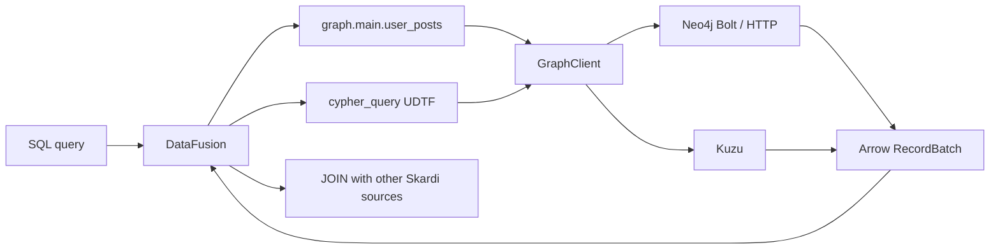

# Graph/Cypher Support via Dedicated Graph Engine Bypass

**Status:** Draft for review
**Date:** 2026-08-08
**Branch:** `design/graph-engine-bypass`

## Summary

Skardi will support property-graph data sources through a **dedicated graph engine bypass** rather than by teaching DataFusion Cypher. The graph engine (Neo4j or Kuzu) lives outside the Skardi process and owns graph storage, indexing, and traversal. Skardi exposes a single SQL interface — the `cypher_query(connection, cypher, params)` UDTF — that forwards read-only Cypher queries to the engine and maps the returned nodes, relationships, and paths into ordinary Arrow-backed relational rows.

A second, optional surface lets users declare stable catalog views from context YAML: a `type: graph` data source binds a connection and a list of named Cypher queries, each exposed as a table under the source catalog. This gives agents predictable table names while the engine remains the graph expert.

Milestone one is read-only. Write paths (`CREATE`, `SET`, `DELETE`) are deferred until the read surface is proven and a mutation security model is designed.

## Motivation

Agents increasingly need graph-shaped data: knowledge graphs, entity-relationship networks, dependency graphs, and social/organization graphs. Cypher is the de-facto query language for property graphs, and mature engines (Neo4j, Kuzu) already solve storage, indexing, query planning, and traversal optimization. Re-implementing any of that inside Skardi would duplicate years of engine work.

DataFusion is a relational SQL engine. It has no native graph model, no Cypher parser, and no graph-aware optimizer. Two broad approaches are possible:

1. **Build a Cypher frontend for DataFusion** — parse Cypher, plan graph traversals, and execute them through new physical operators. This is a multi-month engine project and was rejected.
2. **Bypass to a graph engine** — keep SQL as Skardi's primary language, expose Cypher through a table-returning function, and let the graph engine do what it does best. This is the chosen approach.

The bypass keeps Skardi's federated SQL model intact: a single query can `JOIN` graph results with Postgres, Lance, CSV, or Open Connector tables.

## Research Findings

### Cypher result shapes

A Cypher `RETURN` clause produces rows of heterogeneous values. Each column can be one of:

| Cypher type | SQL representation | Notes |
|---|---|---|
| scalar (string, int, float, bool, null) | native Arrow scalar | trivial mapping |
| node | `STRUCT<id: string, labels: List<Utf8>, properties: Utf8>` | `properties` is JSON text; stable column set independent of label |
| relationship | `STRUCT<id: string, start_id: string, end_id: string, type: Utf8, properties: Utf8>` | direction preserved |
| path | `List<STRUCT<...>>` or flattened rows | paths are ordered sequences of alternating nodes and relationships |
| list / map | `List<...>` or JSON text | nested values JSON-serialized where no stable schema exists |

Because Cypher can return dynamic structures (`RETURN n, r, p`), the UDTF cannot infer a deterministic schema from the query string alone at planning time. The design therefore requires either:

- a **declared output schema** in the YAML view surface, or
- an **execution-time schema probe** for the ad-hoc UDTF: run the Cypher with a small `LIMIT`, inspect the first returned row, and derive the Arrow schema from the actual `GraphValue` kinds.

### Neo4j vs Kuzu

| Concern | Neo4j | Kuzu |
|---|---|---|
| Deployment | standalone server via Bolt/HTTP | embeddable Rust library or standalone server |
| Protocol | Bolt v4/v5 (official `neo4rs`), HTTP JSON | native Rust API / C API |
| Credentials | username/password or token | file-based access |
| Cypher dialect | mature, rich | subset, rapidly growing |
| Best for | existing production graphs | embedded analytics, local-first |

Both speak Cypher. The Skardi adapter should be backend-agnostic at the SQL surface, with a small per-backend driver trait.

### Existing patterns in Skardi

- `open_connector_query` and `open_connector_scan` already prove the UDTF-bypass pattern: a SQL function wraps an external HTTP action and returns rows.
- The Open Connector design deliberately keeps credentials in the gateway. The graph design mirrors this: credentials live in environment variables referenced by the data source config, never in Skardi YAML or logs.
- `TableProvider` scans, projection pushdown, and `LIMIT` pushdown are well-established; the graph UDTF can reuse the same machinery.

## Goals

- Expose graph data through a read-only `cypher_query(connection, cypher, params)` UDTF.
- Support Neo4j (Bolt) and Kuzu as backend engines in milestone one.
- Map Cypher result values (scalars, nodes, relationships, paths, lists, maps) into Arrow rows with a deterministic schema.
- Allow `type: graph` catalog data sources with pre-declared Cypher views, registered from context YAML.
- Enable federated `JOIN`s between graph results and existing Skardi sources.
- Keep provider credentials out of Skardi process memory/logs/YAML.
- Prove the design against a real Neo4j or Kuzu instance in phase-4 live verification.
- Provide a `graph_schema(connection)` introspection UDTF so agents can discover labels, relationship types, and properties before generating Cypher.

## Non-goals

- A native Cypher parser or planner inside DataFusion.
- Mutating graph operations (`CREATE`, `SET`, `DELETE`) in milestone one.
- Automatic schema inference from arbitrary ad-hoc Cypher (ad-hoc queries use execution-time probe or explicit `RETURN` aliases).
- Graph-specific SQL extensions (`MATCH`, `()-[]->()` syntax).
- Embedding the graph engine inside Skardi process by default (Kuzu embedded mode is a later optimization, not the milestone-one default).
- Transaction or snapshot semantics across graph and relational sources.
- Full Cypher feature parity on day one (procedures, APOC, GDS are out of scope).

## Decisions

### SQL surface

- **Primary interface:** `cypher_query(connection_name TEXT, cypher TEXT, params JSON OBJECT optional)` returns a table.
  ```sql
  SELECT u.name, p.title
  FROM cypher_query('neo4j', '
      MATCH (u:User)-[:POSTED]->(p:Post)
      WHERE u.id = $userId
      RETURN u.name, p.title
      LIMIT 10
  ', '{"userId": "u-123"}') AS g(u_name, post_title);
  ```
- **Catalog interface:** `type: graph` sources register stable views from YAML as catalog tables, e.g. `kg.main.user_posts`.

### Backend abstraction

- A `GraphClient` trait hides Neo4j Bolt vs Kuzu details:
  ```rust
  #[async_trait]
  trait GraphClient: Send + Sync {
      async fn execute(&self, cypher: &str, params: Value) -> Result<Vec<GraphRow>>;
  }
  ```
- A `GraphRow` is a vector of `GraphValue` (scalar, node, relationship, path, list, map).
- Conversion from `GraphValue` to Arrow arrays is centralized and backend-agnostic.

### Schema handling

- **YAML views:** the user declares the output schema explicitly. Skardi validates at registration that the Cypher query returns columns compatible with the declared schema (live probe, not static parse).
- **Ad-hoc UDTF:** the first returned row determines the Arrow schema. Empty results produce an empty batch with a schema derived from the Cypher result summary if the driver provides one, otherwise a single `result_json` text column.

### Result flattening

- Nodes and relationships are returned as `STRUCT` columns with stable fields, not exploded into dynamic columns per label/type. This keeps the schema predictable across rows.
- Properties are returned as JSON text (`Utf8`) so the schema is independent of which keys happen to be present in the sampled rows.
- Paths are returned as `List<STRUCT>` by default; a YAML view may opt to flatten a path into multiple rows using `UNWIND` in Cypher.

### Credentials

- `connection_string` carries the Bolt/HTTP URL (e.g. `bolt://localhost:7687`).
- `username_env` / `password_env` name environment variables holding credentials.
- Kuzu file-mode uses a `database_path` instead of URL; credentials are not needed.
- Tokens/passwords are read once at registration and held in an `Arc<str>` inside the `GraphClient`. They are never logged, never serialized, and never returned in errors.

### Security

- Read-only by construction: the driver wrapper rejects queries containing mutating clauses (`CREATE`, `SET`, `DELETE`, `REMOVE`, `MERGE`) at the Cypher-string level before sending.
- Parameterized queries only: parameters are bound by the driver, never interpolated into the string.
- SSRF guard: the connection URL must be HTTP/Bolt and must not resolve to private/reserved IP ranges unless explicitly allowed.

## Alternatives Considered

### Native Cypher frontend for DataFusion

Build a Cypher parser, logical-plan translator, and graph physical operators inside Skardi. This would make Cypher a first-class language, but it requires implementing graph storage, indexing, and traversal optimization — months of engine work. Rejected.

### Expose graph data as relational tables only

Map every node label to a table and every relationship type to a table. This works for simple entity lookup but is lossy for path queries, variable-length traversals, and graph algorithms. It also requires schema discovery against live graph metadata. Kept as a possible future optimization on top of the UDTF, but not the primary surface.

### Embed Kuzu inside Skardi process

Kuzu's Rust API can be embedded, avoiding a separate process. This is attractive for local analytics, but it couples Skardi to Kuzu's threading model, file locking, and memory layout. It also does not help users with existing Neo4j deployments. Rejected for milestone one; may be revisited as an optional backend mode.

## High-level Architecture



## Detailed Design

### `crates/skardi/src/sources/providers/graph/` module layout

```
crates/skardi/src/sources/providers/graph/
├── mod.rs              # registration, GraphTableProvider, GraphDataSource
├── client.rs           # GraphClient trait + Neo4j/Kuzu impls
├── value.rs            # GraphValue enum and Arrow conversion
├── udtf.rs             # cypher_query UDTF
├── config.rs           # GraphConfig typed YAML
├── error.rs            # GraphError
└── tests/              # fixture + integration tests
```

### `GraphConfig` typed YAML

```yaml
spec:
  data_sources:
    - name: kg
      type: graph
      connection_string: bolt://localhost:7687
      graph:
        backend: neo4j
        username_env: NEO4J_USER
        password_env: NEO4J_PASS
        views:
          - name: user_posts
            cypher: |
              MATCH (u:User)-[:POSTED]->(p:Post)
              RETURN u.name AS user_name, p.title AS post_title
            schema:
              - name: user_name
                type: Utf8
                nullable: true
              - name: post_title
                type: Utf8
                nullable: true
```

For Kuzu file mode:

```yaml
      graph:
        backend: kuzu
        database_path: /var/lib/skardi/kg.db
```

### `cypher_query` UDTF signature

```sql
cypher_query(
    connection TEXT,      -- references a registered graph data source name
    cypher TEXT,          -- read-only Cypher query
    params TEXT optional  -- JSON object of query parameters
) RETURNS TABLE(...)
```

- `connection` must name a registered `type: graph` source.
- The UDTF is registered per source by `register_graph_udtf(session_ctx, name)`.
- The UDTF returns rows using the execution-time schema probe described above.

### Projection and limit pushdown

- Projection pushdown is limited: the UDTF cannot rewrite arbitrary Cypher `RETURN` clauses. It can only drop columns from the returned batch.
- `LIMIT` is pushed to the graph engine by appending `LIMIT n` to the Cypher string when the query does not already contain one and the Cypher can be safely truncated.
- Filter pushdown is **not** attempted for the ad-hoc UDTF in milestone one; all `WHERE` filtering is Cypher-native.

### Error handling

Errors carry identity:
- `GraphError::Backend { source, action, message }` for driver failures.
- `GraphError::MutationRejected { query }` when a read-only guard blocks a mutating query.
- `GraphError::SchemaMismatch { column, expected, found }` when a YAML view's declared schema disagrees with the live probe.
- Values are never quoted in error messages; only kinds and identifiers.

### Testing strategy

- Unit tests for `GraphValue` → Arrow conversion using synthetic values.
- Mock `GraphClient` tests for the UDTF schema-probe path and mutation guard.
- Integration tests against a testcontainer Neo4j and an on-disk Kuzu database for real round-trips.
- Live verification phase: run a real Cypher workload end-to-end through `skardi-server`, assert rows and schema, verify credentials never appear in logs.

## Agent and LLM interaction

The primary consumer of Skardi is an agent runtime backed by a large language model. The design must therefore be explicit about how an agent discovers graph content, generates safe Cypher, and interprets results.

### The expected workflow

1. **Discovery** — the agent asks Skardi what graph sources exist and what they contain.
2. **Generation** — the agent asks its LLM to translate the user's natural-language intent into Cypher.
3. **Execution** — the agent sends the Cypher to Skardi through `cypher_query` or a YAML-bound catalog view.
4. **Consumption** — Skardi returns JSON rows; the agent either passes them back to the LLM for summarization or answers the user directly.

### What the agent needs from Skardi

An agent cannot write Cypher blindly. It needs machine-readable answers to:

- *What graph backends are configured?* → the existing data-source metadata endpoint (`GET /data_source`) already lists registered sources; `type: graph` sources should appear with their declared views.
- *What labels, relationship types, and properties exist?* → a lightweight **graph introspection surface** is required. Two options:
  - a UDTF `graph_schema(connection)` that returns one row per label/relationship type with a sample of properties;
  - a YAML view author who declares `nodes` / `edges` metadata tables alongside the Cypher views.
  The design chooses the first option as an engine-provided helper in milestone 1, because requiring every YAML view to also declare metadata duplicates effort.
- *What shape does a `cypher_query` result have?* → the UDTF returns an Arrow schema, and Skardi's JSON response preserves that schema; agents can rely on stable `STRUCT` shapes for nodes and relationships.
- *Is this query allowed?* → read-only is enforced engine-side, so an agent-generated mutating Cypher fails before touching the backend.

### Agent-friendly error messages

Errors from `cypher_query` must be actionable for an LLM:

- `GraphError::MutationRejected { query }` should state the blocked keyword so the LLM can rewrite the query read-only.
- `GraphError::Backend { source, action, message }` should quote the backend's error code and a bounded message snippet, so the LLM can adapt Cypher syntax to the backend dialect.
- No raw node/relationship values in errors — only kinds and identifiers — so sensitive graph properties never leak into prompts or logs.

### Why read-only matters for agents

Agents generate SQL and Cypher probabilistically. A write path would require:

- idempotency guarantees (retries of agent-generated mutations),
- human-in-the-loop confirmation,
- a stricter audit trail.

Deferring writes to milestone 4+ lets milestone 1 land a safe, useful read surface first. The agent can still ask the LLM to produce `CREATE`/`DELETE` Cypher; Skardi will reject it with a clear error, and the agent can fall back to explaining that the operation is not yet supported.

### Natural language to Cypher is outside Skardi's scope

Skardi does not ship an LLM, prompt template, or RAG chain for generating Cypher. The agent runtime owns that. Skardi's responsibility is to provide:

- the metadata the LLM needs to write correct Cypher (`graph_schema`, view docs, stable schemas);
- a safe execution surface (`cypher_query`, read-only guard);
- results in a form the LLM can consume (JSON rows with stable types).

This separation keeps the engine deterministic and the prompt/LLM layer replaceable.

## Milestones

### Milestone 1 — Neo4j read-only UDTF

- `GraphClient` trait.
- `neo4rs`-based Neo4j driver.
- `GraphValue` → Arrow conversion for scalars, nodes, relationships, paths, lists, maps.
- `cypher_query` UDTF with execution-time schema probe.
- `graph_schema` introspection UDTF (labels, relationship types, property samples).
- Read-only mutation guard.
- Basic error taxonomy.
- Integration tests against testcontainer Neo4j.

### Milestone 2 — Kuzu backend

- Kuzu driver (using `kuzu` Rust crate in embedded or HTTP mode).
- Same `GraphValue` conversion reused.
- Prove federated `JOIN` between Kuzu and a CSV source.

### Milestone 3 — YAML catalog views

- `type: graph` data source registration.
- Declared-schema views.
- Live schema validation at registration.
- Docs: per-backend guides, examples, and spec entry.

### Milestone 4+ — Write path (future)

- Design mutation guard, idempotency keys, and transaction semantics.
- Expose `cypher_mutate` only through explicit opt-in, never the read UDTF.

## Risks and Open Questions

1. **Dynamic schema in ad-hoc UDTF.** If the first row of a Cypher result has different types than later rows (e.g., `RETURN n` where some `n` are nodes and some are null), the Arrow schema remains stable but null handling must be correct. The design handles this by making nodes nullable structs.
2. **Cypher injection.** Parameter binding prevents interpolation attacks, but the read-only guard is string-based and could be bypassed by clever Cypher. The guard should be conservative: reject any query containing mutating keywords, regardless of context.
3. **Path representation.** Returning a path as `List<STRUCT>` is convenient but may be awkward for consumers. The YAML view surface lets users `UNWIND` paths into rows when needed.
4. **Backend divergence.** Kuzu Cypher is a subset. The design must avoid features that work on Neo4j but fail on Kuzu unless the view/backend is explicit.

## References

- [Open Connector Integration Design](2026-07-11-open-connector-integration-design.md) — established the UDTF-bypass pattern and credential-handling conventions used here.
- [DataFusion](https://arrow.apache.org/datafusion/) — the SQL engine Skardi builds on.
- [Neo4j Cypher Manual](https://neo4j.com/docs/cypher-manual/current/)
- [Kuzu Documentation](https://docs.kuzudb.com/)
