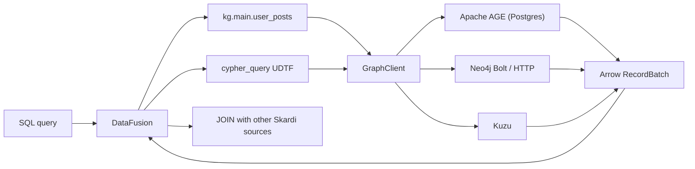

# Graph/Cypher Support via Dedicated Graph Engine Bypass

**Status:** Draft for review
**Date:** 2026-08-08
**Branch:** `design/graph-engine-bypass`

## Summary

Skardi will support property-graph data sources through a **dedicated graph engine bypass** rather than by teaching DataFusion Cypher. The graph engine (Apache AGE inside Postgres, Neo4j, or Kuzu) lives outside the Skardi process and owns graph storage, indexing, and traversal. Skardi exposes a single SQL interface — the `cypher_query(connection, cypher, params, columns)` UDTF — that forwards read-only Cypher queries to the engine and maps the returned nodes, relationships, and paths into ordinary Arrow-backed relational rows. The schema is always fixed at planning time: declared columns when the caller provides them, one JSON-text `record` column otherwise.

A second, optional surface lets users declare stable catalog views from context YAML: a `type: graph` data source binds a connection and a list of named Cypher queries, each exposed as a table under the source catalog. This gives agents predictable table names while the engine remains the graph expert.

Milestone one is read-only. Write paths (`CREATE`, `SET`, `DELETE`) are deferred until the read surface is proven and a mutation security model is designed.

## Motivation

Agents increasingly need graph-shaped data: knowledge graphs, entity-relationship networks, dependency graphs, and social/organization graphs. Cypher is the de-facto query language for property graphs, and mature engines (Neo4j, Kuzu) already solve storage, indexing, query planning, and traversal optimization. Re-implementing any of that inside Skardi would duplicate years of engine work.

DataFusion is a relational SQL engine. It has no native graph model, no Cypher parser, and no graph-aware optimizer. Two broad approaches are possible:

1. **Build a Cypher frontend for DataFusion** — parse Cypher, plan graph traversals, and execute them through new physical operators. This is a multi-month engine project and was rejected.
2. **Bypass to a graph engine** — keep SQL as Skardi's primary language, expose Cypher through a table-returning function, and let the graph engine do what it does best. This is the chosen approach.

The bypass keeps Skardi's federated SQL model intact: a single query can `JOIN` graph results with Postgres, Lance, CSV, or Open Connector tables.

## Research Findings

### Cypher result shapes

A Cypher `RETURN` clause produces rows of heterogeneous values. Each column can be one of:

| Cypher type | SQL representation | Notes |
|---|---|---|
| scalar (string, int, float, bool, null) | native Arrow scalar | trivial mapping |
| node | `STRUCT<id: string, labels: List<Utf8>, properties: Utf8>` | `properties` is JSON text; stable column set independent of label |
| relationship | `STRUCT<id: string, start_id: string, end_id: string, type: Utf8, properties: Utf8>` | direction preserved |
| path | `STRUCT<nodes: List<node STRUCT>, relationships: List<rel STRUCT>>` | a path alternates node/relationship, and the two have different shapes — an Arrow `List` needs ONE element type, so a path is two parallel typed lists: relationship *i* connects node *i* to node *i+1* |
| list / map | `List<...>` or JSON text | nested values JSON-serialized where no stable schema exists |

Because Cypher can return dynamic structures (`RETURN n, r, p`), the UDTF cannot infer a deterministic schema from the query string alone at planning time. Three candidates were evaluated and the first two rejected:

- **Execution-time schema probe** (run the Cypher with a small `LIMIT`, inspect the first row): rejected for three reasons. (1) DataFusion needs the UDTF schema at *planning* time, so the probe is planning-time network I/O — it fires on `EXPLAIN`, and the same query runs twice unless probe results are cached and reused. (2) An empty result has no rows to infer from, degrading the schema to a fallback shape; the same query then returns `(u_name, post_title)` when data exists and a different schema when it does not, breaking downstream `JOIN ... ON g.u_name` — empty results must be complete results, not a schema change. (3) First-row inference is unsound for Neo4j's dynamically-typed properties: `RETURN n.value` with an `int` first row and a `string` fifth row fails mid-scan against the already-fixed `Int64` column.
- **Parsing `RETURN` for column names**: rejected as a fragile half-parser of Cypher — the design deliberately has no Cypher parser.
- **Declared schema at the call site**: chosen. The caller declares the output columns explicitly; without a declaration, the UDTF falls back to a single `record` column carrying the whole Cypher row as JSON text. Both modes have a planning-time-stable schema with no network I/O.

### Neo4j vs Kuzu

| Concern | Neo4j | Kuzu |
|---|---|---|
| Deployment | standalone server via Bolt/HTTP | embeddable Rust library or standalone server |
| Protocol | Bolt v4/v5 (official `neo4rs`), HTTP JSON | native Rust API / C API |
| Credentials | username/password or token | file-based access |
| Cypher dialect | mature, rich | subset, rapidly growing |
| Schema model | schema-optional; property types vary per node | **schema-full**: node/rel tables with declared, typed columns |
| Best for | existing production graphs | embedded analytics, local-first |

Both speak Cypher. The Skardi adapter should be backend-agnostic at the SQL surface, with a small per-backend driver trait. Kuzu's static schema is an upgrade the design should not squander: its `graph_schema` output is exact (read from the catalog, not sampled), and a future optimization can convert Kuzu properties as typed columns instead of JSON text — the uniform JSON-text spelling is the floor both backends meet, not a ceiling.

### Apache AGE (the first backend — milestone 1)

[Apache AGE](https://age.apache.org/) is a PostgreSQL extension that
executes openCypher *inside* Postgres: queries travel over the ordinary
Postgres wire protocol as
`SELECT * FROM cypher('graph_name', $$ MATCH ... $$) AS (a agtype, …)`,
and results come back as `agtype` values (a JSON superset whose node/
edge/path serializations map directly onto `GraphValue`).

Why it matters here: **GraphRAG pipelines commonly land their graph in
Postgres.** With AGE as a backend, that data becomes Cypher-queryable
through the same `cypher_query` surface with no sync pipeline into
Neo4j/Kuzu — and the graph lives next to the text/embedding tables
Skardi already federates with.

How it fits the abstraction (deliberately unchanged):

- A `GraphClient` implementation over `tokio-postgres` instead of Bolt —
  no new SQL surface, no new value model.
- Read-only enforcement maps cleanly onto the backend-enforced model:
  the adapter runs every call inside a `READ ONLY` Postgres transaction,
  with a read-only role as the deployment recommendation — the same
  two-layer story as Neo4j's read transactions.
- The declared-columns mode aligns with AGE's own requirement that the
  `cypher()` call declare its result arity (`AS (col agtype, …)`).
  The JSON-`record` fallback cannot know that arity, so on AGE an
  omitted `columns` is a targeted error telling the caller to declare
  them (settled); the fallback ships with the Neo4j milestone, where
  Bolt needs no declared arity.
- `graph_schema` reads AGE's catalog tables (`ag_catalog.ag_label` and
  friends) — names and types only, as everywhere else.

AGE speaks an openCypher *subset* (as does Kuzu), which the
backend-divergence risk covers. **Review round 1 promoted AGE from
candidate to milestone 1**: GraphRAG-in-Postgres is the deployment in
hand, the Postgres plugin needs zero new infrastructure, and Postgres
`READ ONLY` transactions give the first milestone a security boundary
with no driver-capability risk. Neo4j and Kuzu follow as milestones 2
and 3 behind the same trait.

### Existing patterns in Skardi

- `open_connector_query` and `open_connector_scan` already prove the UDTF-bypass pattern: a SQL function wraps an external HTTP action and returns rows.
- The Open Connector design keeps provider credentials in the gateway — Skardi holds only a runtime token. The graph bypass has **no gateway in the middle**: Skardi speaks Bolt directly, so it must hold the database credential itself. What carries over is the hygiene, not the topology: YAML references environment variables by *name* and never carries values, and the credential is never logged, serialized, or quoted in errors.
- `TableProvider` scans, projection pushdown, and `LIMIT` pushdown are well-established; the graph UDTF can reuse the same machinery.

## Goals

- Expose graph data through a read-only `cypher_query(connection, cypher, params, columns)` UDTF.
- Support Apache AGE (openCypher inside Postgres) in milestone one, then Neo4j (Bolt) and Kuzu behind the same `GraphClient` trait.
- Map Cypher result values (scalars, nodes, relationships, paths, lists, maps) into Arrow rows with a planning-time-stable schema — declared columns when provided, one JSON-text `record` column otherwise.
- Allow `type: graph` catalog data sources with pre-declared Cypher views, registered from context YAML.
- Enable federated `JOIN`s between graph results and existing Skardi sources.
- Keep credentials out of YAML, logs, and error messages. (Unlike Open Connector there is no gateway to hold them: Skardi speaks Bolt directly, so the credential itself necessarily lives in process memory — read once from environment variables at registration, never serialized.)
- Prove the design against a real Postgres+AGE instance in milestone 1's live verification (then Neo4j/Kuzu per milestone).
- Provide a `graph_schema(connection)` introspection UDTF so agents can discover labels, relationship types, and property names/types before generating Cypher.

## Non-goals

- A native Cypher parser or planner inside DataFusion.
- Mutating graph operations (`CREATE`, `SET`, `DELETE`) in milestone one.
- Automatic schema inference from arbitrary ad-hoc Cypher (no probes, no `RETURN` parsing; columns are declared or the whole row is JSON text).
- Network I/O at query planning time.
- Graph-specific SQL extensions (`MATCH`, `()-[]->()` syntax).
- Embedding the graph engine inside Skardi process by default (Kuzu embedded mode is a later optimization, not the milestone-one default).
- Transaction or snapshot semantics across graph and relational sources.
- Full Cypher feature parity on day one (procedures, APOC, GDS are out of scope).

## Decisions

### SQL surface

- **Primary interface:** `cypher_query(connection_name TEXT, cypher TEXT, params JSON OBJECT optional, columns JSON OBJECT optional)` returns a table.
  ```sql
  -- Declared columns: typed multi-column output.
  SELECT user_name, post_title
  FROM cypher_query('neo4j', '
      MATCH (u:User)-[:POSTED]->(p:Post)
      WHERE u.id = $userId
      RETURN u.name, p.title
      LIMIT 10
  ', '{"userId": "u-123"}',
     '{"user_name": "string", "post_title": "string"}');

  -- No declaration: one JSON-text column per row, stable schema always.
  SELECT json_get(record, '$.u.name') AS user_name
  FROM cypher_query('neo4j', '
      MATCH (u:User)-[:POSTED]->(p:Post)
      WHERE u.id = $userId
      RETURN u, p
      LIMIT 10
  ', '{"userId": "u-123"}');
  ```
- **Numeric `params` mapping:** JSON has one number type but Cypher
  distinguishes Integer from Float, and some operations and index
  lookups are type-sensitive. The rule: a JSON number with no fraction
  or exponent binds as Integer; one with a fraction or exponent binds
  as Float — write `1.0` to force a Float parameter. Strings are never
  numerically coerced.
- **Catalog interface:** `type: graph` sources register stable views from YAML as catalog tables, e.g. `kg.main.user_posts`.
- **Capability provider:** `cypher_query` is implemented as a DataFusion `TableFunctionImpl` in `crates/skardi/src/sources/providers/graph/udtf.rs`. Skardi does not parse or plan Cypher itself; the UDTF delegates execution to a backend-agnostic `GraphClient` trait (`crates/skardi/src/sources/providers/graph/client.rs`), whose concrete drivers (`AgeClient`, `Neo4jClient`, `KuzuClient`) speak the Postgres wire protocol, Bolt, or the Kuzu API. DataFusion owns UDTF registration, SQL planning, and result streaming; the graph engine owns storage, indexing, and Cypher execution.

### Backend abstraction

- A `GraphClient` trait hides AGE (Postgres wire) vs Neo4j Bolt vs Kuzu details:
  ```rust
  #[async_trait]
  trait GraphClient: Send + Sync {
      /// Runs read-only Cypher inside a backend-enforced read transaction,
      /// bounded by the per-source timeout and row cap.
      async fn execute(
          &self,
          cypher: &str,
          params: Value,
          bounds: QueryBounds, // { timeout, max_rows }
      ) -> Result<GraphRowStream>;
  }
  ```
- `execute` returns a **stream** of `GraphRow`s, not a buffered `Vec`: the
  row cap and SQL `LIMIT` early-stop both work by ceasing to consume it,
  and a whole-graph `RETURN` never has to fit in memory before the cap
  fires. Milestone 1 may buffer internally up to `max_rows` for
  simplicity — the trait shape is what must not change.
- A `GraphRow` is a vector of `GraphValue` (scalar, node, relationship, path, list, map).
- Conversion from `GraphValue` to Arrow arrays is centralized and backend-agnostic.
- Node identity: the `id` field carries Neo4j 5's `elementId()` (a
  string); Neo4j 4 numeric ids, AGE graphids, and Kuzu internal ids are
  stringified into the same field. The stability contract, stated
  precisely because federated `JOIN`s are a headline use case: an id is
  **stable for the life of the entity within one database instance**,
  which makes it join-safe across the scans of a single federated query
  AND against ids previously exported from the same server (the
  graph-to-Postgres join). What it is NOT is a durable foreign key:
  engines may reuse ids after entity deletion, and no id survives a
  restore, a server migration, or a major-version upgrade — persist
  business keys from properties for that, not engine ids.

### Schema handling

There is no schema probe anywhere in the design: planning performs no network I/O, and every query has a planning-time-stable schema.

- **YAML views:** the user declares the output schema explicitly. Skardi validates at registration that the Cypher query returns columns compatible with the declared schema (one live validation call at registration — registration is allowed to do network I/O; query planning is not). Availability and contract violations part ways here, deliberately diverging from Open Connector's hard-fail health check: OC probes a gateway Skardi deploys, while this backend is a shared external database whose transient blip must not hold every unrelated Postgres/CSV/Lance source hostage at server startup. An **unreachable backend registers the source DEGRADED** — views register with their declared (planning-sufficient) schemas, the source is marked unhealthy in `GET /data_source`, and the first scan retries the validation and fails loudly if the backend is still gone or the view no longer matches. A **reachable backend whose view fails validation refuses registration** — that is a contract violation, not an outage.
- **Declared-type vocabulary — the repo's friendly lowercase names, not Arrow PascalCase** (every existing config-parsed type in the tree spells types this way — dynamodb, mongo, seekdb, llm_extract — and this surface will not introduce a second spelling). The accepted set, exactly: `string` (aliases `str`, `utf8`) → `Utf8`; `int` (aliases `integer`, `bigint`) → `Int64`; `float` (alias `double`) → `Float64`; `bool` (alias `boolean`) → `Boolean`; `json` → `Utf8` carrying JSON text verbatim; `node`, `relationship`, `path` → the canonical `STRUCT` shapes from Result flattening. Anything else fails planning with the accepted set listed. The same vocabulary is used by YAML views' `type:` fields — one spelling everywhere.
- **Ad-hoc declared columns are always nullable.** Cypher can produce `null` in any position (`OPTIONAL MATCH`, missing properties), so the ad-hoc JSON object is name→type only and every field is `nullable: true` — there is no way to declare otherwise. YAML views default to `nullable: true` too and may declare `nullable: false` as an author'ed assertion about the view's Cypher; the two declaration paths cannot silently disagree because the stricter bit exists only where an author explicitly wrote it.
- **Ad-hoc UDTF with declared columns:** an optional fourth argument declares the output columns and their Arrow types as a JSON object (`'{"user_name": "string", "post_title": "string"}'`). The declared object is the planning-time schema; each returned `GraphValue` is converted against its declared type, and a mismatch fails with a typed error carrying column name, row index, expected type, and found JSON kind. Conversion is **batch-atomic, and the batch is the unit this design defines** (a Cypher stream has no upstream "page" the way Open Connector does): the driver stream is consumed in conversion batches of a fixed implementation constant (order 1024 rows, never more than `max_rows`), each batch converts as a unit before it is emitted, and a type mismatch fails the CURRENT batch before emission — batches already emitted may have been consumed downstream, the same trade-off Open Connector's page-atomic conversion accepts. Peak conversion memory is one batch, not one result. Milestone 1 may implement the stream as a single batch of up to `max_rows`, in which case nothing at all is emitted before a mid-scan failure.
- **Ad-hoc UDTF without declared columns:** every row is returned as one `record: Utf8` column containing the whole Cypher record as canonical JSON text (column names from `RETURN` become keys of the JSON object). Empty results are empty batches with the same one-column schema. **Backend note:** AGE's `cypher()` call must declare its result arity, which the fallback by definition does not know — on AGE, omitting `columns` is an error telling the caller to declare them; the fallback ships with the Neo4j milestone, where Bolt needs no declared arity.
- **JSON extraction is a named dependency, not a parenthetical:** the fallback's ergonomics (and property extraction from node/relationship `properties` columns generally) hinge on a JSON getter. The repo has `json_pack` (an encoder) and no getter today. Decision: adopt the `datafusion-functions-json` crate's `json_get` family rather than hand-rolling — ecosystem-standard names and semantics, no collision risk with a homegrown twin. Verifying the crate against the pinned DataFusion is milestone-1 work; only if the pin conflicts does a minimal same-named getter get written in-tree, documented as a subset.

### Result flattening

- Nodes and relationships are returned as `STRUCT` columns with stable fields, not exploded into dynamic columns per label/type. This keeps the schema predictable across rows.
- Properties are returned as JSON text (`Utf8`) so the schema is independent of which keys happen to be present in the sampled rows.
- A path cannot be one `List<STRUCT>`: its elements alternate between the
  node shape and the relationship shape, and an Arrow list has exactly one
  element type. A path column is therefore
  `STRUCT<nodes: List<node STRUCT>, relationships: List<rel STRUCT>>` —
  two parallel typed lists where relationship *i* connects node *i* to
  node *i+1* (`nodes` is always one longer than `relationships`; a
  zero-hop path is one node and an empty relationship list). Callers who
  want row-per-hop flatten with Cypher `UNWIND`/`relationships(p)` in the
  query or view.

### Credentials

- `connection_string` carries the Bolt/HTTP URL (e.g. `bolt://localhost:7687`).
- `username_env` / `password_env` name environment variables holding credentials.
- Kuzu file-mode uses a `database_path` instead of URL; credentials are not needed.
- Tokens/passwords are read once at registration and held in an `Arc<str>` inside the `GraphClient`. They are never logged, never serialized, and never returned in errors.

### Security and operational bounds

**Read-only enforcement is backend-enforced; the string guard is UX, not the security boundary.**

- **Primary enforcement — the backend refuses writes.** Per backend:
  AGE runs every call inside a Postgres `READ ONLY` transaction — native
  to Postgres and `tokio-postgres`, no driver capability in question,
  which is one reason AGE ships first. Neo4j runs every query in an
  explicit READ-access-mode transaction (Bolt carries the access mode in
  `BEGIN`/`RUN` metadata, and the *server* rejects writes inside a read
  transaction — Community edition included); **the `neo4rs` access-mode
  spike is a hard precondition of the Neo4j milestone** — if the pinned
  driver cannot express it, wiring or upstreaming it is part of that
  milestone, and the milestone does not ship on the keyword guard alone.
  Registration of a `neo4j` source performs a **read-mode proof**: open a
  read transaction, attempt a trivial `CREATE`, require the SERVER to
  refuse it, and roll back regardless — a misconfigured driver/server
  combination fails closed at registration instead of silently at
  runtime. Kuzu: the database is opened with `read_only` set, which the
  engine enforces. Deployments should additionally use least-privilege
  credentials (a reader role / read-only DB user) everywhere.
- **Secondary, fast-path guard — keyword screening for agent UX.** Before
  any network round-trip, the wrapper rejects Cypher containing mutating
  or escape-hatch keywords on **word boundaries** (`CREATE`, `SET`,
  `DELETE`, `DETACH`, `REMOVE`, `MERGE`, `DROP`, plus `CALL` — procedures
  can mutate without any write keyword — and `LOAD CSV` — it makes the
  *graph server* fetch arbitrary URLs). This exists to hand an agent a
  fast, actionable error naming the blocked keyword; it is deliberately
  conservative and will false-positive on keyword-shaped string literals
  (`RETURN 'DELETE'`) — an accepted tax, since the backend read mode
  behind it is what actually guarantees read-only. Word-boundary matching
  keeps identifiers like `created_at` out of the blast radius. **Scope:
  the guard screens CALLER-supplied Cypher (the text passed to
  `cypher_query` or declared in a view) only** — `graph_schema` issues
  fixed, engine-authored introspection queries (`db.schema.*`,
  `ag_catalog` reads) that never pass through it, so rejecting `CALL`
  does not self-block discovery.
- **Parameterized queries only:** parameters are bound by the driver,
  never interpolated into the string.
- **Connection URLs are operator trust, not query trust.** The URL comes
  from context YAML — the same trust tier as a Postgres connection string
  in the same file — and the UDTF only ever accepts a registered
  connection *name*, never a URL. No SSRF guard is applied (localhost
  Bolt is the normal dev deployment, and no other Skardi data source
  guards its operator-authored URL); registration validates the scheme
  against an allowlist (`postgres`/`postgresql` for AGE; `bolt`,
  `bolt+s`, `neo4j`, `neo4j+s`; `http`/`https` for Kuzu server mode) and
  rejects anything else.
- **Every query is bounded.** Two per-source limits with config overrides:
  `query_timeout_seconds` (default 30) is passed to the backend as the
  transaction timeout so runaway traversals die server-side, and
  `max_rows` (default 10 000) caps the rows Skardi will consume —
  exceeding it fails with a typed error naming the cap and the row count
  reached, never a silent truncation. Agents generate pathological Cypher
  (unbounded variable-length paths, whole-graph `RETURN`); bounded by
  construction beats bounded by review.

## Alternatives Considered

### Native Cypher frontend for DataFusion

Build a Cypher parser, logical-plan translator, and graph physical operators inside Skardi. This would make Cypher a first-class language, but it requires implementing graph storage, indexing, and traversal optimization — months of engine work. Rejected.

### Expose graph data as relational tables only

Map every node label to a table and every relationship type to a table. This works for simple entity lookup but is lossy for path queries, variable-length traversals, and graph algorithms. It also requires schema discovery against live graph metadata. Kept as a possible future optimization on top of the UDTF, but not the primary surface.

### Embed Kuzu inside Skardi process

Kuzu's Rust API can be embedded, avoiding a separate process. This is attractive for local analytics, but it couples Skardi to Kuzu's threading model, file locking, and memory layout. It also does not help users with existing Neo4j deployments. Rejected for milestone one; may be revisited as an optional backend mode.

## High-level Architecture



> **Component ownership:** The `cypher_query` UDTF and `kg.main.user_posts` catalog views are Skardi surfaces (left side); both route Cypher to the same `GraphClient` abstraction and out to Neo4j or Kuzu. DataFusion never sees graph storage directly — it only sees the Arrow rows coming back.

## Detailed Design

### `crates/skardi/src/sources/providers/graph/` module layout

```
crates/skardi/src/sources/providers/graph/
├── mod.rs              # registration, GraphTableProvider, GraphDataSource
├── client.rs           # GraphClient trait + AGE/Neo4j/Kuzu impls
├── value.rs            # GraphValue enum and Arrow conversion
├── udtf.rs             # cypher_query UDTF
├── config.rs           # GraphConfig typed YAML
├── error.rs            # GraphError
└── tests/              # fixture + integration tests
```

### `GraphConfig` typed YAML

```yaml
spec:
  data_sources:
    - name: kg
      type: graph
      # Milestone 1: AGE — the graph lives inside Postgres.
      connection_string: postgres://localhost:5432/graphrag
      graph:
        backend: age
        graph_name: knowledge          # AGE graphs are named per database
        username_env: AGE_PG_USER
        password_env: AGE_PG_PASS
        views:
          - name: user_posts
            cypher: |
              MATCH (u:User)-[:POSTED]->(p:Post)
              RETURN u.name AS user_name, p.title AS post_title
            schema:                    # same lowercase vocabulary as the
              - name: user_name        # ad-hoc `columns` argument
                type: string
                nullable: true
              - name: post_title
                type: string
                nullable: true
```

For Neo4j (milestone 2) the connection swaps protocol and credentials:

```yaml
      connection_string: bolt://localhost:7687
      graph:
        backend: neo4j
        username_env: NEO4J_USER
        password_env: NEO4J_PASS
```

For Kuzu file mode (milestone 3):

```yaml
      graph:
        backend: kuzu
        database_path: /var/lib/skardi/kg.db
```

### `cypher_query` UDTF signature

```sql
cypher_query(
    connection TEXT,       -- references a registered graph data source name
    cypher TEXT,           -- read-only Cypher query
    params TEXT optional,  -- JSON object of query parameters
    columns TEXT optional  -- JSON object declaring output columns and Arrow types;
                           -- omitted → one `record: Utf8` JSON column per row
) RETURNS TABLE(...)
```

- `connection` must name a registered `type: graph` source.
- `cypher_query` and `graph_schema` are registered **once** as global UDTFs by `register_graph_udtfs(session_ctx, sources)` and resolve the connection by name at call time — the same shape as `open_connector_query('saas', …)`, not one function per source (the first argument would be redundant otherwise).
- The schema is fixed at planning time from `columns` (or the single-column fallback) — no backend call happens before execution.
- **Call-shape constraints (stated because agents generate these calls):**
  the arguments are positional, so declaring `columns` requires passing
  `params` — `'{}'` is the no-parameters spelling, and `NULL` is
  rejected (schema-shaping arguments are strict string literals, the
  `open_connector_query` precedent). And because the schema comes from
  `columns` at PLANNING time, both `params` and `columns` must be
  string **literals** in the SQL text — a column reference, CTE output,
  or subquery there fails planning with a targeted error, it does not
  get evaluated first.
  ```sql
  -- columns with no parameters: '{}' holds the params slot.
  SELECT n_name FROM cypher_query('kg',
      'MATCH (n:User) RETURN n.name LIMIT 5', '{}',
      '{"n_name": "string"}');
  ```

### Projection and limit pushdown

- Projection pushdown is limited: the UDTF cannot rewrite arbitrary Cypher `RETURN` clauses. It can only drop columns from the returned batch.
- `LIMIT` is **not** pushed by rewriting the Cypher string. Appending
  `LIMIT n` to arbitrary Cypher is string surgery on a language this
  design deliberately does not parse — it breaks on `UNION` (the appended
  limit binds to the last subquery only), trailing comments, and other
  shapes no substring check can classify; the Open Connector design
  refused exactly this class of rewrite, and this design follows it.
  Instead, a SQL `LIMIT` stops consuming the driver's record stream after
  *n* rows and discards the open transaction — the transport-level
  early-stop the Bolt protocol already supports. Cypher-native `LIMIT`
  inside the query text remains the recommended spelling (agents write it
  themselves; every example in this document carries one).
- Filter pushdown is **not** attempted for the ad-hoc UDTF in milestone one; all `WHERE` filtering is Cypher-native.

### Error handling

Errors carry identity:
- `GraphError::Backend { source, code, message }` for driver failures — `code` is the backend's error code verbatim and `message` a bounded snippet (backend messages can embed query text, so the snippet is length-capped, not forwarded whole).
- `GraphError::MutationRejected { keyword, offset }` when the fast-path guard blocks a query — it names the blocked keyword and its byte offset, **never the query text**: Cypher legally embeds literal values inline, and quoting the query would quote them.
- `GraphError::SchemaMismatch { column, expected, found }` when a YAML view's declared schema disagrees with the registration-time live validation.
- `GraphError::TypeMismatch { column, row, expected, found }` when a declared ad-hoc column meets a value of the wrong JSON kind mid-conversion.
- `GraphError::RowCapExceeded { max_rows }` and `GraphError::Timeout { seconds }` for the operational bounds — loud, typed, never a silent truncation.
- Values are never quoted in error messages; only kinds and identifiers.

### Testing strategy

- Unit tests for `GraphValue` → Arrow conversion using synthetic values.
- Mock `GraphClient` tests for the declared-columns conversion path (including a mid-scan type-mismatch failing page-atomically), the single-column JSON fallback (including empty results keeping the one-column schema), and the mutation guard.
- Integration tests against a testcontainer Neo4j and an on-disk Kuzu database for real round-trips — marked `#[ignore]` by default per the repo's live-test convention, run behind an explicit CI job/env gate.
- Live verification phase: run a real Cypher workload end-to-end through `skardi-server`, assert rows and schema, verify credentials never appear in logs, and prove the read-transaction enforcement by sending a mutating query past a deliberately-disabled keyword guard and watching the *backend* reject it.

## Agent and LLM interaction

The primary consumer of Skardi is an agent runtime backed by a large language model. The design must therefore be explicit about how an agent discovers graph content, generates safe Cypher, and interprets results.

### The expected workflow

1. **Discovery** — the agent asks Skardi what graph sources exist and what they contain.
2. **Generation** — the agent asks its LLM to translate the user's natural-language intent into Cypher.
3. **Execution** — the agent sends the Cypher to Skardi through `cypher_query` or a YAML-bound catalog view.
4. **Consumption** — Skardi returns JSON rows; the agent either passes them back to the LLM for summarization or answers the user directly.

### What the agent needs from Skardi

An agent cannot write Cypher blindly. It needs machine-readable answers to:

- *What graph backends are configured?* → the existing data-source metadata endpoint (`GET /data_source`) already lists registered sources; `type: graph` sources should appear with their declared views.
- *What labels, relationship types, and properties exist?* → a lightweight **graph introspection surface** is required. Two options:
  - a UDTF `graph_schema(connection)` that returns one row per label/relationship type with its property **names and types** (AGE: `ag_catalog`; Neo4j: `db.schema.nodeTypeProperties()` / `db.schema.relTypeProperties()`; Kuzu: its typed catalog, which is exact because Kuzu is schema-full). Deliberately **names and types only, never property values** — sampled values would flow straight into agent prompts, the exact leak the error-handling rules exist to prevent;
  - a YAML view author who declares `nodes` / `edges` metadata tables alongside the Cypher views.
  The design chooses the first option as an engine-provided helper in milestone 1, because requiring every YAML view to also declare metadata duplicates effort.
- *What shape does a `cypher_query` result have?* → the schema is fixed at planning time and stated in the function's documentation: either the caller-declared columns, or one `record: Utf8` JSON column. Agents can rely on stable `STRUCT` shapes for nodes and relationships inside those columns.
- *Is this query allowed?* → two layers answer differently fast: the keyword guard rejects an agent-generated mutating Cypher before any network round-trip with the blocked keyword named, and the backend's read-transaction mode guarantees that anything slipping past the guard still cannot write.

### Agent-friendly error messages

Errors from `cypher_query` must be actionable for an LLM:

- `GraphError::MutationRejected { keyword, offset }` names the blocked keyword and where it sits, so the LLM can rewrite the query read-only — without echoing the query text (whose inline literals are values).
- `GraphError::Backend { source, code, message }` quotes the backend's error code and a bounded message snippet, so the LLM can adapt Cypher syntax to the backend dialect.
- No raw node/relationship values in errors — only kinds and identifiers — so sensitive graph properties never leak into prompts or logs.

### Why read-only matters for agents

Agents generate SQL and Cypher probabilistically. A write path would require:

- idempotency guarantees (retries of agent-generated mutations),
- human-in-the-loop confirmation,
- a stricter audit trail.

Deferring writes to milestone 4+ lets milestone 1 land a safe, useful read surface first. The agent can still ask the LLM to produce `CREATE`/`DELETE` Cypher; Skardi will reject it with a clear error, and the agent can fall back to explaining that the operation is not yet supported.

### Natural language to Cypher is outside Skardi's scope

Skardi does not ship an LLM, prompt template, or RAG chain for generating Cypher. The agent runtime owns that. Skardi's responsibility is to provide:

- the metadata the LLM needs to write correct Cypher (`graph_schema`, view docs, stable schemas);
- a safe execution surface (`cypher_query`, read-only guard);
- results in a form the LLM can consume (JSON rows with stable types).

This separation keeps the engine deterministic and the prompt/LLM layer replaceable.

## Milestones

### Milestone 1 — Apache AGE read-only UDTF (Postgres first)

Reviewer-directed ordering (review round 1): the Postgres plugin ships
before any new server dependency — GraphRAG-style deployments already
hold their graph in Postgres, so AGE delivers value with zero new
infrastructure. It also de-risks the security boundary: milestone 1's
read-only guarantee is a Postgres `READ ONLY` transaction, native to
`tokio-postgres`, with no driver-capability question attached.

- `GraphClient` trait + `AgeClient` over `tokio-postgres`; every call
  inside a `READ ONLY` transaction (the backend-enforced boundary).
- `GraphValue` → Arrow conversion for scalars, nodes, relationships,
  paths, lists, maps (`agtype` decoding) — shared by every later backend.
- `cypher_query` UDTF, declared-columns mode. The JSON-`record` fallback
  is NOT in this milestone: AGE's `cypher()` call must declare its
  result arity, so on AGE an omitted `columns` is a targeted error
  (settled — previously an open question).
- `graph_schema` from `ag_catalog` (names and types only, never values).
- Keyword guard, query timeout, row cap, error taxonomy.
- JSON getter: adopt `datafusion-functions-json`'s `json_get` family
  (verify against the pinned DataFusion; a minimal same-named in-tree
  getter only if the pin conflicts).
- Integration tests against a Postgres+AGE testcontainer
  (`#[ignore]`-gated).

### Milestone 2 — Neo4j backend

**Precondition, before this milestone starts: the `neo4rs` access-mode
spike.** Read transactions are the security boundary; if the pinned
driver cannot express Bolt's access mode, wiring or upstreaming it is
part of this milestone's cost, and the milestone does not ship on the
keyword guard alone.

- `Neo4jClient` (Bolt): every query in a READ-access-mode transaction;
  registration performs the read-mode proof (attempt a trivial `CREATE`
  inside a read transaction, require the SERVER to refuse it, roll back
  regardless) so a misconfigured driver/server pair fails closed at
  registration.
- JSON-`record` fallback mode (Bolt needs no declared arity).
- `graph_schema` via `db.schema.nodeTypeProperties()` /
  `db.schema.relTypeProperties()`.
- Reuses milestone 1's conversion, guards, bounds, and error taxonomy.
- Integration tests against testcontainer Neo4j (`#[ignore]`-gated).

### Milestone 3 — Kuzu backend

- Kuzu driver (using `kuzu` Rust crate in embedded or HTTP mode);
  database opened `read_only`.
- Same `GraphValue` conversion reused; `graph_schema` from Kuzu's typed
  catalog (exact, schema-full).
- Prove federated `JOIN` between Kuzu and a CSV source.

### Milestone 4 — YAML catalog views

- `type: graph` data source registration (degraded-on-unreachable,
  refuse-on-mismatch — see Schema handling).
- Declared-schema views.
- Live schema validation at registration.
- Docs: per-backend guides, examples, and spec entry.

### Milestone 5+ — Write path (future)

- Design mutation guard, idempotency keys, and transaction semantics.
- Expose `cypher_mutate` only through explicit opt-in, never the read UDTF.

## Risks and Open Questions

1. **Declared-type drift on dynamically-typed properties.** Neo4j property types vary per node: a view declaring `n.value AS Int64` meets a `string` value mid-scan and fails with a typed error (column, row, expected, found-kind). Conversion is page-atomic, but batches already emitted stay emitted — the same mid-scan failure trade-off the Open Connector adapters accept. Views over heterogeneous properties should declare `Utf8` (JSON text) instead of a scalar type, or normalize with Cypher `toInteger()`/`toString()` before `RETURN`.
2. **Cypher injection.** Parameter binding prevents interpolation attacks. The keyword guard is string-based and bypassable by construction — which is why it is *not* the security boundary: the backend's `READ ONLY` transaction (AGE), read-access-mode transaction (Neo4j), or read-only database open (Kuzu) is what guarantees no write executes. Milestone 1 (AGE) carries no driver risk here — Postgres `READ ONLY` is native to `tokio-postgres`. The `neo4rs` access-mode question is scoped to the Neo4j milestone as a hard precondition (see Milestones), with the registration-time read-mode proof failing closed if the deployed pair cannot enforce it.
3. **Path representation.** The parallel-lists struct (`nodes` + `relationships`) is lossless and type-homogeneous but positional — consumers must know relationship *i* joins node *i* to node *i+1*. Row-per-hop consumers flatten with Cypher `UNWIND` in the query or view instead of asking Skardi to restructure paths.
4. **Backend divergence.** Apache AGE's openCypher and Kuzu's Cypher are subsets of Neo4j's dialect — and AGE ships FIRST, so milestone-1 users meet the narrowest dialect before the richest. The design must avoid features that work on Neo4j but fail on the others unless the view/backend is explicit; backend errors surface the dialect gap through `GraphError::Backend { code, … }` so an agent can adapt.

## References

- [Open Connector Integration Design](2026-07-11-open-connector-integration-design.md) — established the UDTF-bypass pattern and credential-handling conventions used here.
- [DataFusion](https://arrow.apache.org/datafusion/) — the SQL engine Skardi builds on.
- [Neo4j Cypher Manual](https://neo4j.com/docs/cypher-manual/current/)
- [Kuzu Documentation](https://docs.kuzudb.com/)
- [Apache AGE](https://age.apache.org/) — openCypher inside PostgreSQL; the milestone-1 backend, chosen because GraphRAG data already lives in Postgres.
