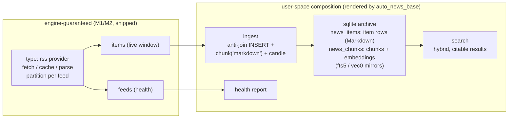

# `auto_news_base` Skill Design (RSS M3)

**Status:** Migration draft under review — Open Questions 1 (resolved by
verification) and 3 (decided: source build primary) are settled; the rest remain open
**Date:** 2026-08-14
**Branch:** `rss-m3-skill-design`
**Supersedes:** the M3 material in [2026-07-22-rss-feed-support-design.md](2026-07-22-rss-feed-support-design.md)

> **What this document is.** The RSS design doc specified M3 in eight scattered
> passages written on 2026-07-22. This migrates that material into one place and
> reorganizes it around the skill rather than around the provider. It deliberately
> does **not** re-decide anything: content carried from the source spec is marked
> *carried*, content the source spec assumed that has since become false is marked
> *stale* with the evidence, and everything a working skill needs that the source
> spec never covered is listed as a gap rather than invented here. Decisions belong
> to the review that follows this draft.

---

## Summary

`auto_news_base` is a skill in the [skardi-skills](https://github.com/SkardiLabs/skardi-skills)
repository. It takes a natural-language subscription list (or an OPML file) and
renders a working news base: an `rss` source, a two-table archive, ingest and
search pipelines, and a semantics overlay — then verifies the result end to end.

The engine half shipped in M1/M2: the `rss` provider serves `feeds` (health) and
`items` (live window) as ordinary DataFusion tables, documented in
[docs/rss.md](../../rss.md). The provider is deliberately a pure protocol adapter.
History retention, chunking, embedding, and hybrid retrieval are **user-space SQL
over it**, and this skill is what renders and self-verifies that composition.

The skill holds no privileged API. Everything it produces is plain configuration a
user could have written by hand.

---

## Motivation

*Carried from the source spec.*

The engine already contains every primitive a news base needs: pipelines can
`INSERT`, `chunk()` and `candle()` run inline in SQL, `sqlite_knn` / `sqlite_fts`
power hybrid search, and semantics overlays make tables agent-discoverable. What
is missing is the packaging that gets a user from "the blogs I read" to "my agent
can search them" in one conversation.

Two properties make that packaging worth a skill rather than a doc page:

- **Continuity is caller-supplied.** The provider fetches only when read and
  nothing self-refreshes. An entry that scrolls out of a feed's live window
  between syncs is never captured — the loss is permanent and silent. Getting the
  sync cadence right is therefore part of the deliverable, not an afterthought.
- **Citability outlives the window.** The whole point of the archive is that
  results stay citable (title, link, published) after the entry is gone from the
  feed. That requires the two-table archive to be built correctly the first time.

---

## Goals

*Carried.*

- Assemble a searchable, citable news base from a natural-language subscription
  list or an OPML file.
- Keep it maintainable afterwards through **configuration edits alone** —
  adding or removing a subscription must not re-render anything.
- Keep results citable after entries leave the live window.
- Render idempotently: `IF NOT EXISTS` DDL, diff-before-write, never
  blind-overwrite a user-edited file.
- Self-verify: the skill proves the base works before declaring success.

## Non-goals

*Carried, plus two that follow from the engine's current shape.*

- **A scheduler inside the provider.** Refresh cadence belongs to the caller.
- **Subscription management via SQL.** Subscriptions are configuration; no
  statement can add, alter, or remove one. Agents edit `ctx.yaml` (or the OPML
  file) and reload.
- **Full-article scraping.** Feeds that carry only summaries are served as
  summaries.
- **Offline or CLI-only operation.** Since [#170](https://github.com/SkardiLabs/skardi/pull/170)
  the CLI holds no query engine; every path in this skill needs a running
  `skardi-server`. (*New — see Stale Assumptions.*)
- **Creating schema in a datastore the user owns.** Following `auto_context`'s
  rule: the skill owns the workspace it created and nothing else.

---

## Architecture

*Carried, with the user-space half redrawn around the skill.*



The division of labour is the load-bearing idea: **the provider guarantees the
live window; everything downstream is SQL the skill writes.** A change to the
archive shape is a skill change, not an engine change.

---

## Rendered Artifacts

*Carried from the source spec, with one item removed as stale.*

| Artifact | Purpose |
|---|---|
| `ctx.yaml` | the `rss` source (subscriptions, TTL, bounds) + the sqlite archive |
| archive DDL | one-shot, idempotent: `news_items` + `news_chunks` and their mirrors |
| `pipelines/…` | ingest and search (count and split — see Open Question 1) |
| semantics overlay | NL descriptions for the archive tables |
| ~~`aliases.yaml`~~ | **removed — the alias layer no longer exists** (see Stale Assumptions) |

**Render rules** (carried): the DDL is idempotent (`CREATE TABLE IF NOT EXISTS`);
re-rendering shows a diff before writing and never blind-overwrites a user-edited
file.

### The archive contract

*Carried verbatim in intent.*

Two tables:

- **`news_items`** retains one row per entry exactly as `items` served it —
  primary key `(feed, guid)`, plus `title`, `link`, `author`, `published`, and
  `content` (Markdown). It is the anti-join target for ingest.
- **`news_chunks`** holds `(feed, guid, chunk_idx, chunk_text, embedding,
  ingested_at)` with the fts5 / vec0 mirrors attached.

Ingest is two `INSERT` steps: new entries land verbatim in `news_items`, then are
chunked and embedded **from `news_items`** into `news_chunks`. Search joins the
two inside the archive, so results stay citable after entries fall out of the live
window, and history can always be re-chunked or re-embedded from retained content.

The worked SQL for both statements and the closing health report is already
published in [docs/rss.md § Pipeline examples](../../rss.md) and exercised by
`crates/skardi/src/sources/providers/rss/composition_tests.rs`. This spec does not
restate it; it inherits it.

---

## The Five-Step Flow

*Carried.*

1. **Collect** a natural-language subscription list or an OPML file.
2. **Autodiscover** feed URLs from site HTML where the user gave a site rather
   than a feed.
3. **Render** every artifact above.
4. **Confirm** — reload, scan `items` once to force every fetch, and check each
   subscription against the `feeds` health table. Registration is zero-I/O, so
   that first scan *is* the preview. Prune dead or mis-discovered feeds.
5. **Self-verify** — run the sync path, then a probe query, asserting non-empty
   citable results served **from the archive itself** (no live-window join).

Steady state is externally paced: the sync runs on the caller's schedule — cron,
CI, or a recurring agent session — at a cadence faster than the fastest feed's
window roll. The provider never fetches unbidden.

---

## Lifecycle

*Carried.* Every rendered artifact except the `rss:` block is
subscription-agnostic — pipelines, DDL, and semantics reference `news.main.items`,
never individual feeds — so the lifecycle splits cleanly:

- **Subscription add/remove (frequent).** A pure configuration action: edit the
  `rss:` block or OPML, reload, scan `items` for the new feed (the scan forces the
  fetch), read its `feeds` row. **No artifact is re-rendered.** Removing a
  subscription retains its archived history by default; the skill offers an
  optional cleanup statement.
- **Parameter change (rare).** A new chunk size, overlap, or embedding model
  requires re-rendering the pipelines and rebuilding `news_chunks` from the
  content retained in `news_items`. The skill owns this rebuild flow.
- **Skill re-run over an existing setup.** Safe by construction — idempotent DDL,
  diff-before-write, no blind overwrites.

---

## Engine ↔ Skill Contract

*Carried.* Rendered artifacts embed `feeds` / `items` column names, the two halves
live in repositories with independent release cadences, and a rendered pipeline
outlives both. Four parts:

| Part | Status |
|---|---|
| **Declared surface.** `feeds` / `items` evolve additively; removing, renaming, retyping, tightening nullability, repurposing an enum domain, or changing `(feed, guid)` identity bumps an integer surface version. | **Shipped** — `RSS_SURFACE_VERSION = 1` at [mod.rs:123](../../../crates/skardi/src/sources/providers/rss/mod.rs) |
| **Visible at registration.** Registration logs the version and carries it in table metadata. | **Shipped** — [mod.rs:337](../../../crates/skardi/src/sources/providers/rss/mod.rs), key `skardi.rss.surface_version` |
| **Pinned consumer fixture.** A canonical render of the skill's artifacts, provenance-stamped with the skill version, vendored into the engine's fixture corpus; acceptance criteria run against it in engine CI. | **Half-shipped** — the contract points are covered by `composition_tests.rs`, but that SQL is **hand-written by the test**, not rendered by the skill. The provenance link the source spec asked for does not exist. See Open Question 5. |
| **Load-time handshake.** The skill stamps `requires: rss/<version>` into each rendered pipeline; the loader refuses a mismatch, naming both versions and the remedy. | **Not built.** `ComponentMetadata` ([types.rs:146](../../../crates/skardi/src/pipeline/types.rs)) has no such field and the loader performs no check. See Open Question 2. |

Standing cross-repo CI was considered and rejected in the source spec: it exercises
only HEAD×HEAD, protecting neither released pairings nor already-rendered
artifacts, at the cost of the heaviest plumbing.

---

## Stale Assumptions in the Source Spec

Written 2026-07-22; the engine moved underneath three of them. **These are facts,
not proposals** — the replacements are what needs deciding.

### 1. `skardi sync` / `skardi news "<probe>"` cannot exist

[#170](https://github.com/SkardiLabs/skardi/pull/170) reframed the CLI as a thin
HTTP client. It holds no query engine, no data-source registration, and no local
execution mode. [The design doc's non-goals](2026-07-23-cli-reframe-design.md) are
explicit: *"No offline/local execution mode of any kind (no feature flag, no
fallback)."*

Every invocation in the source spec must become an HTTP call against a running
server, and **server lifecycle becomes part of the skill** — a whole area the
source spec never addressed.

### 2. The alias layer is gone

Aliases were client-side config mapping a short verb to a pipeline plus defaults
(`0aad1db`, #90). #170 deleted them: *"skardi run executes named server pipelines
(replaces aliases)."* Two independent confirmations: [docs/cli.md:106](../../cli.md)
("there is no separate alias layer to define or maintain"), and `auto_context`'s
migration notes, which record a legacy workspace's `aliases.yaml` as *"nothing
reads it now — harmless"*.

Consequence: `sync` and `news` are no longer aliases pointing at pipelines — they
**are** pipeline names, reachable as `POST /sync/execute` and `skardi run sync`.
This is a simplification, but parameter defaults lose their home and must be baked
into the rendered SQL at render time.

### 3. Acceptance criterion 8's driving surface

The source spec asserts an unmodified agent session drives the base *"using only
README + `--help`"*. `--help` is no longer the entry point to anything the skill
renders. The criterion's intent (the base is usable without bespoke instructions)
survives; its judgement needs rewriting against the HTTP surface.

---

## Gaps — Content a Working Skill Needs That the Source Spec Never Covered

Grouped by whether the source spec was thin or silent. Nothing here is designed
yet; this is the work list.

**Thin — stated but not actionable**

1. **Self-verification** is one sentence. Needs an executable assertion list: which
   queries, expected shape, and what each failure tells the user.
2. **Feed autodiscovery** is one clause. Needs the actual rule (`<link
   rel="alternate" type="application/rss+xml">`), multi-candidate handling,
   relative-URL resolution, and the failure path.
3. **The semantics overlay.** The provider already ships one at
   [docs/rss/semantics.yaml](../../rss/semantics.yaml). What the skill renders is
   an overlay for the *archive* tables; the relationship between the two is unstated.
4. **Archive DDL detail.** The source spec gives columns; the fts5 / vec0 mirror
   tables and their sync triggers are not specified anywhere, including in
   `docs/rss.md`.
5. **Lifecycle mechanics.** Three lifecycles are stated as principles with no
   corresponding scripts or flows.

**Silent — never mentioned**

6. **Server lifecycle** — start, health probe, pipeline-registration check, stop.
   `auto_context` carries ~52 KB of hard-won code here, including a failure mode
   where another workspace's server answers `/health` on the same port and a dead
   launch reports success.
7. **Feature prerequisites** — which `skardi-server` build is required, and the
   fact that no published artifact satisfies it. See Open Question 3.
8. **Workspace model** — where artifacts are rendered, what the breadcrumb
   records, idempotency and `--force`.
9. **Embedding model selection** — which UDF, which model, vector dimension,
   model download, `SQLITE_VEC_PATH`.
10. **Platform matrix** — `auto_context`'s table is measured, not assumed, and
    should be inherited rather than rediscovered.
11. **Search result shape** — see Open Question 4.
12. **CJK full-text search does not work.** Measured 2026-08-13 in `auto_context`:
    both backends tokenise on non-alphanumeric boundaries, so an unbroken run of
    Han characters is a single token and `search-fulltext` returns **zero rows
    while the content is present**, silently (`success: true`, empty set). Tracked
    as [skardi-skills#26](https://github.com/SkardiLabs/skardi-skills/issues/26).
    A news base over Chinese sources inherits this; it must be stated, not discovered.
13. **Scheduling.** The source spec says cadence belongs to the caller. It does not
    say whether the skill installs the schedule, prints it, or merely explains it —
    and the cost of getting this wrong is permanent data loss, not latency.
14. **Error diagnosis.** `auto_context` ships `_diagnose.py` to decode one specific
    lie: a missing embedding feature surfaces as `sqlite_knn(...) expects 4
    arguments, got 3`. The RSS surface will have its own equivalents.
15. **Evals and tests.** The skills repo has conventions for both; the source spec
    predates the skill existing there.

---

## Open Questions

Ordered by how much they change the shape of the work.

### 1. Does the ingest pipeline still need a statement-sequence engine extension?

**Resolved by verification, 2026-08-14: no.** The skill renders **three independent
single-statement pipelines** — archive-items (`INSERT … SELECT` anti-join),
archive-chunks (`INSERT … SELECT` through `chunk_parts` + embedding), and the
health-report `SELECT` — and a driver script POSTs them in order. The
statement-sequence extension the source spec recorded as an M3 dependency is not
needed.

What the verification established:

- **The pipeline execute path has no statement-kind gate.** `execute_pipeline_by_name`
  ([pipeline_handlers.rs:718](../../../crates/server/src/pipeline_handlers.rs))
  substitutes parameters and calls `engine.execute(&sql)` directly — unlike
  `POST /query`, which branches on `StatementKind`. INSERT pipelines are an
  explicitly supported shape: the parameter substituter renders multi-row tuple
  lists for `INSERT … VALUES {rows}` and is tested for it.
- **Production precedent exists.** `auto_context`'s `ingest` / `ingest-chunked`
  pipelines are INSERTs running against a released server (their SKILL.md records
  runs verified 2026-08-04).
- **The engine-level SQL is already proven.** `composition_tests.rs` runs the exact
  cross-source `INSERT INTO archive… SELECT FROM news…` statements this skill will
  render.
- **One requirement carried into the render:** the archive source in `ctx.yaml` must
  declare `access_mode: read_write`, or the INSERTs are refused.

Atomicity is not lost by splitting: ingest is idempotent by anti-join, so an
interrupted run is re-run, not repaired. The original single-pipeline shape would
have fought the execution contract anyway — the single-statement rule is not a
pipeline-layer convenience (`POST /query` rejects multi-statement input with a 400
because DataFusion's `ctx.sql()` does).

**Consequence: M3 requires no engine change for ingest.**

### 2. Where does the version handshake live?

Same shape of question. The source spec puts `requires: rss/<version>` in pipeline
metadata and the check in the pipeline loader. But the skill's own `start_server`
step already verifies pipeline registration on every start; comparing the recorded
surface version against the server's would run at the same moment, in skill space.

**Verified 2026-08-14: the skill-space check is not free either.** The surface
version is logged at registration and stamped into both tables' Arrow schema
metadata (`skardi.rss.surface_version`), but **no HTTP endpoint exposes it**:
`GET /data_source` serializes fields only — name, type, nullability, semantics
description ([get_table_schema](../../../crates/server/src/pipeline_handlers.rs)) —
and schema-level metadata never crosses the wire. So either placement needs an
engine-side change:

- **Skill-space check** → an additive exposure (e.g. table-level metadata in
  `GET /data_source`), small and useful beyond RSS, then the check itself lives in
  the skill's start step.
- **Loader handshake** → the `requires` field on pipeline metadata plus the loader
  check, as the source spec drew it.

The first is the materially smaller engine change, but it is not zero. The
counter-argument the source spec makes is worth preserving either way: rendered
artifacts live in user space and version skew is *"this design's default failure
mode, not an edge case"* — so wherever the check lives, it must be unskippable.

### 3. Which `skardi-server` build, and who produces it?

**Decided 2026-08-14: a source build is the primary path.** The skill's
prerequisite is

```bash
cargo build --release -p skardi-server --features "rss candle"
```

run by the user, served as `--runtime local-process`. Publishing artifacts is
recorded below as **alternatives for future consideration**, not commitments.

The facts that forced the decision, strongest first:

- **No release contains the RSS provider at all.** `v0.5.0` was tagged 2026-08-04;
  RSS 4/4 (#183) merged after it, and no tag contains it. Until the next release,
  a build from `main` is the only way to get `type: rss` — regardless of features,
  images, or anything else. (Verified: `git show v0.5.0:crates/skardi/src/sources/providers/rss/mod.rs`
  → path does not exist.)
- **Even ignoring that, no published artifact combines `rss` with embedding.** The
  release matrix ([release.yml:144](../../../.github/workflows/release.yml))
  publishes exactly two image variants — `skardi-server` (no features) and
  `skardi-server-rag` (`--features rag`) — and `rag = ["embedding", "chunking"]`
  does not include `rss`. There is no `skardi-server` release **binary** on any
  platform either.
- **Minimum feature set is `rss candle`, not `rss rag`.** On `main`, server
  `default = ["chunking"]`, so `chunk()` / `chunk_parts()` are in every build
  (note: that default landed in #193, *after* v0.5.0, whose default was empty —
  moot today given the first bullet, but it pins the minimum server version the
  skill must declare). `candle` alone avoids `gguf` (pulls `llama-cpp-4`, needs
  cmake + a C++ toolchain) and `onnx` (pulls `ort`): **no C++ toolchain needed for
  the default path.**

**Alternatives recorded for future consideration** (either would be triggered by a
release decision in the skardi repo, not by this skill):

- **An image variant** (`--features "rag rss"` or similar). Mechanically cheap —
  the Dockerfile already takes `ARG FEATURES`; the release matrix needs two build
  rows plus one manifest row. On its own it forces a Postgres archive, because the
  runtime image carries no Linux sqlite-vec (`auto_context` refuses
  `--backend sqlite --runtime docker` for exactly this reason) — an awkward trade
  for the personal-subscriptions persona.
- **An image variant plus sqlite-vec baked into the runtime image** (a per-arch
  `.so` plus a default `SQLITE_VEC_PATH`). The only path that gets to
  "docker-only, no toolchain, local sqlite archive" — and it would incidentally fix
  `auto_context`'s docker+sqlite refusal. It is also a general-image decision
  (version pinning, licensing, arch coverage) with reach beyond this skill, which
  is why it is not assumed here.
- Folding `rss` into the `rag` umbrella is **rejected** in any variant: `rag` is a
  UDF umbrella and `rss` is a source connector (`documents` is not in `rag`
  either), and `rss` turns on reqwest's `gzip` feature whose reach is
  workspace-wide by Cargo's feature unification
  ([Cargo.toml:38-46](../../../crates/skardi/Cargo.toml)).
- A lighter unblock worth noting: `dev-docker.yml` builds an image from any branch
  on demand but takes no features input; adding one would produce experimental
  `rss`-bearing images for skill development without touching the release matrix.

### 4. Does search return whole articles or chunks?

`news_items` retains full Markdown and `news_chunks` is derived and disposable, so
the archive can answer either way with one join. Returning whole articles is cheap
here in a way it is not for `auto_context` (which stores only chunks), and news
entries are short enough to fit a prompt. The alternative — returning chunks with
neighbours (`chunk_idx ± 1`) — matters only for long full-text feeds.

This decides the search pipelines' shape, so it should be settled before they are
written.

### 5. How is the pinned consumer fixture's provenance established?

The contract asks for a canonical render, stamped with the skill version that
produced it, vendored into the engine's corpus. Today `composition_tests.rs`
hand-writes equivalent SQL. The contract points are covered; the link that would
make a *rendering* drift fail engine CI is not. Either build the link or amend the
contract to match reality.

### 6. Skill name and packaging

The source spec says `auto_news_base/`. The skills repo now holds two plugins,
`auto-context` and `feishu-connector`, after [#24](https://github.com/SkardiLabs/skardi-skills/pull/24)
merged on 2026-08-14. A third plugin is the assumed shape; the name is worth one
sentence of confirmation.

**Settled during review, recorded here:** `auto_news_base` is a *separate skill*,
not a mode of `auto_context`. The two share their downstream half (chunk → embed →
hybrid search over near-identical tables) but differ in the half that matters:
`auto_context` ingest is client-driven (read file, hash, one POST per document,
manifest, resume), while news ingest is server-resident (`INSERT … SELECT` with an
anti-join, zero client I/O, idempotent by construction). Add the subscription
lifecycle and feed health, and it is a different product, not a parameter.

### 7. Who keeps the server alive, and who triggers the sync?

Unique to this skill. `auto_context`'s server only needs to be up while someone is
querying. A news base needs a server up **and** something poking it on a schedule,
because entries that scroll out of the window between syncs are gone for good. The
failure mode is silent ("the news stopped updating"). Related to gap 13.

---

## Testing Strategy

*Carried where it applies to the skill; the provider's own suites are M1 and shipped.*

- **Engine-side, already in place.** `composition_tests.rs` covers the federated
  join, idempotent two-table archive, citability after window roll, the health
  report's shape, and subscription-add-is-config-only.
- **Skill-side, to be built.** The skills repo runs plain `python3 tests/<file>.py`
  with no pytest dependency. `auto_context` is the precedent — and its own coverage
  note is worth heeding: it states plainly that `setup_context.py` and all pipeline
  templates are untested while SKILL.md makes six behavioural promises about ingest.
  This skill should not repeat that.
- **Evals.** `evals/evals.json` per repo convention.

## Acceptance Criteria

Carried from the source spec's 6 / 8 / 11 / 12 / 17, restated against the skill and
marked where a stale assumption forces a rewrite.

1. *(from 6)* The ingest path INSERTs item rows verbatim into `news_items` and
   chunk/embedding rows into `news_chunks`; re-running inserts zero new rows.
2. *(from 11)* After an entry falls out of the live window, a search still returns
   its title, link, and published timestamp from the archive.
3. *(from 12)* Adding or removing a subscription changes only the `rss:` block or
   OPML; every other rendered artifact is byte-identical.
4. *(from 17)* A rendered artifact whose recorded surface version mismatches the
   running engine's is refused, with an error naming both versions and the remedy.
   **Placement depends on Open Question 2.**
5. *(from 8, needs rewriting)* On a clean machine the skill takes a natural-language
   subscription list to a working news base and its self-verification passes, and an
   unmodified agent session can drive sync and search without bespoke instructions.
   **The original judgement ("README + `--help`") is stale — see Stale Assumption 3.**
6. *(new, implied by the archive's purpose)* A degraded feed is visible in the sync
   path's output with its reason, and never changes the run's exit status.

---

## Repository Shape

The skill lands in skardi-skills as its own plugin, following the layout `#24`
established:

```text
auto_news_base/
├── .claude-plugin/plugin.json
├── skills/auto_news_base/
│   ├── SKILL.md
│   ├── assets/            # ctx.yaml.tpl, archive DDL, pipelines/*.tpl, semantics.yaml.tpl
│   ├── references/        # troubleshooting, feed dialects, scheduling
│   └── scripts/           # setup, server lifecycle, sync driver
└── tests/
```

Engine-side changes, if any, are limited to whatever Open Questions 1 and 2 settle
on, and belong in the skardi repository rather than here.

## References

- [RSS Feed Support Design](2026-07-22-rss-feed-support-design.md) — the source of
  everything marked *carried*
- [docs/rss.md](../../rss.md) — the provider's user-facing contract, including the
  worked pipeline SQL this skill renders
- [CLI Reframe Design](2026-07-23-cli-reframe-design.md) — why the CLI holds no engine
- [Ad-hoc SQL Query Endpoint](2026-07-17-query-endpoint-design.md) — the
  single-statement rule
- `auto_context` in [skardi-skills](https://github.com/SkardiLabs/skardi-skills) —
  the structural precedent for workspace, server lifecycle, and rendering conventions
